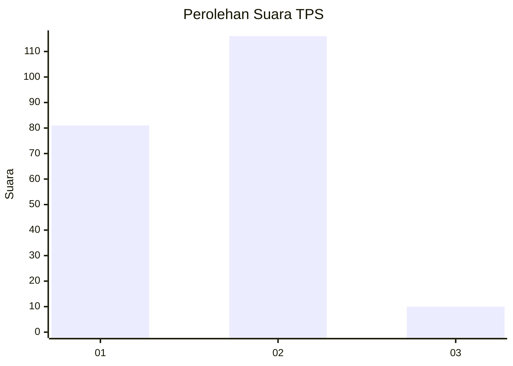
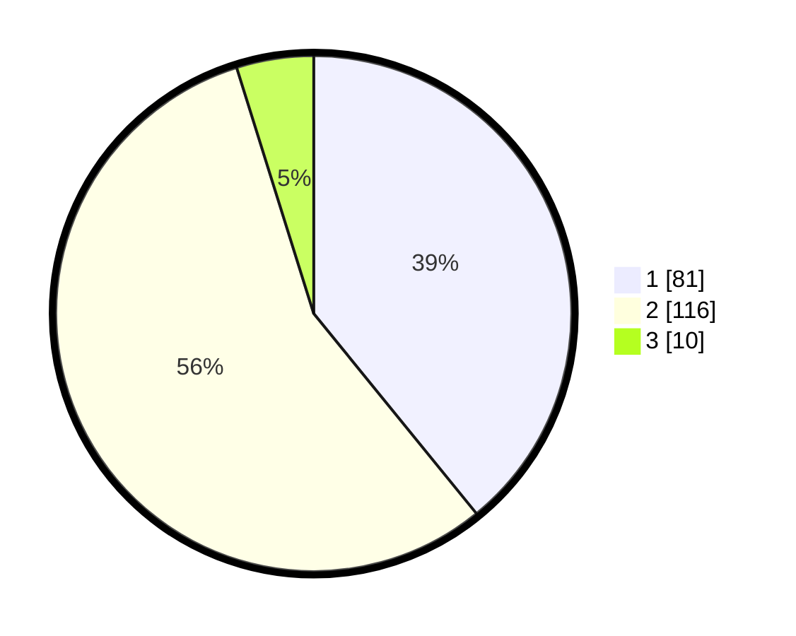

# Hasil

## Grafik

## Tabel

| No. | Nama Paslon    | Suara | Suara (raw) | Persentase |
|:--- |:-------------- | -----:| -----------:| ----------:|
| 1   | ANIES MUHAIMIN | 81    | [81][p-1]   | 39,13      |
| 2   | PRABOWO GIBRAN | 116   | [116][p-2]  | 56,04      |
| 3   | GANJAR MAHFUD  | 10    | [10][p-3]   | 4,83       |

[p-1]: https://github.com/gigit-pemilu/pemilu-2024-32-jawa-barat/blob/main/pilpres/hitung-suara/sub/32-jawa-barat/sub/03-cianjur/sub/14-sukanagara/sub/2001-sukanagara/sub/001-tps/sub/paslon-1.txt
[p-2]: https://github.com/gigit-pemilu/pemilu-2024-32-jawa-barat/blob/main/pilpres/hitung-suara/sub/32-jawa-barat/sub/03-cianjur/sub/14-sukanagara/sub/2001-sukanagara/sub/001-tps/sub/paslon-2.txt
[p-3]: https://github.com/gigit-pemilu/pemilu-2024-32-jawa-barat/blob/main/pilpres/hitung-suara/sub/32-jawa-barat/sub/03-cianjur/sub/14-sukanagara/sub/2001-sukanagara/sub/001-tps/sub/paslon-3.txt

## Foto C Plano

https://sirekap-obj-formc.kpu.go.id/b890/pemilu/ppwp/32/03/14/20/01/3203142001001-20240215-003406--58267af6-6339-4e6c-9513-452b0dbea4d5.jpg

https://sirekap-obj-formc.kpu.go.id/b890/pemilu/ppwp/32/03/14/20/01/3203142001001-20240215-003523--7137e306-9a39-49dc-b252-509f88de9df1.jpg

https://sirekap-obj-formc.kpu.go.id/b890/pemilu/ppwp/32/03/14/20/01/3203142001001-20240215-003615--9fa56221-4a6f-4521-9269-875c96f52e32.jpg

## Metadata

| Key        | Value               |
| ---------- | ------------------- |
| Time Stamp | 2024-02-15 16:00:26 |

