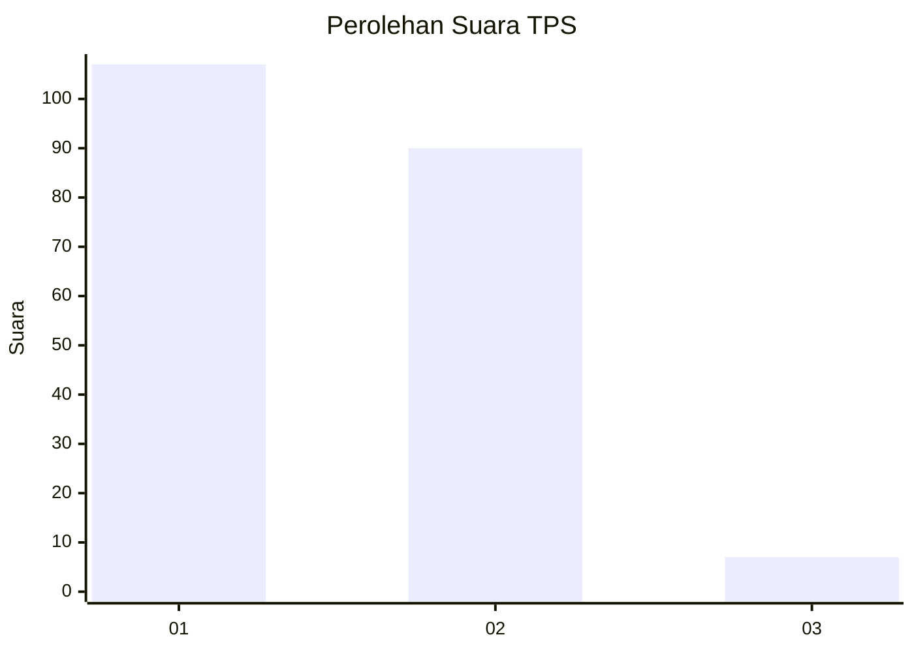
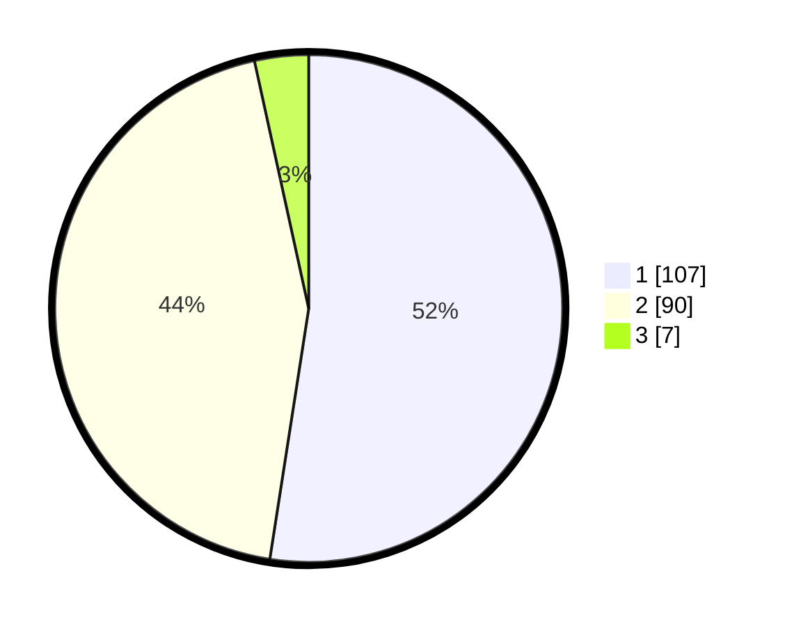

# Hasil

## Grafik

## Tabel

| No. | Nama Paslon    | Suara | Suara (raw) | Persentase |
|:--- |:-------------- | -----:| -----------:| ----------:|
| 1   | ANIES MUHAIMIN | 107   | [107][p-1]  | 52,45      |
| 2   | PRABOWO GIBRAN | 90    | [90][p-2]   | 44,12      |
| 3   | GANJAR MAHFUD  | 7     | [7][p-3]    | 3,43       |

[p-1]: https://github.com/gigit-pemilu/pemilu-2024/blob/main/pilpres/hitung-suara/sub/32-jawa-barat/sub/03-cianjur/sub/14-sukanagara/sub/2001-sukanagara/sub/007-tps/sub/paslon-1.txt
[p-2]: https://github.com/gigit-pemilu/pemilu-2024/blob/main/pilpres/hitung-suara/sub/32-jawa-barat/sub/03-cianjur/sub/14-sukanagara/sub/2001-sukanagara/sub/007-tps/sub/paslon-2.txt
[p-3]: https://github.com/gigit-pemilu/pemilu-2024/blob/main/pilpres/hitung-suara/sub/32-jawa-barat/sub/03-cianjur/sub/14-sukanagara/sub/2001-sukanagara/sub/007-tps/sub/paslon-3.txt

## Foto C Plano

https://sirekap-obj-formc.kpu.go.id/6e40/pemilu/ppwp/32/03/14/20/01/3203142001007-20240214-155502--18176c4f-a9a6-4b3d-b93d-1508bc492551.jpg

https://sirekap-obj-formc.kpu.go.id/6e40/pemilu/ppwp/32/03/14/20/01/3203142001007-20240214-155646--0105d9c7-5c2e-4ec8-9986-37865072232d.jpg

https://sirekap-obj-formc.kpu.go.id/6e40/pemilu/ppwp/32/03/14/20/01/3203142001007-20240214-162244--9415a75e-5d89-4126-8b60-c05787db6206.jpg

## Metadata

| Key        | Value               |
| ---------- | ------------------- |
| Time Stamp | 2024-02-16 13:30:32 |

