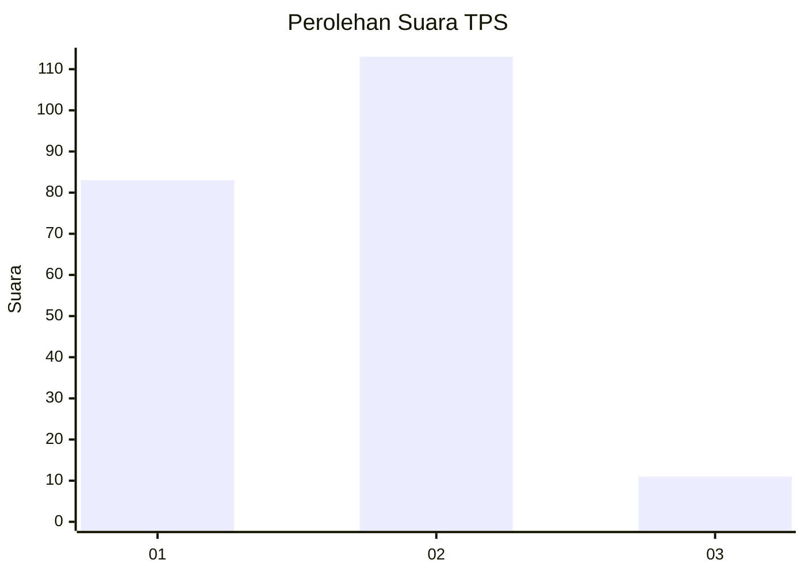
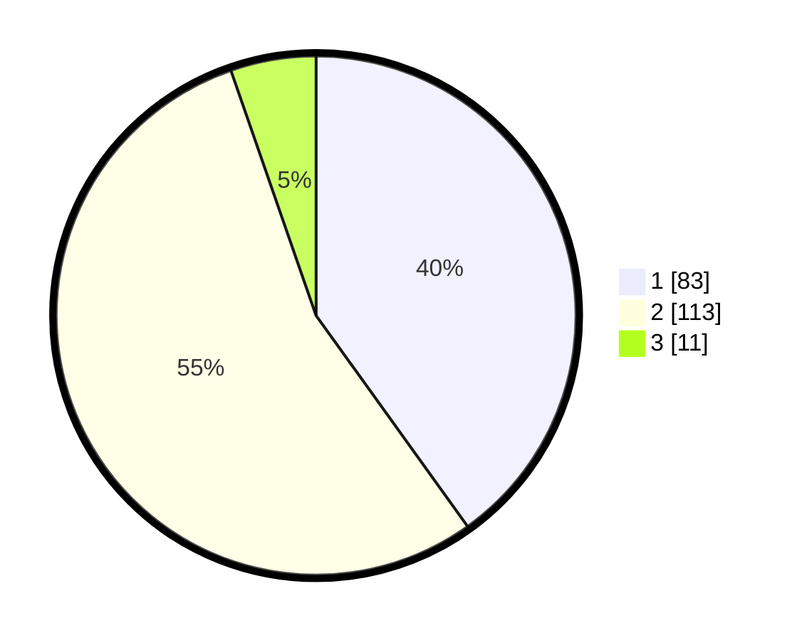

# Hasil

## Grafik

## Tabel

| No. | Nama Paslon    | Suara | Suara (raw) | Persentase |
|:--- |:-------------- | -----:| -----------:| ----------:|
| 1   | ANIES MUHAIMIN | 83    | [83][p-1]   | 40,10      |
| 2   | PRABOWO GIBRAN | 113   | [113][p-2]  | 54,59      |
| 3   | GANJAR MAHFUD  | 11    | [11][p-3]   | 5,31       |

[p-1]: https://github.com/gigit-pemilu/pemilu-2024/blob/main/pilpres/hitung-suara/sub/32-jawa-barat/sub/03-cianjur/sub/14-sukanagara/sub/2001-sukanagara/sub/016-tps/sub/paslon-1.txt
[p-2]: https://github.com/gigit-pemilu/pemilu-2024/blob/main/pilpres/hitung-suara/sub/32-jawa-barat/sub/03-cianjur/sub/14-sukanagara/sub/2001-sukanagara/sub/016-tps/sub/paslon-2.txt
[p-3]: https://github.com/gigit-pemilu/pemilu-2024/blob/main/pilpres/hitung-suara/sub/32-jawa-barat/sub/03-cianjur/sub/14-sukanagara/sub/2001-sukanagara/sub/016-tps/sub/paslon-3.txt

## Foto C Plano

https://sirekap-obj-formc.kpu.go.id/b17d/pemilu/ppwp/32/03/14/20/01/3203142001016-20240214-192730--2714bd38-7250-4462-bef2-de312c95e8a8.jpg

https://sirekap-obj-formc.kpu.go.id/b17d/pemilu/ppwp/32/03/14/20/01/3203142001016-20240214-192640--2c594476-e939-4724-8137-1546a66426d3.jpg

https://sirekap-obj-formc.kpu.go.id/b17d/pemilu/ppwp/32/03/14/20/01/3203142001016-20240214-192814--b81a284a-7a93-468e-996f-93ef0e0469d3.jpg

## Metadata

| Key        | Value               |
| ---------- | ------------------- |
| Time Stamp | 2024-02-16 13:30:32 |

