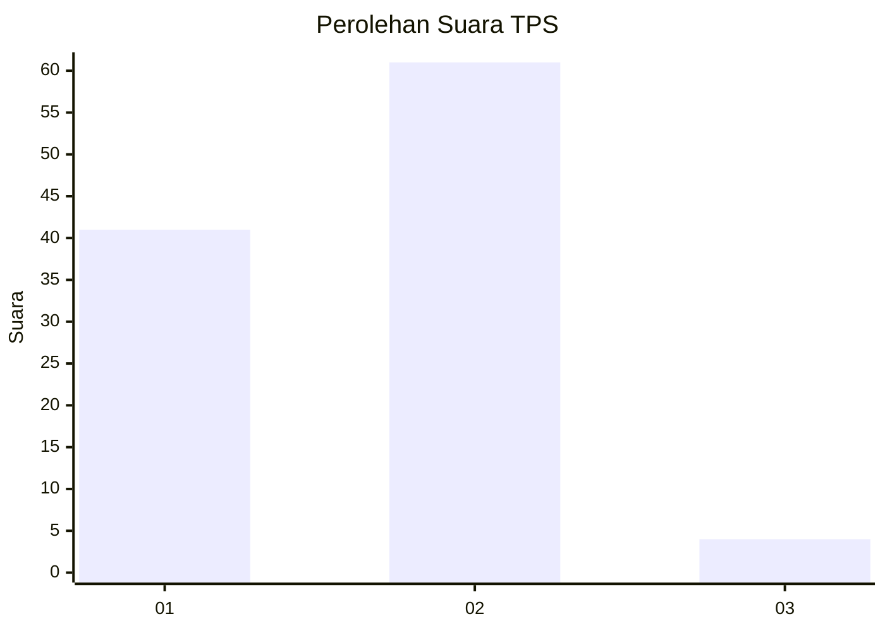
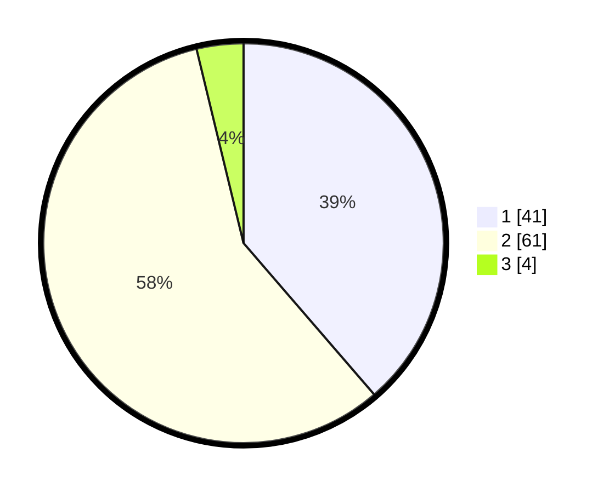

# Hasil

## Grafik

## Tabel

| No. | Nama Paslon    | Suara | Suara (raw) | Persentase |
|:--- |:-------------- | -----:| -----------:| ----------:|
| 1   | ANIES MUHAIMIN | 41    | [41][p-1]   | 38,68      |
| 2   | PRABOWO GIBRAN | 61    | [61][p-2]   | 57,55      |
| 3   | GANJAR MAHFUD  | 4     | [4][p-3]    | 3,77       |

[p-1]: https://github.com/gigit-pemilu/pemilu-2024/blob/main/pilpres/hitung-suara/sub/32-jawa-barat/sub/03-cianjur/sub/14-sukanagara/sub/2003-sukakarya/sub/012-tps/sub/paslon-1.txt
[p-2]: https://github.com/gigit-pemilu/pemilu-2024/blob/main/pilpres/hitung-suara/sub/32-jawa-barat/sub/03-cianjur/sub/14-sukanagara/sub/2003-sukakarya/sub/012-tps/sub/paslon-2.txt
[p-3]: https://github.com/gigit-pemilu/pemilu-2024/blob/main/pilpres/hitung-suara/sub/32-jawa-barat/sub/03-cianjur/sub/14-sukanagara/sub/2003-sukakarya/sub/012-tps/sub/paslon-3.txt

## Foto C Plano

https://sirekap-obj-formc.kpu.go.id/01d7/pemilu/ppwp/32/03/14/20/03/3203142003012-20240214-193425--eb0cfced-2f0d-4cd3-89c6-445d03cbff7d.jpg

https://sirekap-obj-formc.kpu.go.id/01d7/pemilu/ppwp/32/03/14/20/03/3203142003012-20240214-223417--9e085865-9e68-44e5-a8c8-608b804e014a.jpg

https://sirekap-obj-formc.kpu.go.id/01d7/pemilu/ppwp/32/03/14/20/03/3203142003012-20240214-193436--87ba63d7-dbe0-44f9-87c8-2e70df0fb726.jpg

## Metadata

| Key        | Value               |
| ---------- | ------------------- |
| Time Stamp | 2024-02-16 17:30:00 |

