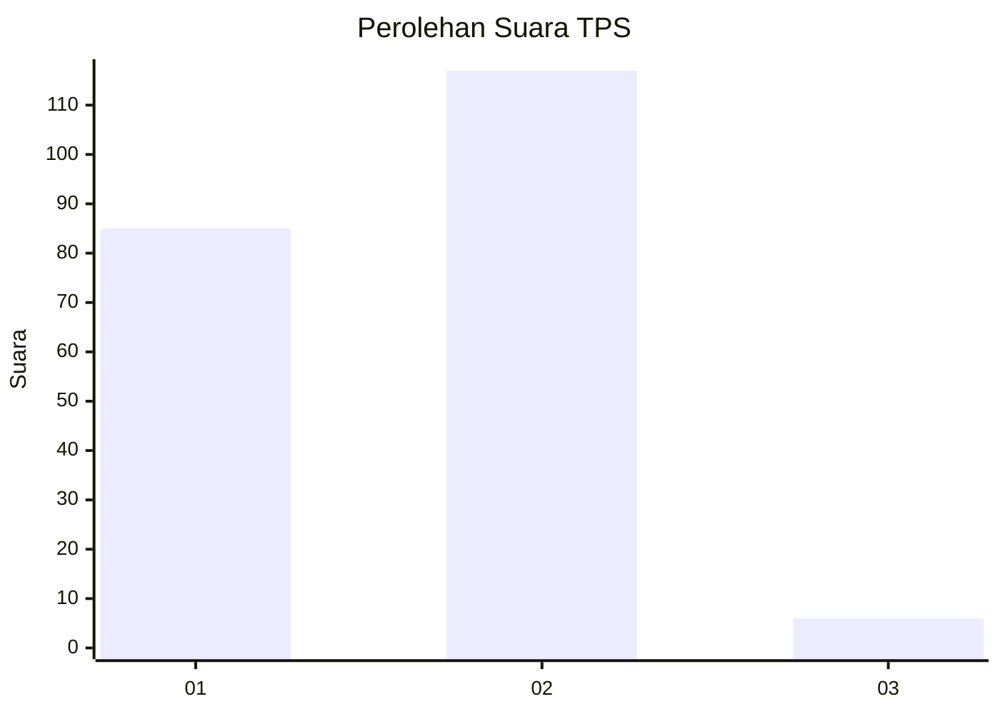
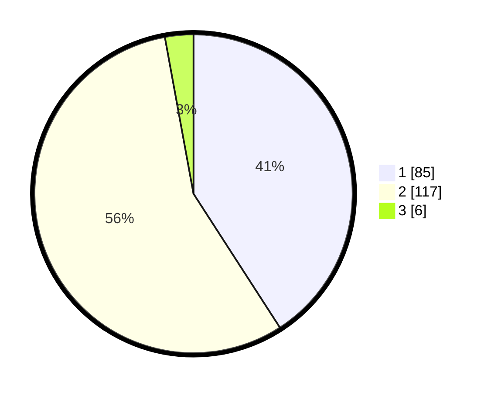

# Hasil

## Grafik

## Tabel

| No. | Nama Paslon    | Suara | Suara (raw) | Persentase |
|:--- |:-------------- | -----:| -----------:| ----------:|
| 1   | ANIES MUHAIMIN | 85    | [85][p-1]   | 40,87      |
| 2   | PRABOWO GIBRAN | 117   | [117][p-2]  | 56,25      |
| 3   | GANJAR MAHFUD  | 6     | [6][p-3]    | 2,88       |

[p-1]: https://github.com/gigit-pemilu/pemilu-2024/blob/main/pilpres/hitung-suara/sub/32-jawa-barat/sub/03-cianjur/sub/15-campaka/sub/2001-cidadap/sub/001-tps/sub/paslon-1.txt
[p-2]: https://github.com/gigit-pemilu/pemilu-2024/blob/main/pilpres/hitung-suara/sub/32-jawa-barat/sub/03-cianjur/sub/15-campaka/sub/2001-cidadap/sub/001-tps/sub/paslon-2.txt
[p-3]: https://github.com/gigit-pemilu/pemilu-2024/blob/main/pilpres/hitung-suara/sub/32-jawa-barat/sub/03-cianjur/sub/15-campaka/sub/2001-cidadap/sub/001-tps/sub/paslon-3.txt

## Foto C Plano

https://sirekap-obj-formc.kpu.go.id/1607/pemilu/ppwp/32/03/15/20/01/3203152001001-20240214-220300--6ec414e4-d7e2-480e-ac05-d2ab3a523508.jpg

https://sirekap-obj-formc.kpu.go.id/1607/pemilu/ppwp/32/03/15/20/01/3203152001001-20240214-221505--ea0b135a-1235-4791-91c2-7d8639cf4ccb.jpg

https://sirekap-obj-formc.kpu.go.id/1607/pemilu/ppwp/32/03/15/20/01/3203152001001-20240214-221824--67618878-f2df-4910-bcdd-ee4650a8f742.jpg

## Metadata

| Key        | Value               |
| ---------- | ------------------- |
| Time Stamp | 2024-02-15 16:00:26 |

