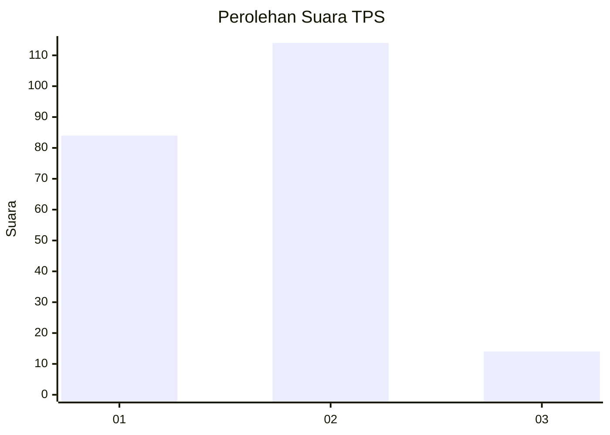

# Hasil

## Grafik

## Tabel

| No. | Nama Paslon    | Suara | Suara (raw) | Persentase |
|:--- |:-------------- | -----:| -----------:| ----------:|
| 1   | ANIES MUHAIMIN | 84    | [84][p-1]   | 39,62      |
| 2   | PRABOWO GIBRAN | 114   | [114][p-2]  | 53,77      |
| 3   | GANJAR MAHFUD  | 14    | [14][p-3]   | 6,60       |

[p-1]: https://github.com/gigit-pemilu/pemilu-2024-32-jawa-barat/blob/main/pilpres/hitung-suara/sub/32-jawa-barat/sub/03-cianjur/sub/15-campaka/sub/2001-cidadap/sub/002-tps/sub/paslon-1.txt
[p-2]: https://github.com/gigit-pemilu/pemilu-2024-32-jawa-barat/blob/main/pilpres/hitung-suara/sub/32-jawa-barat/sub/03-cianjur/sub/15-campaka/sub/2001-cidadap/sub/002-tps/sub/paslon-2.txt
[p-3]: https://github.com/gigit-pemilu/pemilu-2024-32-jawa-barat/blob/main/pilpres/hitung-suara/sub/32-jawa-barat/sub/03-cianjur/sub/15-campaka/sub/2001-cidadap/sub/002-tps/sub/paslon-3.txt

## Foto C Plano

https://sirekap-obj-formc.kpu.go.id/0f0f/pemilu/ppwp/32/03/15/20/01/3203152001002-20240215-000601--d651c1e8-e056-4484-aa5d-c5544e9fd4a8.jpg

https://sirekap-obj-formc.kpu.go.id/0f0f/pemilu/ppwp/32/03/15/20/01/3203152001002-20240215-000716--a1983812-0771-48c9-81b0-213c4b98c661.jpg

https://sirekap-obj-formc.kpu.go.id/0f0f/pemilu/ppwp/32/03/15/20/01/3203152001002-20240215-000934--8ec525ee-6e9d-434a-ae1e-cc34322f70b3.jpg

## Metadata

| Key        | Value               |
| ---------- | ------------------- |
| Time Stamp | 2024-02-16 13:30:32 |

