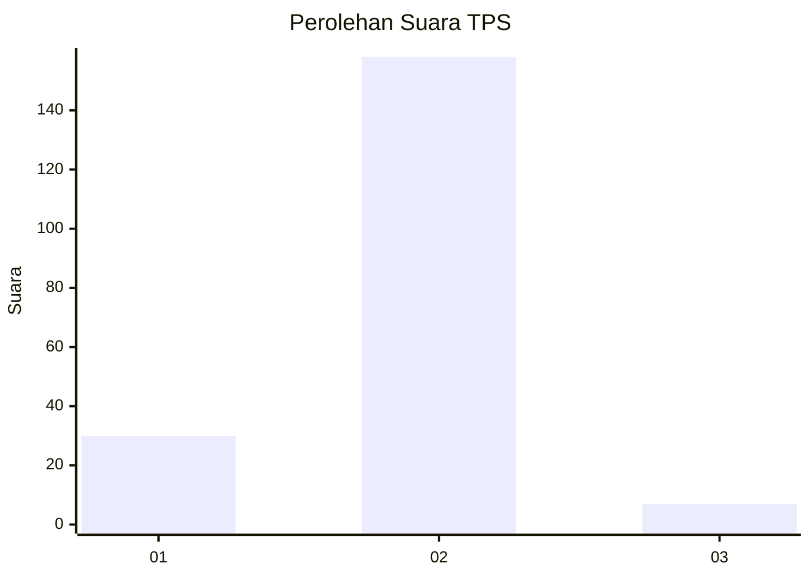
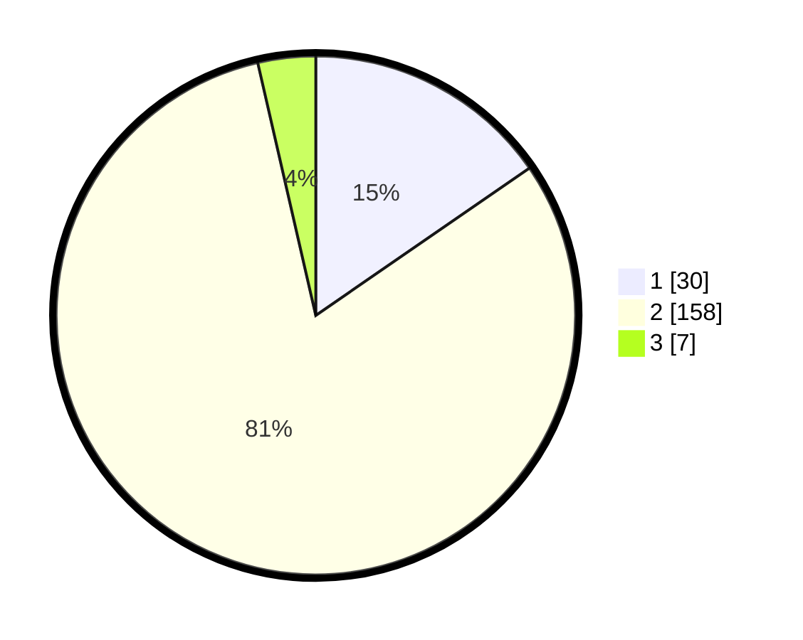

# Hasil

## Grafik

## Tabel

| No. | Nama Paslon    | Suara | Suara (raw) | Persentase |
|:--- |:-------------- | -----:| -----------:| ----------:|
| 1   | ANIES MUHAIMIN | 30    | [30][p-1]   | 15,38      |
| 2   | PRABOWO GIBRAN | 158   | [158][p-2]  | 81,03      |
| 3   | GANJAR MAHFUD  | 7     | [7][p-3]    | 3,59       |

[p-1]: https://github.com/gigit-pemilu/pemilu-2024/blob/main/pilpres/hitung-suara/sub/32-jawa-barat/sub/03-cianjur/sub/15-campaka/sub/2001-cidadap/sub/004-tps/sub/paslon-1.txt
[p-2]: https://github.com/gigit-pemilu/pemilu-2024/blob/main/pilpres/hitung-suara/sub/32-jawa-barat/sub/03-cianjur/sub/15-campaka/sub/2001-cidadap/sub/004-tps/sub/paslon-2.txt
[p-3]: https://github.com/gigit-pemilu/pemilu-2024/blob/main/pilpres/hitung-suara/sub/32-jawa-barat/sub/03-cianjur/sub/15-campaka/sub/2001-cidadap/sub/004-tps/sub/paslon-3.txt

## Foto C Plano

https://sirekap-obj-formc.kpu.go.id/96aa/pemilu/ppwp/32/03/15/20/01/3203152001004-20240215-033301--b4578317-0e40-4cb8-97a2-a2d7792c0492.jpg

https://sirekap-obj-formc.kpu.go.id/96aa/pemilu/ppwp/32/03/15/20/01/3203152001004-20240215-033417--abb16000-b3d8-44dd-9193-f2e631ebd9d9.jpg

https://sirekap-obj-formc.kpu.go.id/96aa/pemilu/ppwp/32/03/15/20/01/3203152001004-20240215-033525--5936bf24-c010-4be5-a962-734413948486.jpg

## Metadata

| Key        | Value               |
| ---------- | ------------------- |
| Time Stamp | 2024-02-15 16:30:25 |

