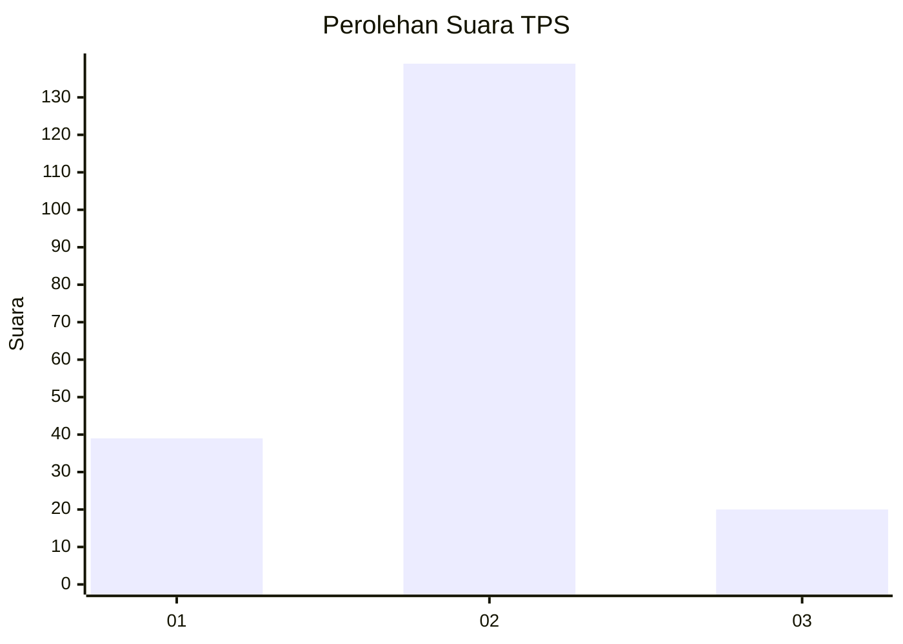
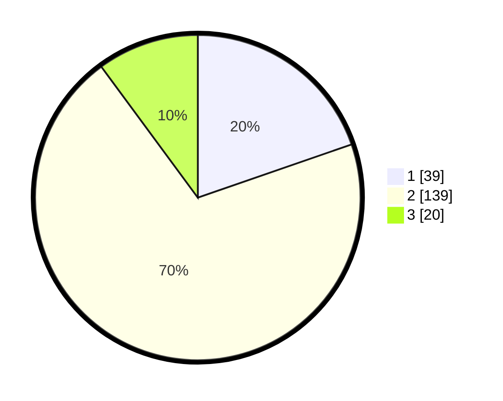

# Hasil

## Grafik

## Tabel

| No. | Nama Paslon    | Suara | Suara (raw) | Persentase |
|:--- |:-------------- | -----:| -----------:| ----------:|
| 1   | ANIES MUHAIMIN | 39    | [39][p-1]   | 19,70      |
| 2   | PRABOWO GIBRAN | 139   | [139][p-2]  | 70,20      |
| 3   | GANJAR MAHFUD  | 20    | [20][p-3]   | 10,10      |

[p-1]: https://github.com/gigit-pemilu/pemilu-2024/blob/main/pilpres/hitung-suara/sub/32-jawa-barat/sub/03-cianjur/sub/15-campaka/sub/2001-cidadap/sub/005-tps/sub/paslon-1.txt
[p-2]: https://github.com/gigit-pemilu/pemilu-2024/blob/main/pilpres/hitung-suara/sub/32-jawa-barat/sub/03-cianjur/sub/15-campaka/sub/2001-cidadap/sub/005-tps/sub/paslon-2.txt
[p-3]: https://github.com/gigit-pemilu/pemilu-2024/blob/main/pilpres/hitung-suara/sub/32-jawa-barat/sub/03-cianjur/sub/15-campaka/sub/2001-cidadap/sub/005-tps/sub/paslon-3.txt

## Foto C Plano

https://sirekap-obj-formc.kpu.go.id/8b03/pemilu/ppwp/32/03/15/20/01/3203152001005-20240214-192437--be9bdaf5-7540-4bc8-b9d5-e7735f0e5ca4.jpg

https://sirekap-obj-formc.kpu.go.id/8b03/pemilu/ppwp/32/03/15/20/01/3203152001005-20240214-192726--1ce47400-13f2-4164-86b9-ac0f468a82d7.jpg

https://sirekap-obj-formc.kpu.go.id/8b03/pemilu/ppwp/32/03/15/20/01/3203152001005-20240214-201554--35d0fd37-4804-42e3-b207-3a280d057f4b.jpg

## Metadata

| Key        | Value               |
| ---------- | ------------------- |
| Time Stamp | 2024-02-14 21:46:01 |

