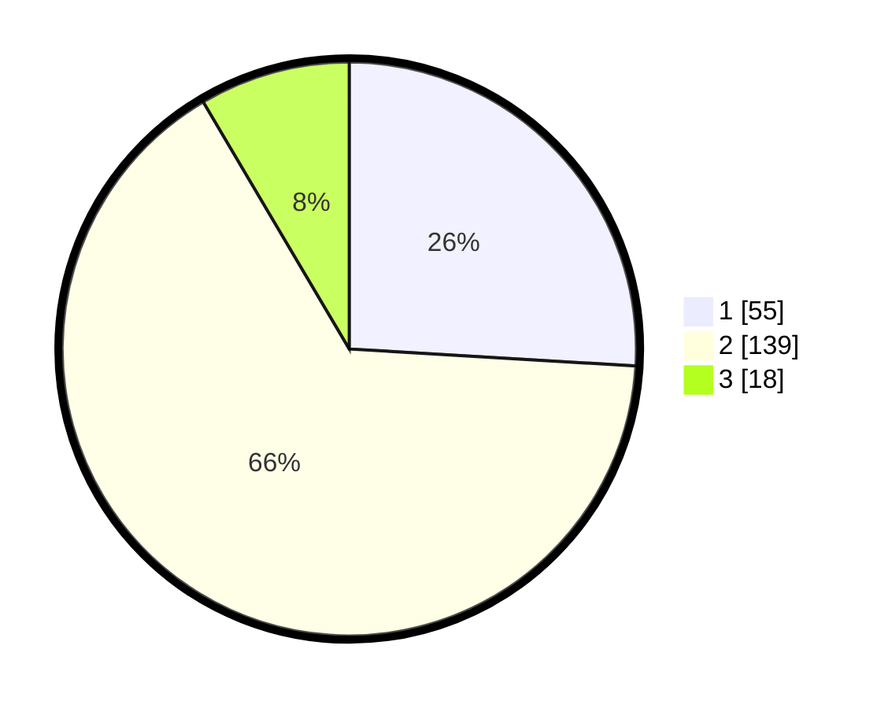

# Hasil

## Grafik

## Tabel

| No. | Nama Paslon    | Suara | Suara (raw) | Persentase |
|:--- |:-------------- | -----:| -----------:| ----------:|
| 1   | ANIES MUHAIMIN | 55    | [55][p-1]   | 25,94      |
| 2   | PRABOWO GIBRAN | 139   | [139][p-2]  | 65,57      |
| 3   | GANJAR MAHFUD  | 18    | [18][p-3]   | 8,49       |

[p-1]: https://github.com/gigit-pemilu/pemilu-2024-32-jawa-barat/blob/main/pilpres/hitung-suara/sub/32-jawa-barat/sub/03-cianjur/sub/15-campaka/sub/2001-cidadap/sub/006-tps/sub/paslon-1.txt
[p-2]: https://github.com/gigit-pemilu/pemilu-2024-32-jawa-barat/blob/main/pilpres/hitung-suara/sub/32-jawa-barat/sub/03-cianjur/sub/15-campaka/sub/2001-cidadap/sub/006-tps/sub/paslon-2.txt
[p-3]: https://github.com/gigit-pemilu/pemilu-2024-32-jawa-barat/blob/main/pilpres/hitung-suara/sub/32-jawa-barat/sub/03-cianjur/sub/15-campaka/sub/2001-cidadap/sub/006-tps/sub/paslon-3.txt

## Foto C Plano

https://sirekap-obj-formc.kpu.go.id/5e04/pemilu/ppwp/32/03/15/20/01/3203152001006-20240215-024449--de2825a8-b02d-42ef-a318-483735c8e38c.jpg

https://sirekap-obj-formc.kpu.go.id/5e04/pemilu/ppwp/32/03/15/20/01/3203152001006-20240215-004310--f8e531c3-d12b-485a-9476-2ae37bfe4e61.jpg

https://sirekap-obj-formc.kpu.go.id/5e04/pemilu/ppwp/32/03/15/20/01/3203152001006-20240215-004512--67592472-e387-455d-b292-99a352c64fa4.jpg

## Metadata

| Key        | Value               |
| ---------- | ------------------- |
| Time Stamp | 2024-02-16 16:25:10 |

