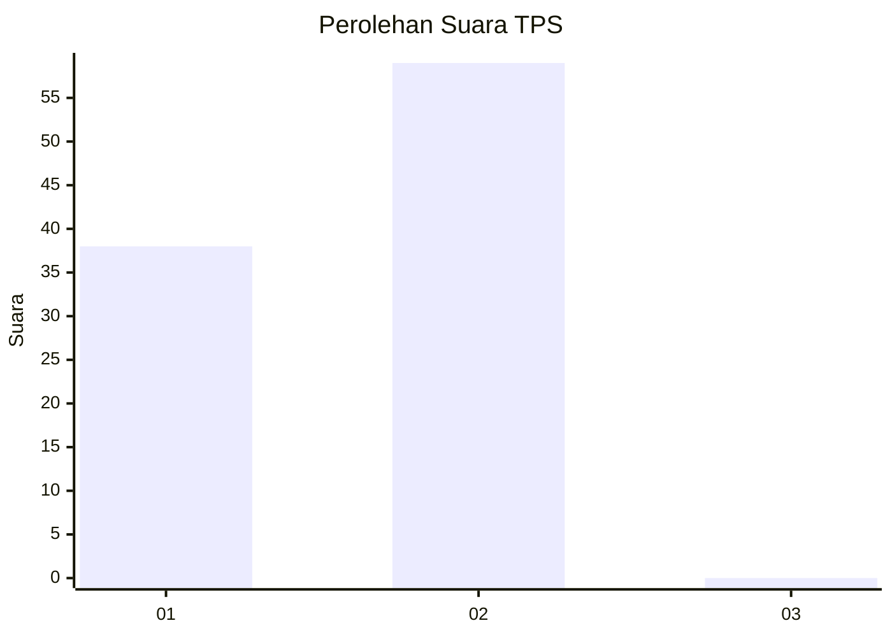
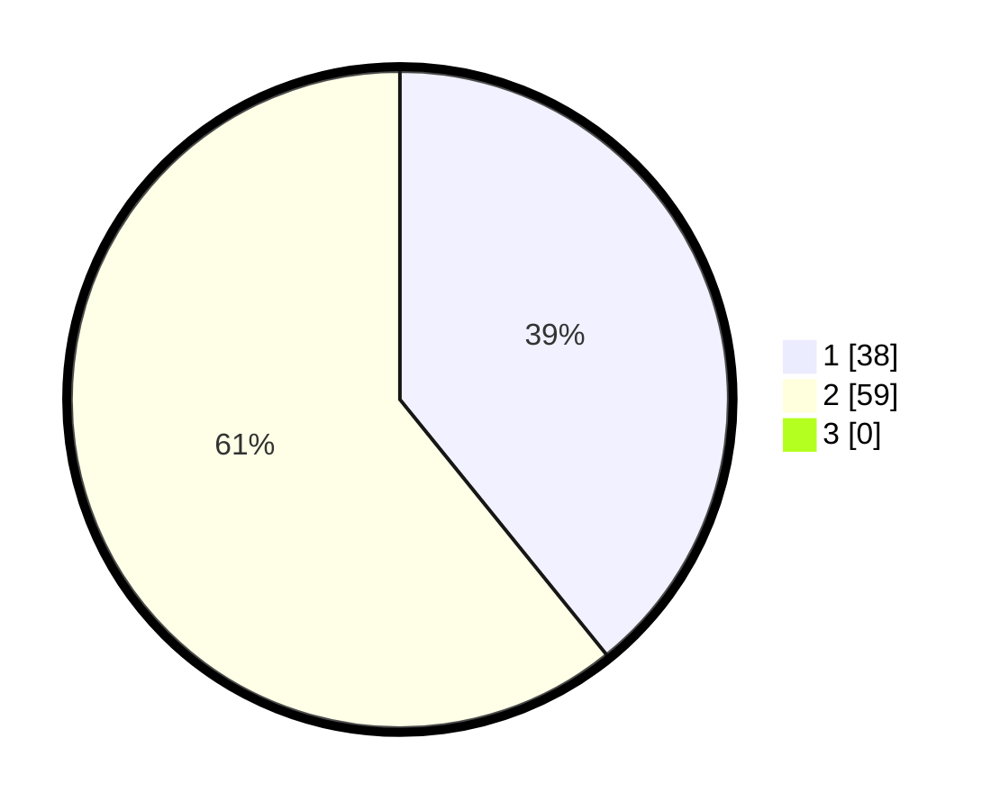

# Hasil

## Grafik

## Tabel

| No. | Nama Paslon    | Suara | Suara (raw) | Persentase |
|:--- |:-------------- | -----:| -----------:| ----------:|
| 1   | ANIES MUHAIMIN | 38    | [38][p-1]   | 39,18      |
| 2   | PRABOWO GIBRAN | 59    | [59][p-2]   | 60,82      |
| 3   | GANJAR MAHFUD  | 0     | [0][p-3]    | 0,00       |

[p-1]: https://github.com/gigit-pemilu/pemilu-2024-32-jawa-barat/blob/main/pilpres/hitung-suara/sub/32-jawa-barat/sub/03-cianjur/sub/15-campaka/sub/2007-karyamukti/sub/011-tps/sub/paslon-1.txt
[p-2]: https://github.com/gigit-pemilu/pemilu-2024-32-jawa-barat/blob/main/pilpres/hitung-suara/sub/32-jawa-barat/sub/03-cianjur/sub/15-campaka/sub/2007-karyamukti/sub/011-tps/sub/paslon-2.txt
[p-3]: https://github.com/gigit-pemilu/pemilu-2024-32-jawa-barat/blob/main/pilpres/hitung-suara/sub/32-jawa-barat/sub/03-cianjur/sub/15-campaka/sub/2007-karyamukti/sub/011-tps/sub/paslon-3.txt

## Foto C Plano

https://sirekap-obj-formc.kpu.go.id/a9d8/pemilu/ppwp/32/03/15/20/07/3203152007011-20240215-013018--110eef59-16ca-4642-84a8-e7c0bb4a1ffb.jpg

https://sirekap-obj-formc.kpu.go.id/a9d8/pemilu/ppwp/32/03/15/20/07/3203152007011-20240215-013521--b00fa388-b699-4e44-8b2a-ade66219eebd.jpg

https://sirekap-obj-formc.kpu.go.id/a9d8/pemilu/ppwp/32/03/15/20/07/3203152007011-20240215-013756--ada8e95e-bce0-44c4-b5cd-bf2bcb587c6d.jpg

## Metadata

| Key        | Value               |
| ---------- | ------------------- |
| Time Stamp | 2024-02-24 22:31:28 |

