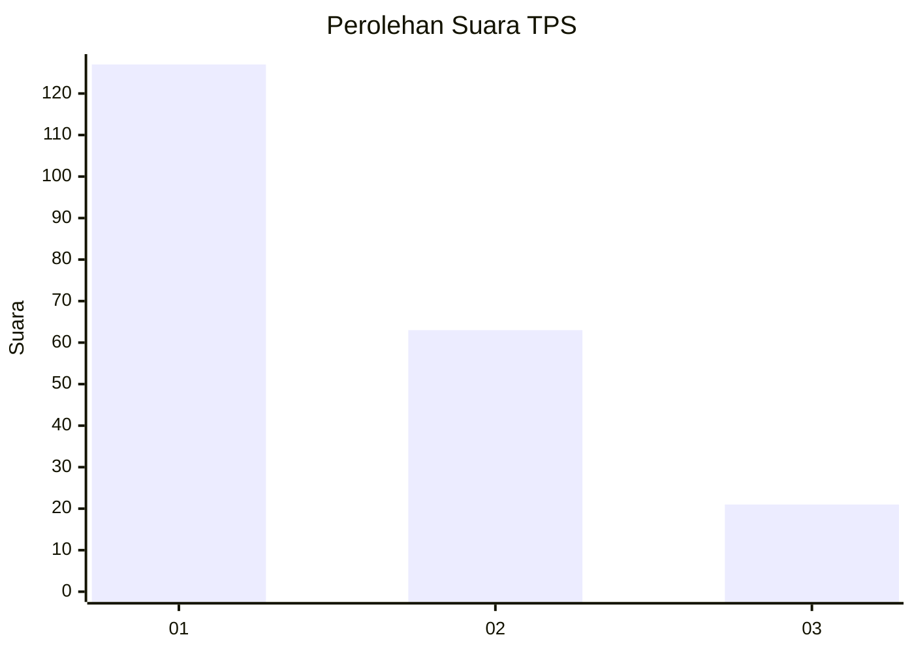
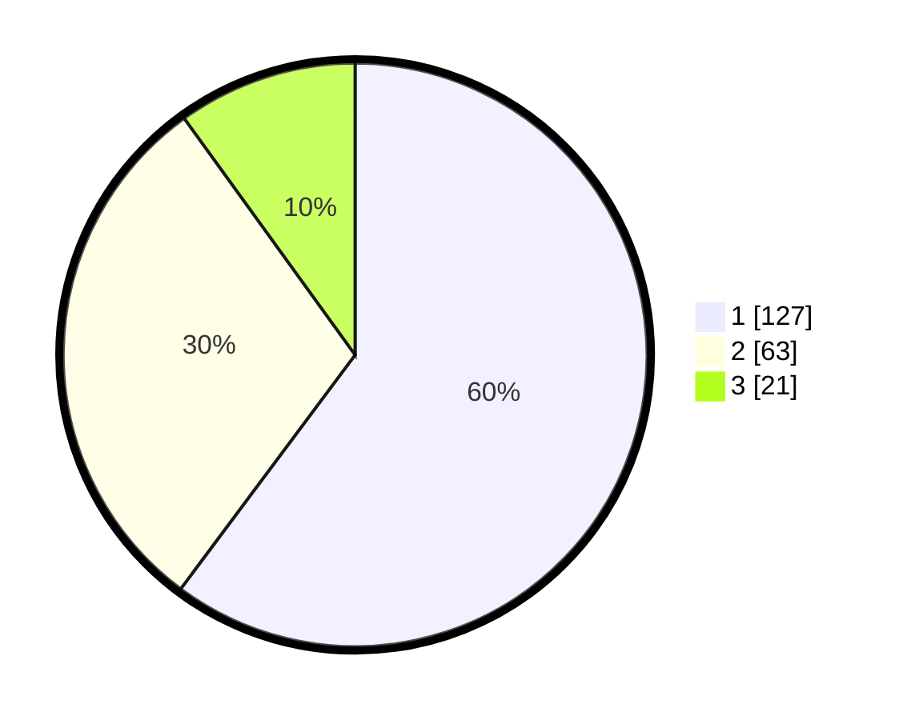

# Hasil

## Grafik

## Tabel

| No. | Nama Paslon    | Suara | Suara (raw) | Persentase |
|:--- |:-------------- | -----:| -----------:| ----------:|
| 1   | ANIES MUHAIMIN | 127   | [127][p-1]  | 60,19      |
| 2   | PRABOWO GIBRAN | 63    | [63][p-2]   | 29,86      |
| 3   | GANJAR MAHFUD  | 21    | [21][p-3]   | 9,95       |

[p-1]: https://github.com/gigit-pemilu/pemilu-2024-32-jawa-barat/blob/main/pilpres/hitung-suara/sub/32-jawa-barat/sub/03-cianjur/sub/16-takokak/sub/2003-sindanghayu/sub/005-tps/sub/paslon-1.txt
[p-2]: https://github.com/gigit-pemilu/pemilu-2024-32-jawa-barat/blob/main/pilpres/hitung-suara/sub/32-jawa-barat/sub/03-cianjur/sub/16-takokak/sub/2003-sindanghayu/sub/005-tps/sub/paslon-2.txt
[p-3]: https://github.com/gigit-pemilu/pemilu-2024-32-jawa-barat/blob/main/pilpres/hitung-suara/sub/32-jawa-barat/sub/03-cianjur/sub/16-takokak/sub/2003-sindanghayu/sub/005-tps/sub/paslon-3.txt

## Foto C Plano

https://sirekap-obj-formc.kpu.go.id/0ed9/pemilu/ppwp/32/03/16/20/03/3203162003005-20240215-110922--78156ec7-98ee-4dbc-8226-d58e7c7e7a93.jpg

https://sirekap-obj-formc.kpu.go.id/0ed9/pemilu/ppwp/32/03/16/20/03/3203162003005-20240215-110927--3992c554-efed-4b37-8f69-8141e09e59f5.jpg

https://sirekap-obj-formc.kpu.go.id/0ed9/pemilu/ppwp/32/03/16/20/03/3203162003005-20240215-110933--61de60db-b412-4940-8248-0d2044ecd456.jpg

## Metadata

| Key        | Value               |
| ---------- | ------------------- |
| Time Stamp | 2024-02-17 04:30:02 |

