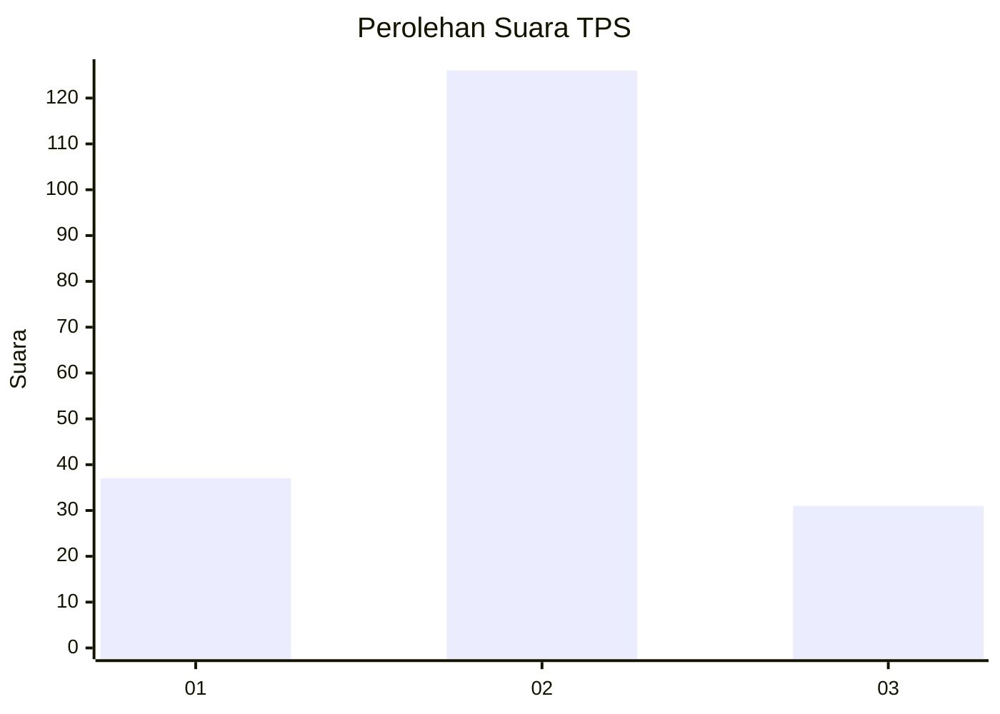
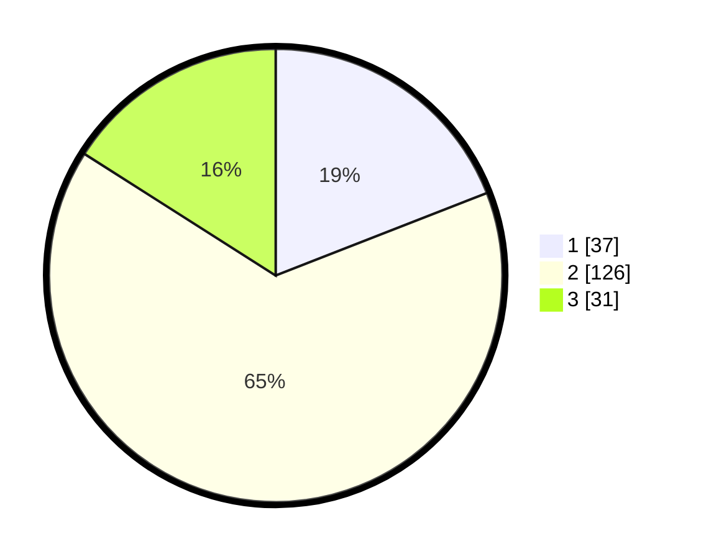

# Hasil

## Grafik

## Tabel

| No. | Nama Paslon    | Suara | Suara (raw) | Persentase |
|:--- |:-------------- | -----:| -----------:| ----------:|
| 1   | ANIES MUHAIMIN | 37    | [37][p-1]   | 19,07      |
| 2   | PRABOWO GIBRAN | 126   | [126][p-2]  | 64,95      |
| 3   | GANJAR MAHFUD  | 31    | [31][p-3]   | 15,98      |

[p-1]: https://github.com/gigit-pemilu/pemilu-2024/blob/main/pilpres/hitung-suara/sub/32-jawa-barat/sub/03-cianjur/sub/16-takokak/sub/2008-hegarmanah/sub/006-tps/sub/paslon-1.txt
[p-2]: https://github.com/gigit-pemilu/pemilu-2024/blob/main/pilpres/hitung-suara/sub/32-jawa-barat/sub/03-cianjur/sub/16-takokak/sub/2008-hegarmanah/sub/006-tps/sub/paslon-2.txt
[p-3]: https://github.com/gigit-pemilu/pemilu-2024/blob/main/pilpres/hitung-suara/sub/32-jawa-barat/sub/03-cianjur/sub/16-takokak/sub/2008-hegarmanah/sub/006-tps/sub/paslon-3.txt

## Foto C Plano

https://sirekap-obj-formc.kpu.go.id/9aa0/pemilu/ppwp/32/03/16/20/08/3203162008006-20240216-114238--6eb10686-b1fe-4281-be57-64119c4364ab.jpg

https://sirekap-obj-formc.kpu.go.id/9aa0/pemilu/ppwp/32/03/16/20/08/3203162008006-20240216-115047--d9e3cde3-9c06-4b84-b8fc-bbf652b1269c.jpg

https://sirekap-obj-formc.kpu.go.id/9aa0/pemilu/ppwp/32/03/16/20/08/3203162008006-20240216-124318--6125dcf7-9f39-40dc-80cc-ae156f74e213.jpg

## Metadata

| Key        | Value               |
| ---------- | ------------------- |
| Time Stamp | 2024-02-16 21:01:00 |

