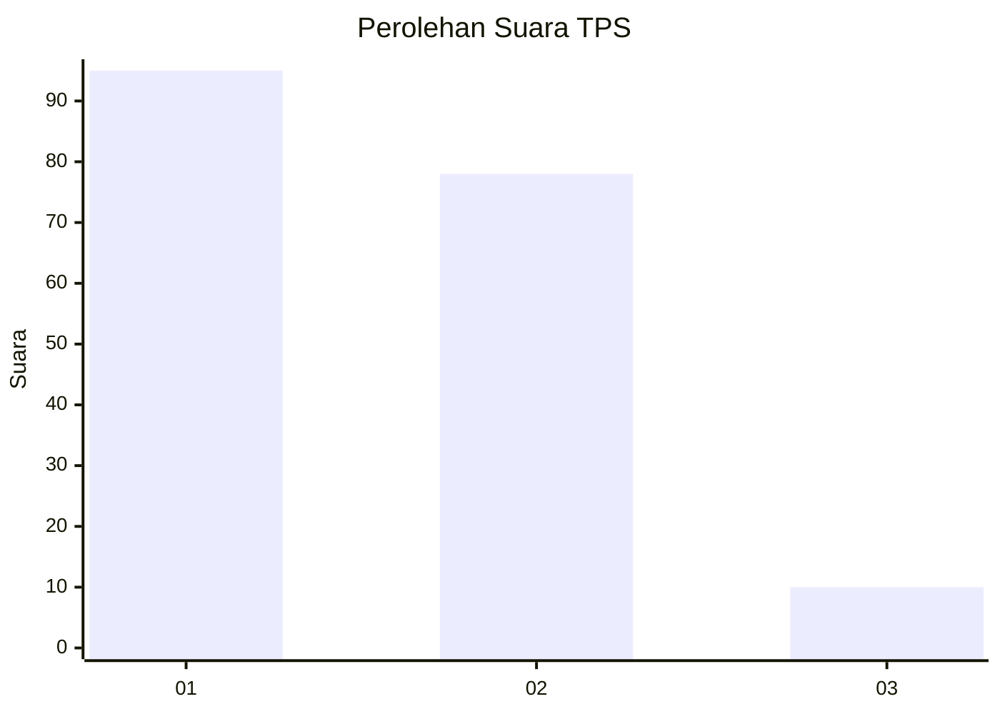
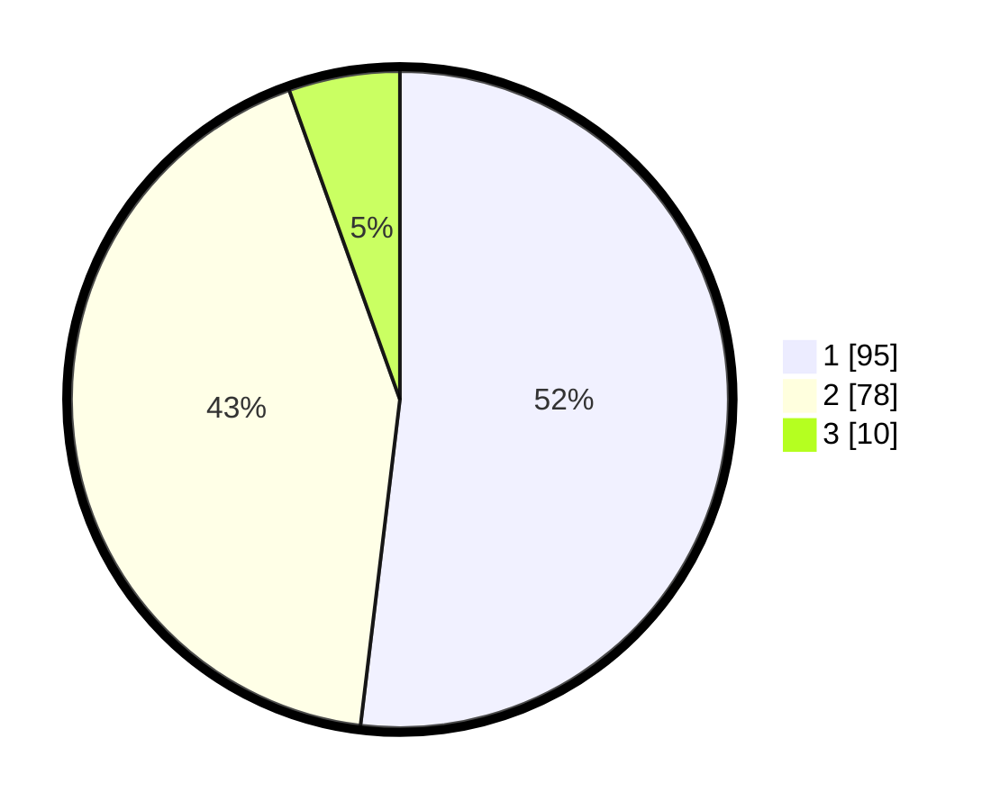

# Hasil

## Grafik

## Tabel

| No. | Nama Paslon    | Suara | Suara (raw) | Persentase |
|:--- |:-------------- | -----:| -----------:| ----------:|
| 1   | ANIES MUHAIMIN | 95    | [95][p-1]   | 51,91      |
| 2   | PRABOWO GIBRAN | 78    | [78][p-2]   | 42,62      |
| 3   | GANJAR MAHFUD  | 10    | [10][p-3]   | 5,46       |

[p-1]: https://github.com/gigit-pemilu/pemilu-2024/blob/main/pilpres/hitung-suara/sub/32-jawa-barat/sub/03-cianjur/sub/17-kadupandak/sub/2003-sukasari/sub/004-tps/sub/paslon-1.txt
[p-2]: https://github.com/gigit-pemilu/pemilu-2024/blob/main/pilpres/hitung-suara/sub/32-jawa-barat/sub/03-cianjur/sub/17-kadupandak/sub/2003-sukasari/sub/004-tps/sub/paslon-2.txt
[p-3]: https://github.com/gigit-pemilu/pemilu-2024/blob/main/pilpres/hitung-suara/sub/32-jawa-barat/sub/03-cianjur/sub/17-kadupandak/sub/2003-sukasari/sub/004-tps/sub/paslon-3.txt

## Foto C Plano

https://sirekap-obj-formc.kpu.go.id/8ae8/pemilu/ppwp/32/03/17/20/03/3203172003004-20240217-230828--0a17d8ea-8591-4b85-a8d9-7a46518ed8f7.jpg

https://sirekap-obj-formc.kpu.go.id/8ae8/pemilu/ppwp/32/03/17/20/03/3203172003004-20240217-181525--85e6bd20-4a9c-4273-b52b-21a3d2764295.jpg

https://sirekap-obj-formc.kpu.go.id/8ae8/pemilu/ppwp/32/03/17/20/03/3203172003004-20240217-181608--fcba9783-687f-4e8b-897c-6356d6b37bee.jpg

## Metadata

| Key        | Value               |
| ---------- | ------------------- |
| Time Stamp | 2024-02-19 06:16:00 |

