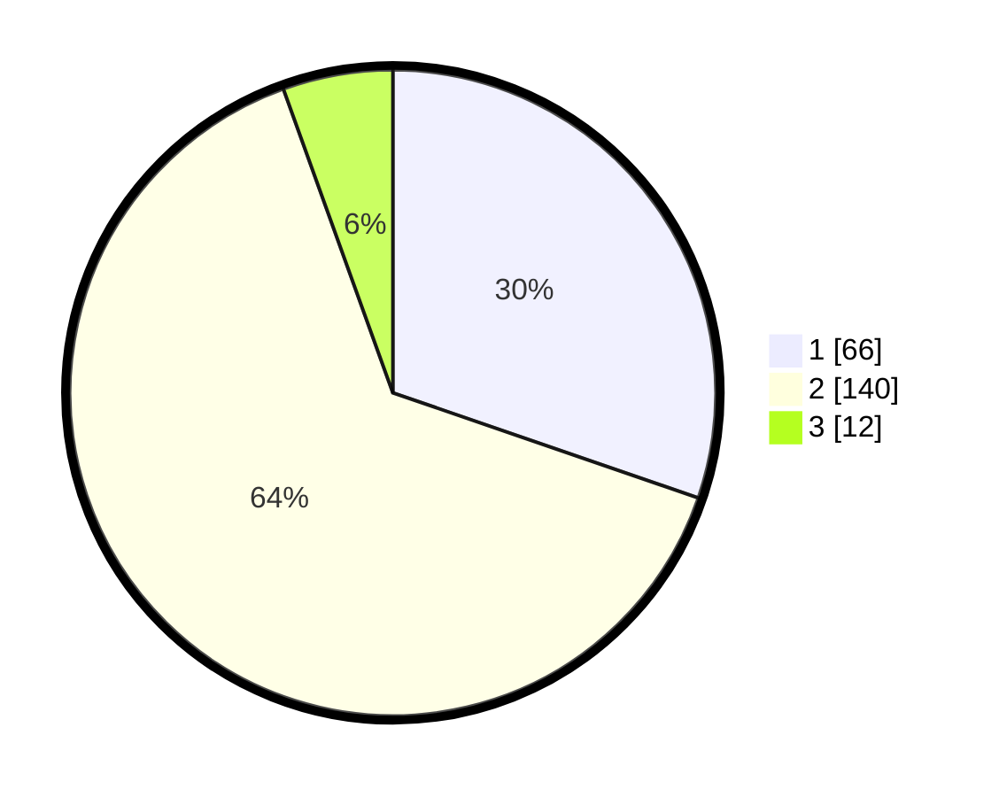

# Hasil

## Grafik

## Tabel

| No. | Nama Paslon    | Suara | Suara (raw) | Persentase |
|:--- |:-------------- | -----:| -----------:| ----------:|
| 1   | ANIES MUHAIMIN | 66    | [66][p-1]   | 30,28      |
| 2   | PRABOWO GIBRAN | 140   | [140][p-2]  | 64,22      |
| 3   | GANJAR MAHFUD  | 12    | [12][p-3]   | 5,50       |

[p-1]: https://github.com/gigit-pemilu/pemilu-2024/blob/main/pilpres/hitung-suara/sub/32-jawa-barat/sub/03-cianjur/sub/18-pagelaran/sub/2001-pagelaran/sub/005-tps/sub/paslon-1.txt
[p-2]: https://github.com/gigit-pemilu/pemilu-2024/blob/main/pilpres/hitung-suara/sub/32-jawa-barat/sub/03-cianjur/sub/18-pagelaran/sub/2001-pagelaran/sub/005-tps/sub/paslon-2.txt
[p-3]: https://github.com/gigit-pemilu/pemilu-2024/blob/main/pilpres/hitung-suara/sub/32-jawa-barat/sub/03-cianjur/sub/18-pagelaran/sub/2001-pagelaran/sub/005-tps/sub/paslon-3.txt

## Foto C Plano

https://sirekap-obj-formc.kpu.go.id/b282/pemilu/ppwp/32/03/18/20/01/3203182001005-20240218-152013--fdabc387-dd24-4296-93a6-a477e2cfdb45.jpg

https://sirekap-obj-formc.kpu.go.id/b282/pemilu/ppwp/32/03/18/20/01/3203182001005-20240218-152450--1425242a-b6dc-4ca2-81c0-1424066e8d7d.jpg

https://sirekap-obj-formc.kpu.go.id/b282/pemilu/ppwp/32/03/18/20/01/3203182001005-20240218-152621--70513c3b-bca0-4b88-a57b-bdd56d25b588.jpg

## Metadata

| Key        | Value               |
| ---------- | ------------------- |
| Time Stamp | 2024-02-19 06:16:00 |

