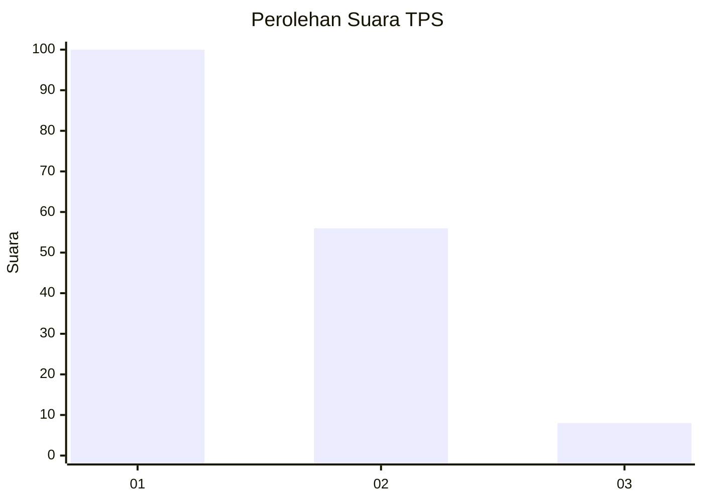
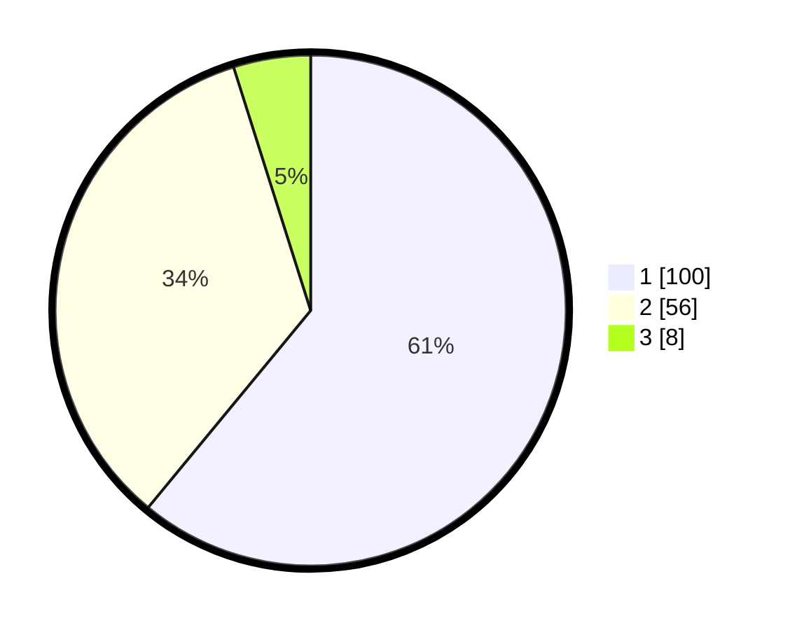

# Hasil

## Grafik

## Tabel

| No. | Nama Paslon    | Suara | Suara (raw) | Persentase |
|:--- |:-------------- | -----:| -----------:| ----------:|
| 1   | ANIES MUHAIMIN | 100   | [100][p-1]  | 60,98      |
| 2   | PRABOWO GIBRAN | 56    | [56][p-2]   | 34,15      |
| 3   | GANJAR MAHFUD  | 8     | [8][p-3]    | 4,88       |

[p-1]: https://github.com/gigit-pemilu/pemilu-2024-32-jawa-barat/blob/main/pilpres/hitung-suara/sub/32-jawa-barat/sub/03-cianjur/sub/18-pagelaran/sub/2010-situhiang/sub/005-tps/sub/paslon-1.txt
[p-2]: https://github.com/gigit-pemilu/pemilu-2024-32-jawa-barat/blob/main/pilpres/hitung-suara/sub/32-jawa-barat/sub/03-cianjur/sub/18-pagelaran/sub/2010-situhiang/sub/005-tps/sub/paslon-2.txt
[p-3]: https://github.com/gigit-pemilu/pemilu-2024-32-jawa-barat/blob/main/pilpres/hitung-suara/sub/32-jawa-barat/sub/03-cianjur/sub/18-pagelaran/sub/2010-situhiang/sub/005-tps/sub/paslon-3.txt

## Foto C Plano

https://sirekap-obj-formc.kpu.go.id/22b6/pemilu/ppwp/32/03/18/20/10/3203182010005-20240215-090013--09a45f6e-1633-4dfc-84a0-5ec2e82bb365.jpg

https://sirekap-obj-formc.kpu.go.id/22b6/pemilu/ppwp/32/03/18/20/10/3203182010005-20240215-090104--95c599e9-1fef-4c47-a3d3-3ab10ca8ef54.jpg

https://sirekap-obj-formc.kpu.go.id/22b6/pemilu/ppwp/32/03/18/20/10/3203182010005-20240215-090226--3d8eca1f-0a05-472f-94d8-009efab7c744.jpg

## Metadata

| Key        | Value               |
| ---------- | ------------------- |
| Time Stamp | 2024-02-16 21:01:00 |

