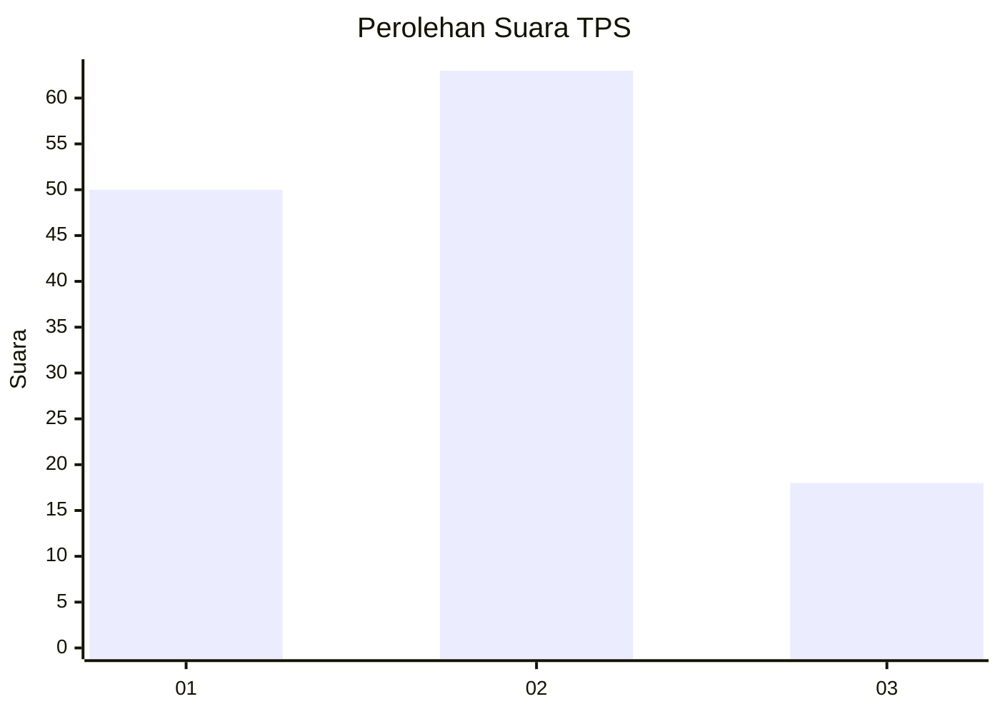
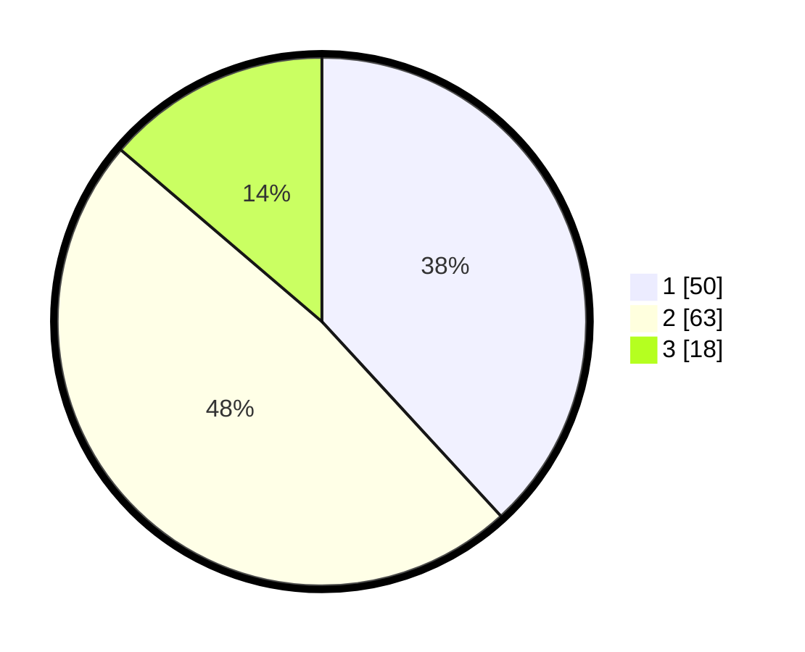

# Hasil

## Grafik

## Tabel

| No. | Nama Paslon    | Suara | Suara (raw) | Persentase |
|:--- |:-------------- | -----:| -----------:| ----------:|
| 1   | ANIES MUHAIMIN | 50    | [50][p-1]   | 38,17      |
| 2   | PRABOWO GIBRAN | 63    | [63][p-2]   | 48,09      |
| 3   | GANJAR MAHFUD  | 18    | [18][p-3]   | 13,74      |

[p-1]: https://github.com/gigit-pemilu/pemilu-2024/blob/main/pilpres/hitung-suara/sub/32-jawa-barat/sub/03-cianjur/sub/19-tanggeung/sub/2002-rawagede/sub/010-tps/sub/paslon-1.txt
[p-2]: https://github.com/gigit-pemilu/pemilu-2024/blob/main/pilpres/hitung-suara/sub/32-jawa-barat/sub/03-cianjur/sub/19-tanggeung/sub/2002-rawagede/sub/010-tps/sub/paslon-2.txt
[p-3]: https://github.com/gigit-pemilu/pemilu-2024/blob/main/pilpres/hitung-suara/sub/32-jawa-barat/sub/03-cianjur/sub/19-tanggeung/sub/2002-rawagede/sub/010-tps/sub/paslon-3.txt

## Foto C Plano

https://sirekap-obj-formc.kpu.go.id/5c4f/pemilu/ppwp/32/03/19/20/02/3203192002010-20240215-091150--a4a0128b-b973-4812-85d7-1553bf276e70.jpg

https://sirekap-obj-formc.kpu.go.id/5c4f/pemilu/ppwp/32/03/19/20/02/3203192002010-20240215-091420--628bb5bf-4bc2-4e2c-9528-5066ba37d79f.jpg

https://sirekap-obj-formc.kpu.go.id/5c4f/pemilu/ppwp/32/03/19/20/02/3203192002010-20240215-092227--72d59068-4aa4-46ec-b9c4-e5c70d1560e9.jpg

## Metadata

| Key        | Value               |
| ---------- | ------------------- |
| Time Stamp | 2024-02-25 00:00:00 |

