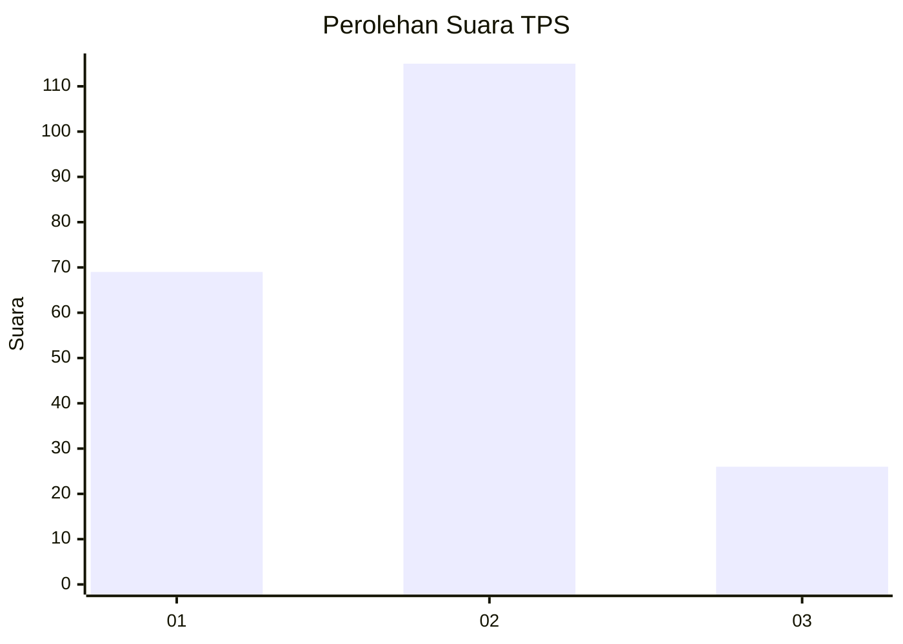
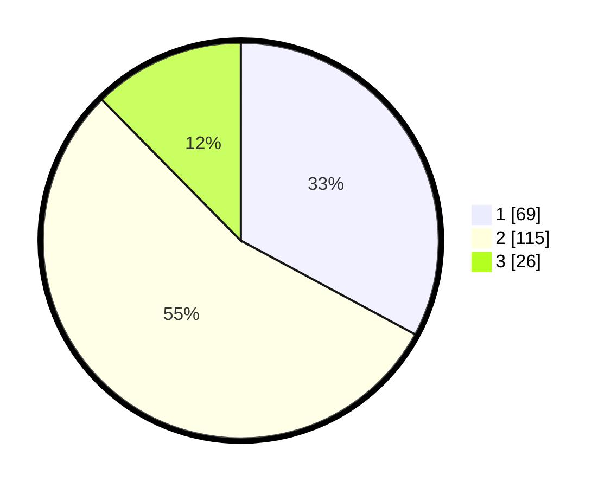

# Hasil

## Grafik

## Tabel

| No. | Nama Paslon    | Suara | Suara (raw) | Persentase |
|:--- |:-------------- | -----:| -----------:| ----------:|
| 1   | ANIES MUHAIMIN | 69    | [69][p-1]   | 32,86      |
| 2   | PRABOWO GIBRAN | 115   | [115][p-2]  | 54,76      |
| 3   | GANJAR MAHFUD  | 26    | [26][p-3]   | 12,38      |

[p-1]: https://github.com/gigit-pemilu/pemilu-2024/blob/main/pilpres/hitung-suara/sub/32-jawa-barat/sub/03-cianjur/sub/20-cibinong/sub/2001-pananggapan/sub/002-tps/sub/paslon-1.txt
[p-2]: https://github.com/gigit-pemilu/pemilu-2024/blob/main/pilpres/hitung-suara/sub/32-jawa-barat/sub/03-cianjur/sub/20-cibinong/sub/2001-pananggapan/sub/002-tps/sub/paslon-2.txt
[p-3]: https://github.com/gigit-pemilu/pemilu-2024/blob/main/pilpres/hitung-suara/sub/32-jawa-barat/sub/03-cianjur/sub/20-cibinong/sub/2001-pananggapan/sub/002-tps/sub/paslon-3.txt

## Foto C Plano

https://sirekap-obj-formc.kpu.go.id/b14b/pemilu/ppwp/32/03/20/20/01/3203202001002-20240215-092714--d0e9c278-2514-4b01-8be9-f844a6737a81.jpg

https://sirekap-obj-formc.kpu.go.id/b14b/pemilu/ppwp/32/03/20/20/01/3203202001002-20240215-092954--f2deda42-a8dd-46fd-9cd9-9ccaf82ebf93.jpg

https://sirekap-obj-formc.kpu.go.id/b14b/pemilu/ppwp/32/03/20/20/01/3203202001002-20240215-093123--32daa955-bfd0-4780-a994-a1844a06542b.jpg

## Metadata

| Key        | Value               |
| ---------- | ------------------- |
| Time Stamp | 2024-02-16 13:30:32 |

