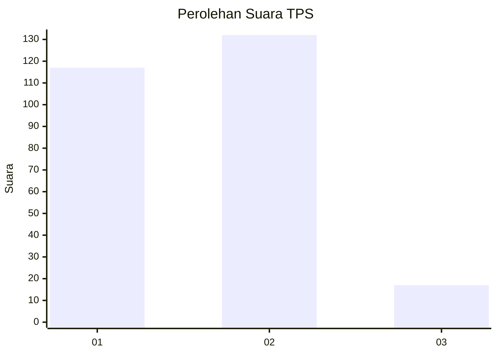
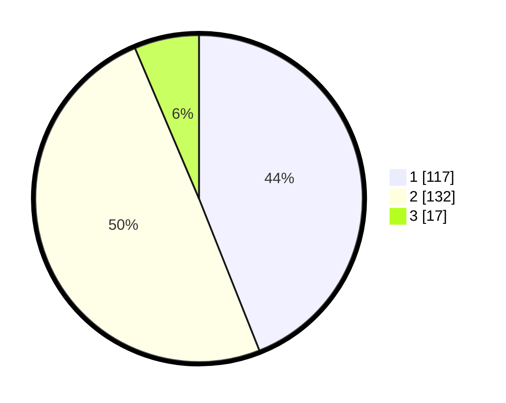

# Hasil

## Grafik

## Tabel

| No. | Nama Paslon    | Suara | Suara (raw) | Persentase |
|:--- |:-------------- | -----:| -----------:| ----------:|
| 1   | ANIES MUHAIMIN | 117   | [117][p-1]  | 43,98      |
| 2   | PRABOWO GIBRAN | 132   | [132][p-2]  | 49,62      |
| 3   | GANJAR MAHFUD  | 17    | [17][p-3]   | 6,39       |

[p-1]: https://github.com/gigit-pemilu/pemilu-2024/blob/main/pilpres/hitung-suara/sub/32-jawa-barat/sub/03-cianjur/sub/20-cibinong/sub/2002-cikangkareng/sub/014-tps/sub/paslon-1.txt
[p-2]: https://github.com/gigit-pemilu/pemilu-2024/blob/main/pilpres/hitung-suara/sub/32-jawa-barat/sub/03-cianjur/sub/20-cibinong/sub/2002-cikangkareng/sub/014-tps/sub/paslon-2.txt
[p-3]: https://github.com/gigit-pemilu/pemilu-2024/blob/main/pilpres/hitung-suara/sub/32-jawa-barat/sub/03-cianjur/sub/20-cibinong/sub/2002-cikangkareng/sub/014-tps/sub/paslon-3.txt

## Foto C Plano

https://sirekap-obj-formc.kpu.go.id/3422/pemilu/ppwp/32/03/20/20/02/3203202002014-20240215-172842--65485ecc-c942-48ac-b7ad-1342043e1f50.jpg

https://sirekap-obj-formc.kpu.go.id/3422/pemilu/ppwp/32/03/20/20/02/3203202002014-20240215-173001--9a3e4df0-73b9-4fa1-80a7-7fee87324bcb.jpg

https://sirekap-obj-formc.kpu.go.id/3422/pemilu/ppwp/32/03/20/20/02/3203202002014-20240215-154440--858cf75a-ea74-4300-a4c7-db2f8e1a447c.jpg

## Metadata

| Key        | Value               |
| ---------- | ------------------- |
| Time Stamp | 2024-02-24 22:31:28 |

