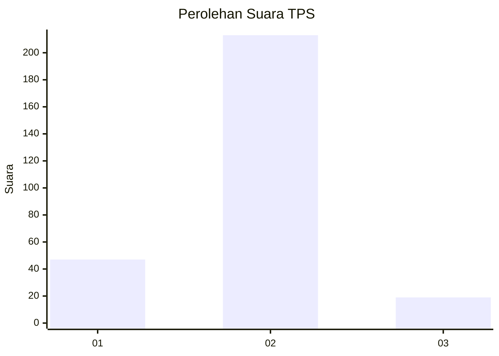
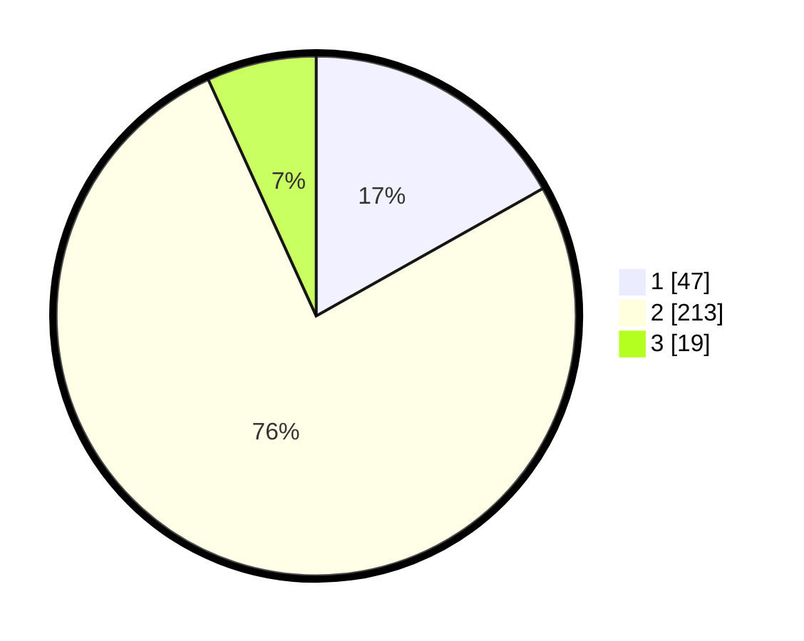

# Hasil

## Grafik

## Tabel

| No. | Nama Paslon    | Suara | Suara (raw) | Persentase |
|:--- |:-------------- | -----:| -----------:| ----------:|
| 1   | ANIES MUHAIMIN | 47    | [47][p-1]   | 16,85      |
| 2   | PRABOWO GIBRAN | 213   | [213][p-2]  | 76,34      |
| 3   | GANJAR MAHFUD  | 19    | [19][p-3]   | 6,81       |

[p-1]: https://github.com/gigit-pemilu/pemilu-2024-32-jawa-barat/blob/main/pilpres/hitung-suara/sub/32-jawa-barat/sub/03-cianjur/sub/20-cibinong/sub/2013-mekarmukti/sub/006-tps/sub/paslon-1.txt
[p-2]: https://github.com/gigit-pemilu/pemilu-2024-32-jawa-barat/blob/main/pilpres/hitung-suara/sub/32-jawa-barat/sub/03-cianjur/sub/20-cibinong/sub/2013-mekarmukti/sub/006-tps/sub/paslon-2.txt
[p-3]: https://github.com/gigit-pemilu/pemilu-2024-32-jawa-barat/blob/main/pilpres/hitung-suara/sub/32-jawa-barat/sub/03-cianjur/sub/20-cibinong/sub/2013-mekarmukti/sub/006-tps/sub/paslon-3.txt

## Foto C Plano

https://sirekap-obj-formc.kpu.go.id/32e1/pemilu/ppwp/32/03/20/20/13/3203202013006-20240215-192548--4e54345c-9f7a-4ea9-8c55-5fa3bcc89c09.jpg

https://sirekap-obj-formc.kpu.go.id/32e1/pemilu/ppwp/32/03/20/20/13/3203202013006-20240215-191940--1352914e-3980-4605-8ded-a53b2b22c695.jpg

https://sirekap-obj-formc.kpu.go.id/32e1/pemilu/ppwp/32/03/20/20/13/3203202013006-20240215-192041--bf8199bd-b685-4ad4-80a0-73ea190e021c.jpg

## Metadata

| Key        | Value               |
| ---------- | ------------------- |
| Time Stamp | 2024-02-25 16:00:00 |

