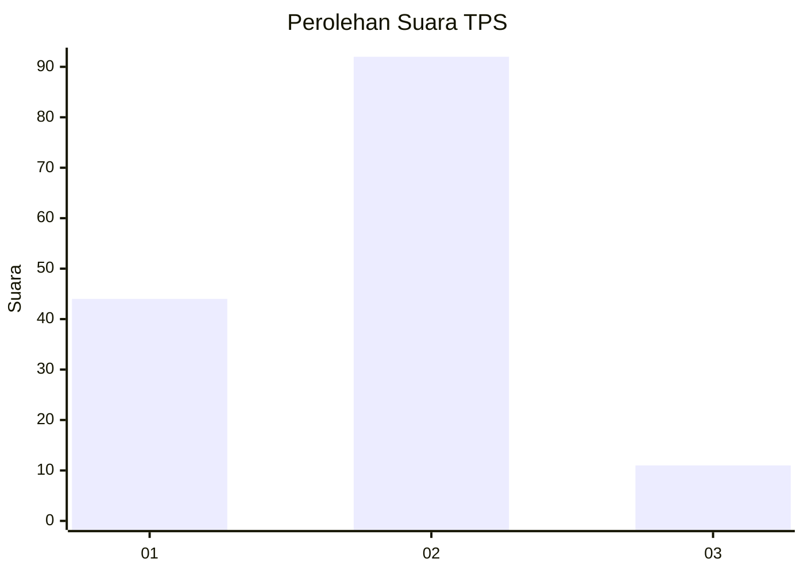
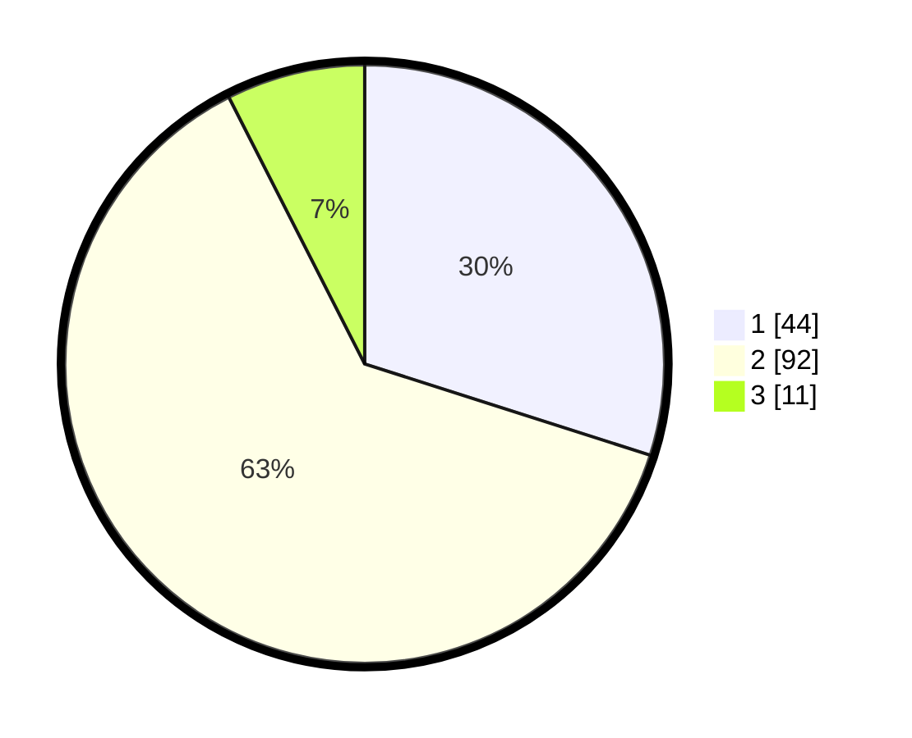

# Hasil

## Grafik

## Tabel

| No. | Nama Paslon    | Suara | Suara (raw) | Persentase |
|:--- |:-------------- | -----:| -----------:| ----------:|
| 1   | ANIES MUHAIMIN | 44    | [44][p-1]   | 29,93      |
| 2   | PRABOWO GIBRAN | 92    | [92][p-2]   | 62,59      |
| 3   | GANJAR MAHFUD  | 11    | [11][p-3]   | 7,48       |

[p-1]: https://github.com/gigit-pemilu/pemilu-2024-32-jawa-barat/blob/main/pilpres/hitung-suara/sub/32-jawa-barat/sub/03-cianjur/sub/21-sindangbarang/sub/2001-saganten/sub/005-tps/sub/paslon-1.txt
[p-2]: https://github.com/gigit-pemilu/pemilu-2024-32-jawa-barat/blob/main/pilpres/hitung-suara/sub/32-jawa-barat/sub/03-cianjur/sub/21-sindangbarang/sub/2001-saganten/sub/005-tps/sub/paslon-2.txt
[p-3]: https://github.com/gigit-pemilu/pemilu-2024-32-jawa-barat/blob/main/pilpres/hitung-suara/sub/32-jawa-barat/sub/03-cianjur/sub/21-sindangbarang/sub/2001-saganten/sub/005-tps/sub/paslon-3.txt

## Foto C Plano

https://sirekap-obj-formc.kpu.go.id/0c3b/pemilu/ppwp/32/03/21/20/01/3203212001005-20240215-131216--4a8e3b07-f8ae-4abc-b3b3-40846afeb146.jpg

https://sirekap-obj-formc.kpu.go.id/0c3b/pemilu/ppwp/32/03/21/20/01/3203212001005-20240215-130751--11d2c315-7066-44fc-8a36-2ec7301c02bc.jpg

https://sirekap-obj-formc.kpu.go.id/0c3b/pemilu/ppwp/32/03/21/20/01/3203212001005-20240215-161527--951e9365-b340-4691-a434-3ec838306173.jpg

## Metadata

| Key        | Value               |
| ---------- | ------------------- |
| Time Stamp | 2024-02-24 22:31:28 |

