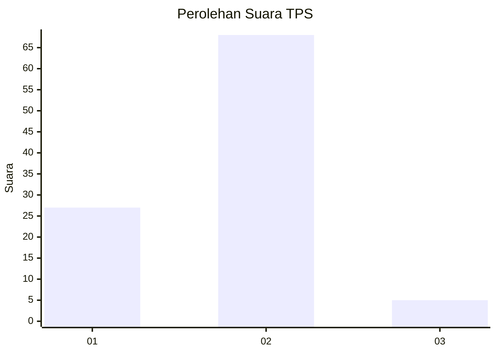
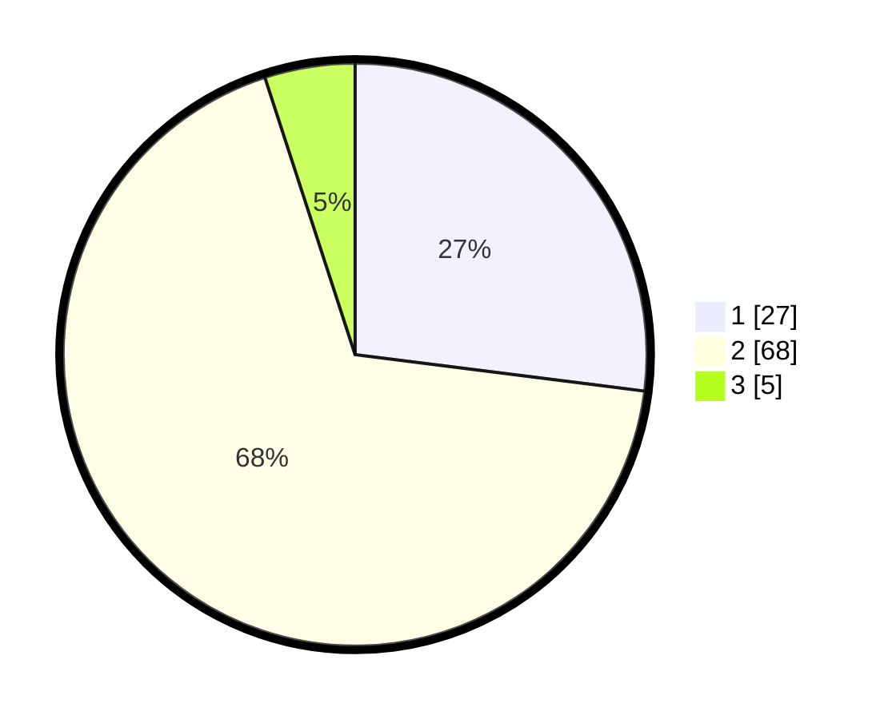

# Hasil

## Grafik

## Tabel

| No. | Nama Paslon    | Suara | Suara (raw) | Persentase |
|:--- |:-------------- | -----:| -----------:| ----------:|
| 1   | ANIES MUHAIMIN | 27    | [27][p-1]   | 27,00      |
| 2   | PRABOWO GIBRAN | 68    | [68][p-2]   | 68,00      |
| 3   | GANJAR MAHFUD  | 5     | [5][p-3]    | 5,00       |

[p-1]: https://github.com/gigit-pemilu/pemilu-2024/blob/main/pilpres/hitung-suara/sub/32-jawa-barat/sub/03-cianjur/sub/21-sindangbarang/sub/2011-kertamukti/sub/004-tps/sub/paslon-1.txt
[p-2]: https://github.com/gigit-pemilu/pemilu-2024/blob/main/pilpres/hitung-suara/sub/32-jawa-barat/sub/03-cianjur/sub/21-sindangbarang/sub/2011-kertamukti/sub/004-tps/sub/paslon-2.txt
[p-3]: https://github.com/gigit-pemilu/pemilu-2024/blob/main/pilpres/hitung-suara/sub/32-jawa-barat/sub/03-cianjur/sub/21-sindangbarang/sub/2011-kertamukti/sub/004-tps/sub/paslon-3.txt

## Foto C Plano

https://sirekap-obj-formc.kpu.go.id/73d2/pemilu/ppwp/32/03/21/20/11/3203212011004-20240214-200933--2e1094eb-24ff-48da-9056-ec3d0597cbf5.jpg

https://sirekap-obj-formc.kpu.go.id/73d2/pemilu/ppwp/32/03/21/20/11/3203212011004-20240214-204229--b7992439-1a67-4ab0-ade8-78d8b1442680.jpg

https://sirekap-obj-formc.kpu.go.id/73d2/pemilu/ppwp/32/03/21/20/11/3203212011004-20240214-201854--98e12de5-db8e-475a-9e3a-5fe0044e1132.jpg

## Metadata

| Key        | Value               |
| ---------- | ------------------- |
| Time Stamp | 2024-02-16 21:01:00 |

