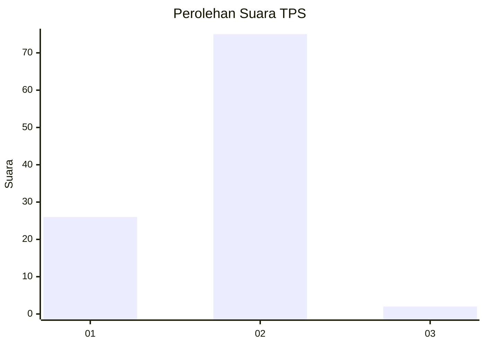
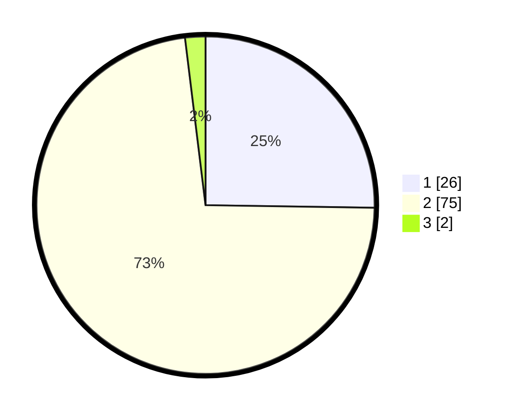

# Hasil

## Grafik

## Tabel

| No. | Nama Paslon    | Suara | Suara (raw) | Persentase |
|:--- |:-------------- | -----:| -----------:| ----------:|
| 1   | ANIES MUHAIMIN | 26    | [26][p-1]   | 25,24      |
| 2   | PRABOWO GIBRAN | 75    | [75][p-2]   | 72,82      |
| 3   | GANJAR MAHFUD  | 2     | [2][p-3]    | 1,94       |

[p-1]: https://github.com/gigit-pemilu/pemilu-2024/blob/main/pilpres/hitung-suara/sub/32-jawa-barat/sub/03-cianjur/sub/21-sindangbarang/sub/2011-kertamukti/sub/008-tps/sub/paslon-1.txt
[p-2]: https://github.com/gigit-pemilu/pemilu-2024/blob/main/pilpres/hitung-suara/sub/32-jawa-barat/sub/03-cianjur/sub/21-sindangbarang/sub/2011-kertamukti/sub/008-tps/sub/paslon-2.txt
[p-3]: https://github.com/gigit-pemilu/pemilu-2024/blob/main/pilpres/hitung-suara/sub/32-jawa-barat/sub/03-cianjur/sub/21-sindangbarang/sub/2011-kertamukti/sub/008-tps/sub/paslon-3.txt

## Foto C Plano

https://sirekap-obj-formc.kpu.go.id/0d3e/pemilu/ppwp/32/03/21/20/11/3203212011008-20240214-231556--fe4237b9-9056-4609-850f-446b55888c59.jpg

https://sirekap-obj-formc.kpu.go.id/0d3e/pemilu/ppwp/32/03/21/20/11/3203212011008-20240214-225013--3477e1cb-4d72-4f0c-85cc-c20cafc65ec3.jpg

https://sirekap-obj-formc.kpu.go.id/0d3e/pemilu/ppwp/32/03/21/20/11/3203212011008-20240214-224014--65ac0016-8baf-4119-8e84-79b9e3351c69.jpg

## Metadata

| Key        | Value               |
| ---------- | ------------------- |
| Time Stamp | 2024-02-24 22:31:28 |

