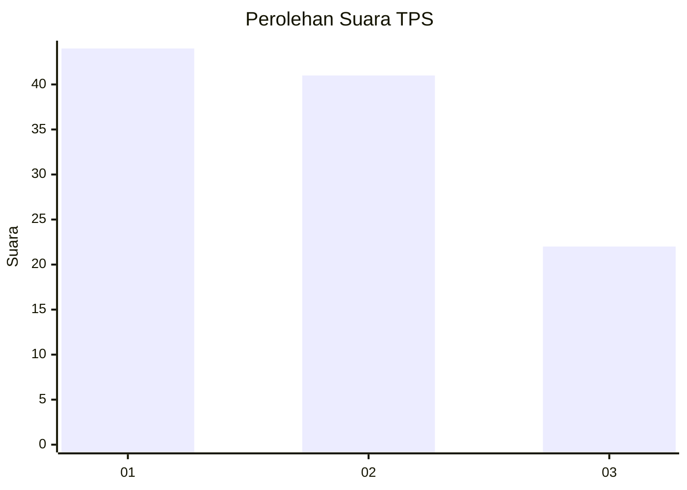
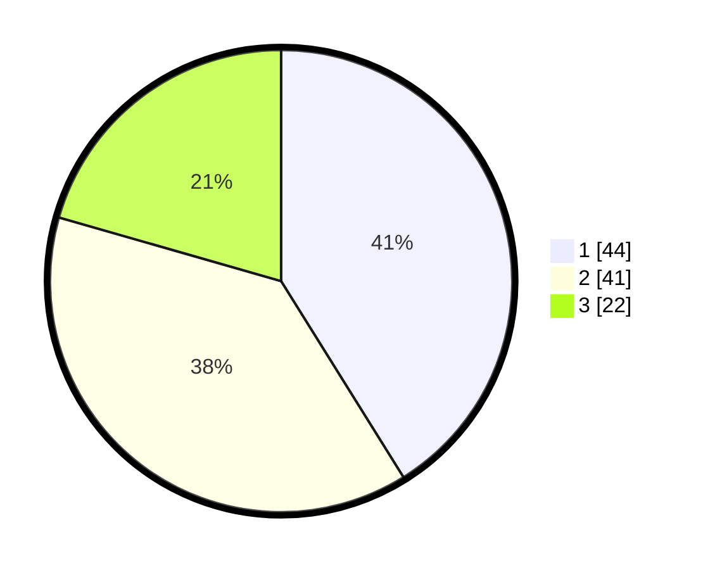

# Hasil

## Grafik

## Tabel

| No. | Nama Paslon    | Suara | Suara (raw) | Persentase |
|:--- |:-------------- | -----:| -----------:| ----------:|
| 1   | ANIES MUHAIMIN | 44    | [44][p-1]   | 41,12      |
| 2   | PRABOWO GIBRAN | 41    | [41][p-2]   | 38,32      |
| 3   | GANJAR MAHFUD  | 22    | [22][p-3]   | 20,56      |

[p-1]: https://github.com/gigit-pemilu/pemilu-2024-32-jawa-barat/blob/main/pilpres/hitung-suara/sub/32-jawa-barat/sub/03-cianjur/sub/22-agrabinta/sub/2019-mekarsari/sub/013-tps/sub/paslon-1.txt
[p-2]: https://github.com/gigit-pemilu/pemilu-2024-32-jawa-barat/blob/main/pilpres/hitung-suara/sub/32-jawa-barat/sub/03-cianjur/sub/22-agrabinta/sub/2019-mekarsari/sub/013-tps/sub/paslon-2.txt
[p-3]: https://github.com/gigit-pemilu/pemilu-2024-32-jawa-barat/blob/main/pilpres/hitung-suara/sub/32-jawa-barat/sub/03-cianjur/sub/22-agrabinta/sub/2019-mekarsari/sub/013-tps/sub/paslon-3.txt

## Foto C Plano

https://sirekap-obj-formc.kpu.go.id/53eb/pemilu/ppwp/32/03/22/20/19/3203222019013-20240215-075955--653849bf-ac4c-4840-b9cd-f72f0e0f1df9.jpg

https://sirekap-obj-formc.kpu.go.id/53eb/pemilu/ppwp/32/03/22/20/19/3203222019013-20240215-080122--49aff5c5-fd7f-4071-9ff2-c8f8b6736983.jpg

https://sirekap-obj-formc.kpu.go.id/53eb/pemilu/ppwp/32/03/22/20/19/3203222019013-20240215-080251--b04a51a8-c489-4a79-ba05-adc01d1392bd.jpg

## Metadata

| Key        | Value               |
| ---------- | ------------------- |
| Time Stamp | 2024-02-24 22:31:28 |

