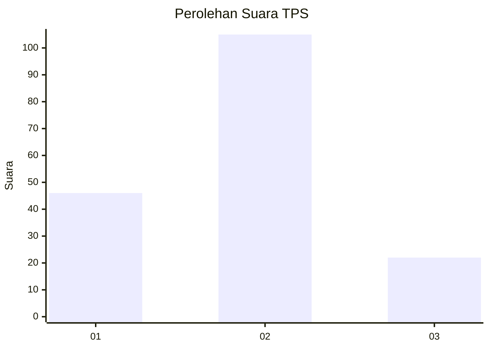
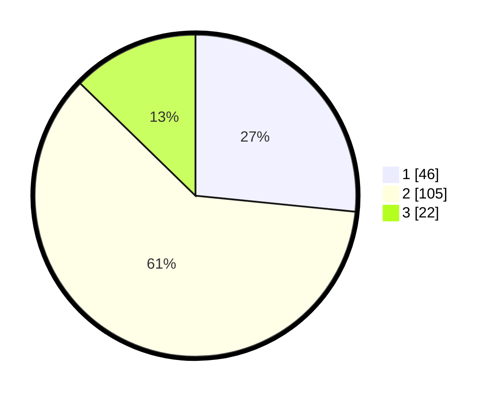

# Hasil

## Grafik

## Tabel

| No. | Nama Paslon    | Suara | Suara (raw) | Persentase |
|:--- |:-------------- | -----:| -----------:| ----------:|
| 1   | ANIES MUHAIMIN | 46    | [46][p-1]   | 26,59      |
| 2   | PRABOWO GIBRAN | 105   | [105][p-2]  | 60,69      |
| 3   | GANJAR MAHFUD  | 22    | [22][p-3]   | 12,72      |

[p-1]: https://github.com/gigit-pemilu/pemilu-2024/blob/main/pilpres/hitung-suara/sub/32-jawa-barat/sub/03-cianjur/sub/23-cidaun/sub/2001-cidamar/sub/002-tps/sub/paslon-1.txt
[p-2]: https://github.com/gigit-pemilu/pemilu-2024/blob/main/pilpres/hitung-suara/sub/32-jawa-barat/sub/03-cianjur/sub/23-cidaun/sub/2001-cidamar/sub/002-tps/sub/paslon-2.txt
[p-3]: https://github.com/gigit-pemilu/pemilu-2024/blob/main/pilpres/hitung-suara/sub/32-jawa-barat/sub/03-cianjur/sub/23-cidaun/sub/2001-cidamar/sub/002-tps/sub/paslon-3.txt

## Foto C Plano

https://sirekap-obj-formc.kpu.go.id/78b3/pemilu/ppwp/32/03/23/20/01/3203232001002-20240215-062846--dcacb31b-78a8-4535-85bd-45e1a13901ab.jpg

https://sirekap-obj-formc.kpu.go.id/78b3/pemilu/ppwp/32/03/23/20/01/3203232001002-20240215-062907--a769eb95-c083-4ff2-8405-548fc016233b.jpg

https://sirekap-obj-formc.kpu.go.id/78b3/pemilu/ppwp/32/03/23/20/01/3203232001002-20240215-062929--38e8b9b2-7031-45a0-a46c-caf78a96f2b4.jpg

## Metadata

| Key        | Value               |
| ---------- | ------------------- |
| Time Stamp | 2024-02-16 13:30:32 |

