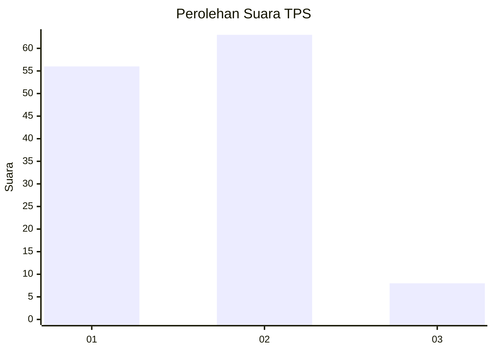
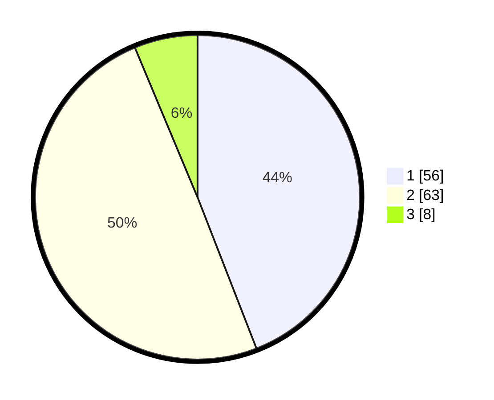

# Hasil

## Grafik

## Tabel

| No. | Nama Paslon    | Suara | Suara (raw) | Persentase |
|:--- |:-------------- | -----:| -----------:| ----------:|
| 1   | ANIES MUHAIMIN | 56    | [56][p-1]   | 44,09      |
| 2   | PRABOWO GIBRAN | 63    | [63][p-2]   | 49,61      |
| 3   | GANJAR MAHFUD  | 8     | [8][p-3]    | 6,30       |

[p-1]: https://github.com/gigit-pemilu/pemilu-2024-32-jawa-barat/blob/main/pilpres/hitung-suara/sub/32-jawa-barat/sub/03-cianjur/sub/23-cidaun/sub/2001-cidamar/sub/007-tps/sub/paslon-1.txt
[p-2]: https://github.com/gigit-pemilu/pemilu-2024-32-jawa-barat/blob/main/pilpres/hitung-suara/sub/32-jawa-barat/sub/03-cianjur/sub/23-cidaun/sub/2001-cidamar/sub/007-tps/sub/paslon-2.txt
[p-3]: https://github.com/gigit-pemilu/pemilu-2024-32-jawa-barat/blob/main/pilpres/hitung-suara/sub/32-jawa-barat/sub/03-cianjur/sub/23-cidaun/sub/2001-cidamar/sub/007-tps/sub/paslon-3.txt

## Foto C Plano

https://sirekap-obj-formc.kpu.go.id/9001/pemilu/ppwp/32/03/23/20/01/3203232001007-20240215-143852--93c1a134-838b-4c26-ad29-754d056af482.jpg

https://sirekap-obj-formc.kpu.go.id/9001/pemilu/ppwp/32/03/23/20/01/3203232001007-20240215-144430--655bf195-42b9-4113-ac50-6f1ee4870811.jpg

https://sirekap-obj-formc.kpu.go.id/9001/pemilu/ppwp/32/03/23/20/01/3203232001007-20240215-153434--5e0e7171-a88e-4609-9e03-a616c080f67e.jpg

## Metadata

| Key        | Value               |
| ---------- | ------------------- |
| Time Stamp | 2024-02-16 13:30:32 |

