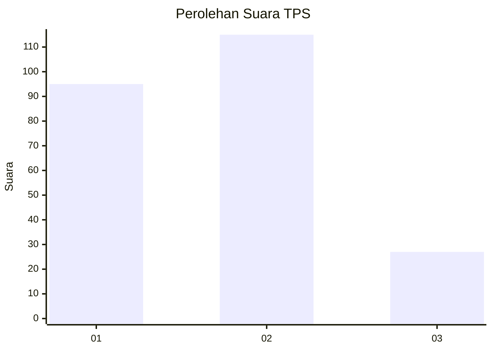
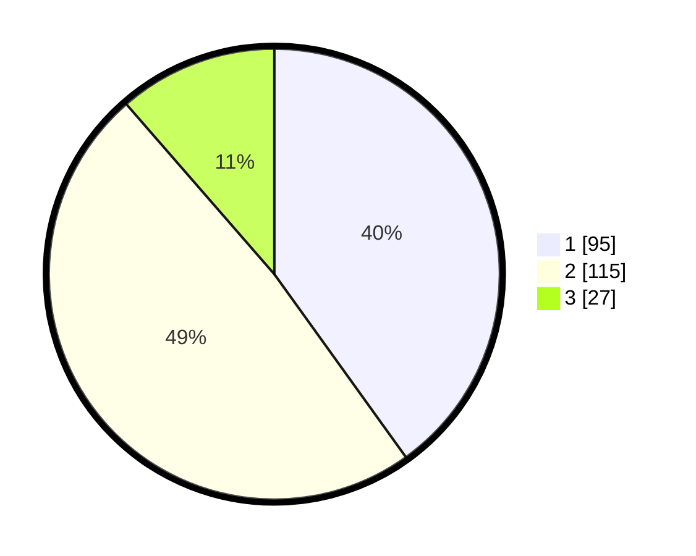

# Hasil

## Grafik

## Tabel

| No. | Nama Paslon    | Suara | Suara (raw) | Persentase |
|:--- |:-------------- | -----:| -----------:| ----------:|
| 1   | ANIES MUHAIMIN | 95    | [95][p-1]   | 40,08      |
| 2   | PRABOWO GIBRAN | 115   | [115][p-2]  | 48,52      |
| 3   | GANJAR MAHFUD  | 27    | [27][p-3]   | 11,39      |

[p-1]: https://github.com/gigit-pemilu/pemilu-2024/blob/main/pilpres/hitung-suara/sub/32-jawa-barat/sub/03-cianjur/sub/23-cidaun/sub/2001-cidamar/sub/012-tps/sub/paslon-1.txt
[p-2]: https://github.com/gigit-pemilu/pemilu-2024/blob/main/pilpres/hitung-suara/sub/32-jawa-barat/sub/03-cianjur/sub/23-cidaun/sub/2001-cidamar/sub/012-tps/sub/paslon-2.txt
[p-3]: https://github.com/gigit-pemilu/pemilu-2024/blob/main/pilpres/hitung-suara/sub/32-jawa-barat/sub/03-cianjur/sub/23-cidaun/sub/2001-cidamar/sub/012-tps/sub/paslon-3.txt

## Foto C Plano

https://sirekap-obj-formc.kpu.go.id/bba6/pemilu/ppwp/32/03/23/20/01/3203232001012-20240215-135829--89ef3330-e03e-445f-9717-ad4d65405a48.jpg

https://sirekap-obj-formc.kpu.go.id/bba6/pemilu/ppwp/32/03/23/20/01/3203232001012-20240215-135907--ead8f12c-e376-4b5f-8068-305370aa2f9b.jpg

https://sirekap-obj-formc.kpu.go.id/bba6/pemilu/ppwp/32/03/23/20/01/3203232001012-20240215-135930--55fd0f5a-7dab-4a1a-b3e0-76638c4f49fa.jpg

## Metadata

| Key        | Value               |
| ---------- | ------------------- |
| Time Stamp | 2024-02-16 14:00:34 |

