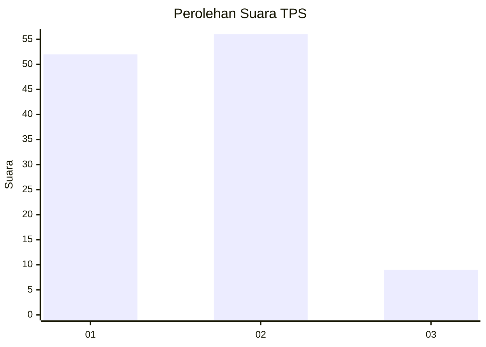
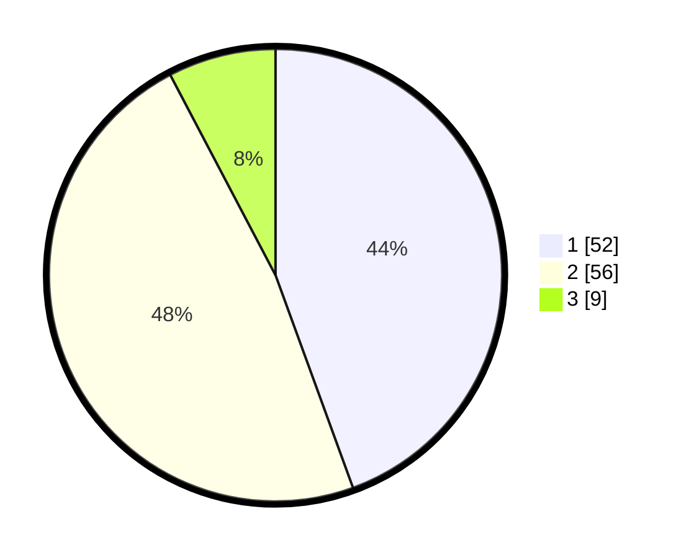

# Hasil

## Grafik

## Tabel

| No. | Nama Paslon    | Suara | Suara (raw) | Persentase |
|:--- |:-------------- | -----:| -----------:| ----------:|
| 1   | ANIES MUHAIMIN | 52    | [52][p-1]   | 44,44      |
| 2   | PRABOWO GIBRAN | 56    | [56][p-2]   | 47,86      |
| 3   | GANJAR MAHFUD  | 9     | [9][p-3]    | 7,69       |

[p-1]: https://github.com/gigit-pemilu/pemilu-2024/blob/main/pilpres/hitung-suara/sub/32-jawa-barat/sub/03-cianjur/sub/23-cidaun/sub/2003-cisalak/sub/014-tps/sub/paslon-1.txt
[p-2]: https://github.com/gigit-pemilu/pemilu-2024/blob/main/pilpres/hitung-suara/sub/32-jawa-barat/sub/03-cianjur/sub/23-cidaun/sub/2003-cisalak/sub/014-tps/sub/paslon-2.txt
[p-3]: https://github.com/gigit-pemilu/pemilu-2024/blob/main/pilpres/hitung-suara/sub/32-jawa-barat/sub/03-cianjur/sub/23-cidaun/sub/2003-cisalak/sub/014-tps/sub/paslon-3.txt

## Foto C Plano

https://sirekap-obj-formc.kpu.go.id/dbf1/pemilu/ppwp/32/03/23/20/03/3203232003014-20240215-120839--f0e43068-50ec-481a-b319-b1d9ad6394a7.jpg

https://sirekap-obj-formc.kpu.go.id/dbf1/pemilu/ppwp/32/03/23/20/03/3203232003014-20240215-121111--a5c45c2c-be1b-447e-b5d4-4da4aa5f9f9d.jpg

https://sirekap-obj-formc.kpu.go.id/dbf1/pemilu/ppwp/32/03/23/20/03/3203232003014-20240215-152829--4e32cdb5-8233-4fa0-bd43-b9b6e377d833.jpg

## Metadata

| Key        | Value               |
| ---------- | ------------------- |
| Time Stamp | 2024-02-16 21:01:00 |

