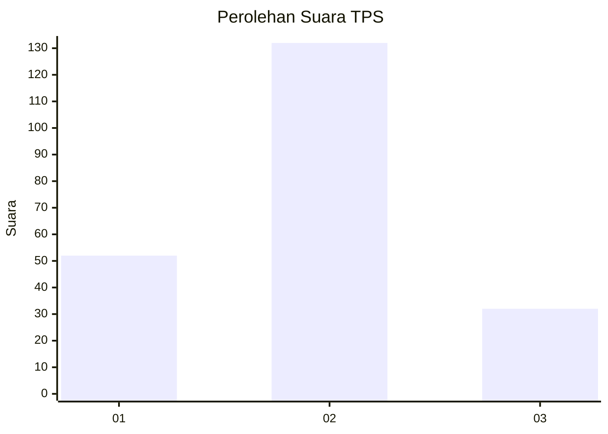
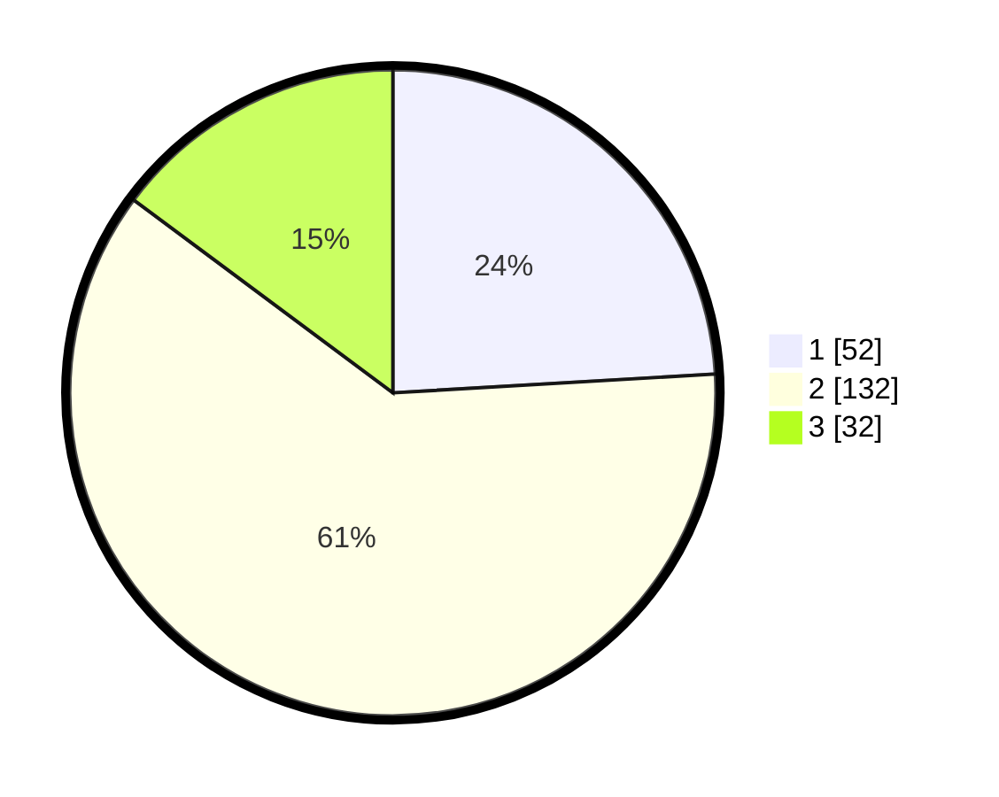

# Hasil

## Grafik

## Tabel

| No. | Nama Paslon    | Suara | Suara (raw) | Persentase |
|:--- |:-------------- | -----:| -----------:| ----------:|
| 1   | ANIES MUHAIMIN | 52    | [52][p-1]   | 24,07      |
| 2   | PRABOWO GIBRAN | 132   | [132][p-2]  | 61,11      |
| 3   | GANJAR MAHFUD  | 32    | [32][p-3]   | 14,81      |

[p-1]: https://github.com/gigit-pemilu/pemilu-2024/blob/main/pilpres/hitung-suara/sub/32-jawa-barat/sub/03-cianjur/sub/24-naringgul/sub/2001-naringgul/sub/001-tps/sub/paslon-1.txt
[p-2]: https://github.com/gigit-pemilu/pemilu-2024/blob/main/pilpres/hitung-suara/sub/32-jawa-barat/sub/03-cianjur/sub/24-naringgul/sub/2001-naringgul/sub/001-tps/sub/paslon-2.txt
[p-3]: https://github.com/gigit-pemilu/pemilu-2024/blob/main/pilpres/hitung-suara/sub/32-jawa-barat/sub/03-cianjur/sub/24-naringgul/sub/2001-naringgul/sub/001-tps/sub/paslon-3.txt

## Foto C Plano

https://sirekap-obj-formc.kpu.go.id/5dfb/pemilu/ppwp/32/03/24/20/01/3203242001001-20240214-195431--4d844cc1-e8c2-4af6-8f52-e939f9044a8c.jpg

https://sirekap-obj-formc.kpu.go.id/5dfb/pemilu/ppwp/32/03/24/20/01/3203242001001-20240214-195453--3f5828d5-bdd7-4dbd-863f-c2da56adf927.jpg

https://sirekap-obj-formc.kpu.go.id/5dfb/pemilu/ppwp/32/03/24/20/01/3203242001001-20240214-211403--41c7ddfc-8712-434f-8b59-beac3a5162e0.jpg

## Metadata

| Key        | Value               |
| ---------- | ------------------- |
| Time Stamp | 2024-02-14 21:46:01 |

