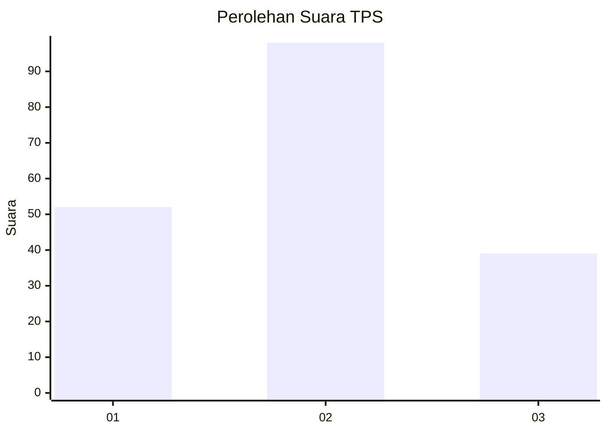
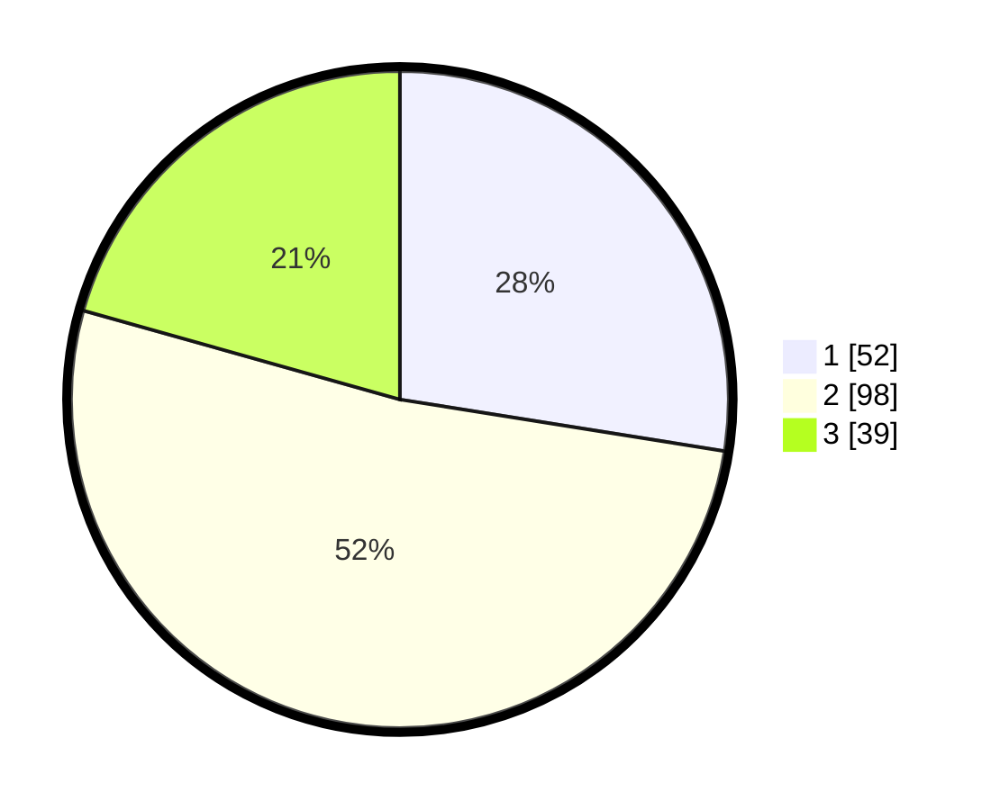

# Hasil

## Grafik

## Tabel

| No. | Nama Paslon    | Suara | Suara (raw) | Persentase |
|:--- |:-------------- | -----:| -----------:| ----------:|
| 1   | ANIES MUHAIMIN | 52    | [52][p-1]   | 27,51      |
| 2   | PRABOWO GIBRAN | 98    | [98][p-2]   | 51,85      |
| 3   | GANJAR MAHFUD  | 39    | [39][p-3]   | 20,63      |

[p-1]: https://github.com/gigit-pemilu/pemilu-2024-32-jawa-barat/blob/main/pilpres/hitung-suara/sub/32-jawa-barat/sub/03-cianjur/sub/24-naringgul/sub/2001-naringgul/sub/002-tps/sub/paslon-1.txt
[p-2]: https://github.com/gigit-pemilu/pemilu-2024-32-jawa-barat/blob/main/pilpres/hitung-suara/sub/32-jawa-barat/sub/03-cianjur/sub/24-naringgul/sub/2001-naringgul/sub/002-tps/sub/paslon-2.txt
[p-3]: https://github.com/gigit-pemilu/pemilu-2024-32-jawa-barat/blob/main/pilpres/hitung-suara/sub/32-jawa-barat/sub/03-cianjur/sub/24-naringgul/sub/2001-naringgul/sub/002-tps/sub/paslon-3.txt

## Foto C Plano

https://sirekap-obj-formc.kpu.go.id/5206/pemilu/ppwp/32/03/24/20/01/3203242001002-20240214-155758--d062d1b8-ee51-4cbd-9b34-d2b6ca74064c.jpg

https://sirekap-obj-formc.kpu.go.id/5206/pemilu/ppwp/32/03/24/20/01/3203242001002-20240214-160119--a6d2d4f4-0c69-4d93-806a-7c5cac65ccd3.jpg

https://sirekap-obj-formc.kpu.go.id/5206/pemilu/ppwp/32/03/24/20/01/3203242001002-20240214-160112--815e5ae0-03e7-45d7-8f73-aebe3f8f6add.jpg

## Metadata

| Key        | Value               |
| ---------- | ------------------- |
| Time Stamp | 2024-02-16 14:00:34 |

