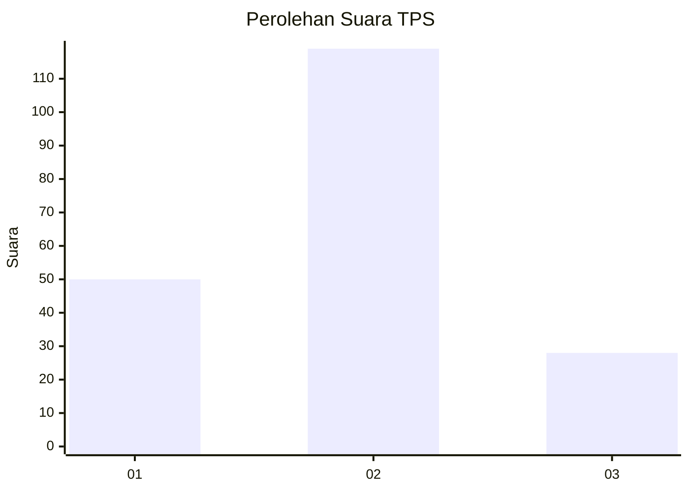
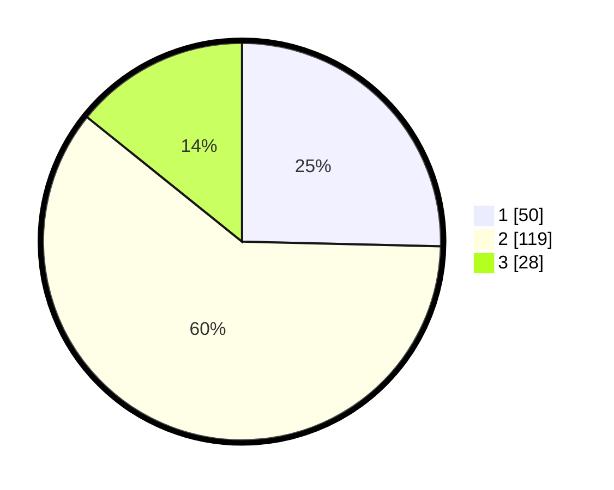

# Hasil

## Grafik

## Tabel

| No. | Nama Paslon    | Suara | Suara (raw) | Persentase |
|:--- |:-------------- | -----:| -----------:| ----------:|
| 1   | ANIES MUHAIMIN | 50    | [50][p-1]   | 25,38      |
| 2   | PRABOWO GIBRAN | 119   | [119][p-2]  | 60,41      |
| 3   | GANJAR MAHFUD  | 28    | [28][p-3]   | 14,21      |

[p-1]: https://github.com/gigit-pemilu/pemilu-2024/blob/main/pilpres/hitung-suara/sub/32-jawa-barat/sub/03-cianjur/sub/24-naringgul/sub/2001-naringgul/sub/003-tps/sub/paslon-1.txt
[p-2]: https://github.com/gigit-pemilu/pemilu-2024/blob/main/pilpres/hitung-suara/sub/32-jawa-barat/sub/03-cianjur/sub/24-naringgul/sub/2001-naringgul/sub/003-tps/sub/paslon-2.txt
[p-3]: https://github.com/gigit-pemilu/pemilu-2024/blob/main/pilpres/hitung-suara/sub/32-jawa-barat/sub/03-cianjur/sub/24-naringgul/sub/2001-naringgul/sub/003-tps/sub/paslon-3.txt

## Foto C Plano

https://sirekap-obj-formc.kpu.go.id/121d/pemilu/ppwp/32/03/24/20/01/3203242001003-20240215-094407--0b2f833c-6701-4e83-9b4c-77d84bb6d702.jpg

https://sirekap-obj-formc.kpu.go.id/121d/pemilu/ppwp/32/03/24/20/01/3203242001003-20240214-231102--1aa7c052-befc-40e6-a8e1-b152404d099c.jpg

https://sirekap-obj-formc.kpu.go.id/121d/pemilu/ppwp/32/03/24/20/01/3203242001003-20240215-024834--696a64de-01aa-498a-b584-7b4e378c94e6.jpg

## Metadata

| Key        | Value               |
| ---------- | ------------------- |
| Time Stamp | 2024-02-16 21:01:00 |

