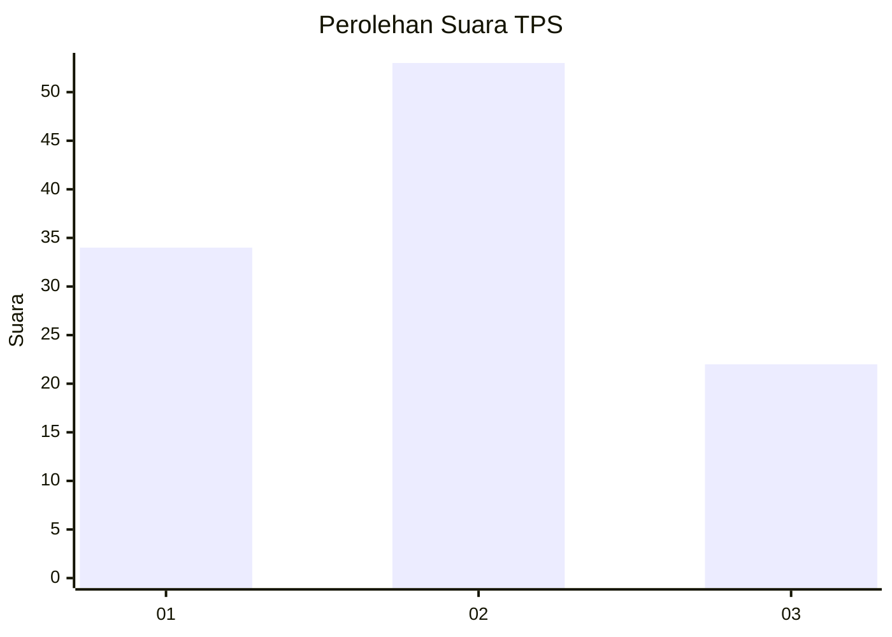
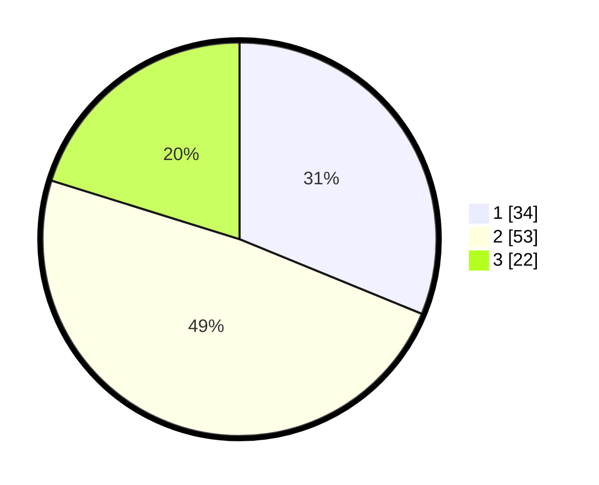

# Hasil

## Grafik

## Tabel

| No. | Nama Paslon    | Suara | Suara (raw) | Persentase |
|:--- |:-------------- | -----:| -----------:| ----------:|
| 1   | ANIES MUHAIMIN | 34    | [34][p-1]   | 31,19      |
| 2   | PRABOWO GIBRAN | 53    | [53][p-2]   | 48,62      |
| 3   | GANJAR MAHFUD  | 22    | [22][p-3]   | 20,18      |

[p-1]: https://github.com/gigit-pemilu/pemilu-2024-32-jawa-barat/blob/main/pilpres/hitung-suara/sub/32-jawa-barat/sub/03-cianjur/sub/24-naringgul/sub/2005-cinerang/sub/011-tps/sub/paslon-1.txt
[p-2]: https://github.com/gigit-pemilu/pemilu-2024-32-jawa-barat/blob/main/pilpres/hitung-suara/sub/32-jawa-barat/sub/03-cianjur/sub/24-naringgul/sub/2005-cinerang/sub/011-tps/sub/paslon-2.txt
[p-3]: https://github.com/gigit-pemilu/pemilu-2024-32-jawa-barat/blob/main/pilpres/hitung-suara/sub/32-jawa-barat/sub/03-cianjur/sub/24-naringgul/sub/2005-cinerang/sub/011-tps/sub/paslon-3.txt

## Foto C Plano

https://sirekap-obj-formc.kpu.go.id/829c/pemilu/ppwp/32/03/24/20/05/3203242005011-20240215-093813--a4d87555-51e1-4038-9076-2e5a2b8730e1.jpg

https://sirekap-obj-formc.kpu.go.id/829c/pemilu/ppwp/32/03/24/20/05/3203242005011-20240215-094531--aecc2a9d-498e-4f0a-b0c0-b4c3f4789bfd.jpg

https://sirekap-obj-formc.kpu.go.id/829c/pemilu/ppwp/32/03/24/20/05/3203242005011-20240215-094646--01ce239a-ea75-43b5-bf46-696dd0441330.jpg

## Metadata

| Key        | Value               |
| ---------- | ------------------- |
| Time Stamp | 2024-02-24 22:31:28 |

