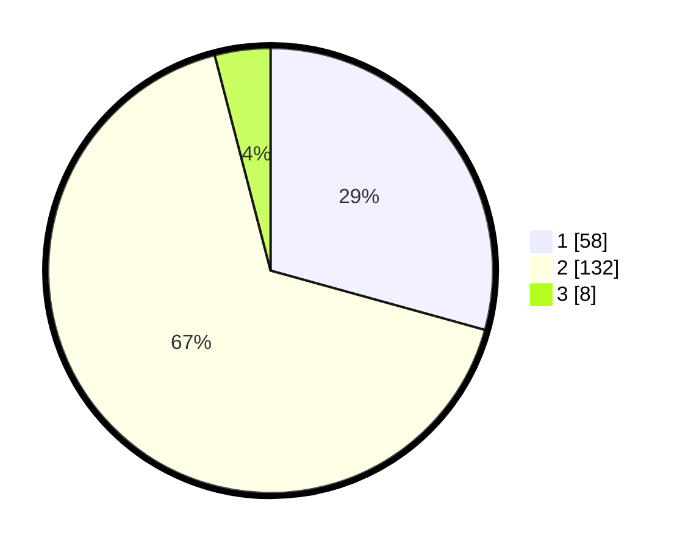

# Hasil

## Grafik

## Tabel

| No. | Nama Paslon    | Suara | Suara (raw) | Persentase |
|:--- |:-------------- | -----:| -----------:| ----------:|
| 1   | ANIES MUHAIMIN | 58    | [58][p-1]   | 29,29      |
| 2   | PRABOWO GIBRAN | 132   | [132][p-2]  | 66,67      |
| 3   | GANJAR MAHFUD  | 8     | [8][p-3]    | 4,04       |

[p-1]: https://github.com/gigit-pemilu/pemilu-2024/blob/main/pilpres/hitung-suara/sub/32-jawa-barat/sub/03-cianjur/sub/25-campakamulya/sub/2001-cibanggala/sub/003-tps/sub/paslon-1.txt
[p-2]: https://github.com/gigit-pemilu/pemilu-2024/blob/main/pilpres/hitung-suara/sub/32-jawa-barat/sub/03-cianjur/sub/25-campakamulya/sub/2001-cibanggala/sub/003-tps/sub/paslon-2.txt
[p-3]: https://github.com/gigit-pemilu/pemilu-2024/blob/main/pilpres/hitung-suara/sub/32-jawa-barat/sub/03-cianjur/sub/25-campakamulya/sub/2001-cibanggala/sub/003-tps/sub/paslon-3.txt

## Foto C Plano

https://sirekap-obj-formc.kpu.go.id/5bd7/pemilu/ppwp/32/03/25/20/01/3203252001003-20240215-142145--a4a11aee-ae3f-47ee-8d64-38442d1f4c0b.jpg

https://sirekap-obj-formc.kpu.go.id/5bd7/pemilu/ppwp/32/03/25/20/01/3203252001003-20240215-142307--a02411af-2f92-45ec-8303-dee4aa63d6b1.jpg

https://sirekap-obj-formc.kpu.go.id/5bd7/pemilu/ppwp/32/03/25/20/01/3203252001003-20240215-142415--0fc34c15-9c63-4e11-9548-aee3b5f26cd4.jpg

## Metadata

| Key        | Value               |
| ---------- | ------------------- |
| Time Stamp | 2024-02-16 13:30:32 |

