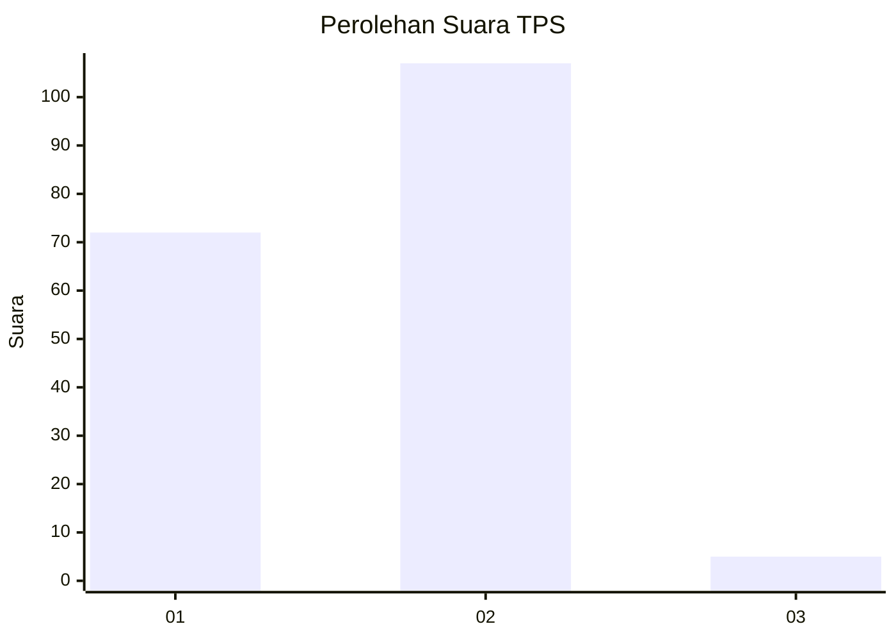
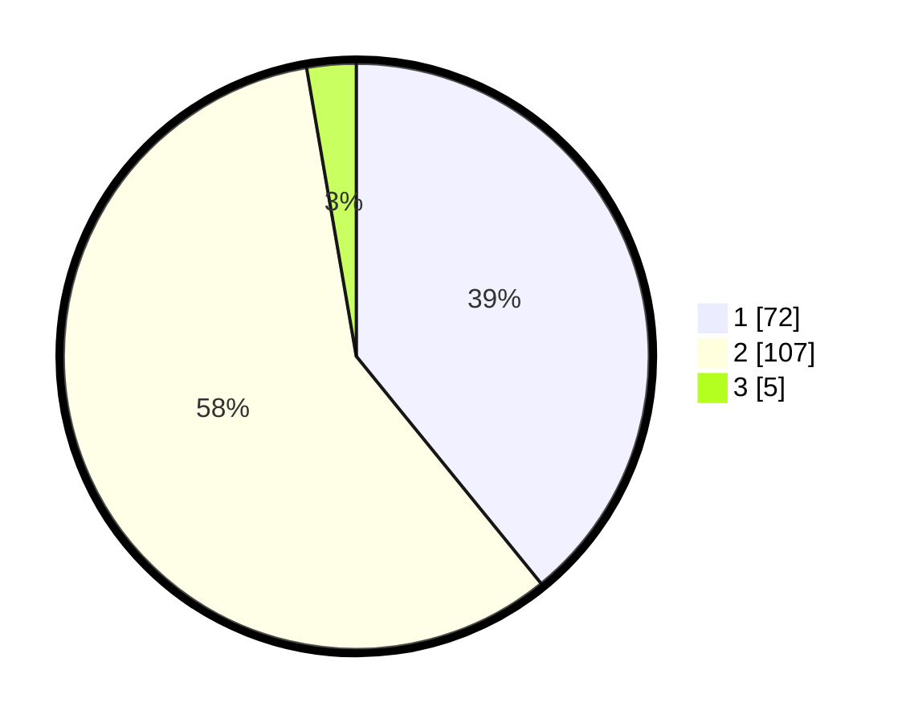

# Hasil

## Grafik

## Tabel

| No. | Nama Paslon    | Suara | Suara (raw) | Persentase |
|:--- |:-------------- | -----:| -----------:| ----------:|
| 1   | ANIES MUHAIMIN | 72    | [72][p-1]   | 39,13      |
| 2   | PRABOWO GIBRAN | 107   | [107][p-2]  | 58,15      |
| 3   | GANJAR MAHFUD  | 5     | [5][p-3]    | 2,72       |

[p-1]: https://github.com/gigit-pemilu/pemilu-2024/blob/main/pilpres/hitung-suara/sub/32-jawa-barat/sub/03-cianjur/sub/25-campakamulya/sub/2001-cibanggala/sub/005-tps/sub/paslon-1.txt
[p-2]: https://github.com/gigit-pemilu/pemilu-2024/blob/main/pilpres/hitung-suara/sub/32-jawa-barat/sub/03-cianjur/sub/25-campakamulya/sub/2001-cibanggala/sub/005-tps/sub/paslon-2.txt
[p-3]: https://github.com/gigit-pemilu/pemilu-2024/blob/main/pilpres/hitung-suara/sub/32-jawa-barat/sub/03-cianjur/sub/25-campakamulya/sub/2001-cibanggala/sub/005-tps/sub/paslon-3.txt

## Foto C Plano

https://sirekap-obj-formc.kpu.go.id/6691/pemilu/ppwp/32/03/25/20/01/3203252001005-20240219-115549--67fefdb8-7816-4620-bf8d-0f7b65d78164.jpg

https://sirekap-obj-formc.kpu.go.id/6691/pemilu/ppwp/32/03/25/20/01/3203252001005-20240219-115601--920bfa87-faae-4d9b-88dd-79a8f81dde12.jpg

https://sirekap-obj-formc.kpu.go.id/6691/pemilu/ppwp/32/03/25/20/01/3203252001005-20240219-115608--0993cdd6-f270-4d58-897f-42bccafd2320.jpg

## Metadata

| Key        | Value               |
| ---------- | ------------------- |
| Time Stamp | 2024-02-19 16:00:00 |

