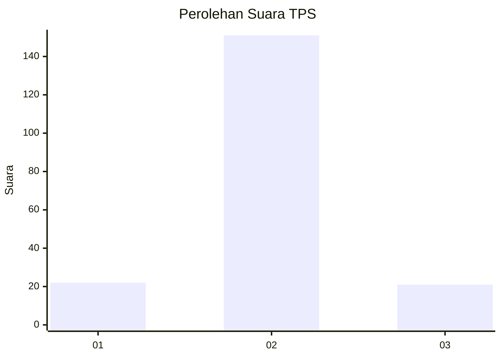
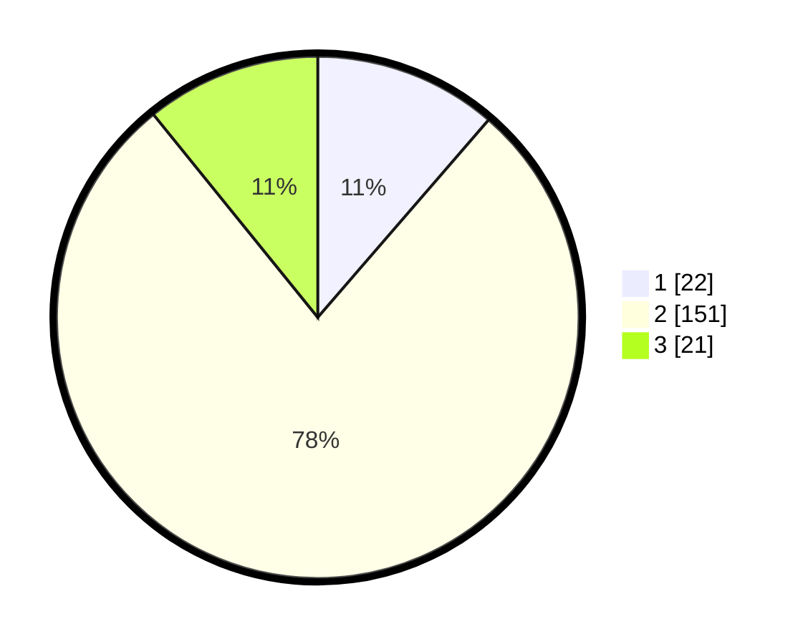

# Hasil

## Grafik

## Tabel

| No. | Nama Paslon    | Suara | Suara (raw) | Persentase |
|:--- |:-------------- | -----:| -----------:| ----------:|
| 1   | ANIES MUHAIMIN | 22    | [22][p-1]   | 11,34      |
| 2   | PRABOWO GIBRAN | 151   | [151][p-2]  | 77,84      |
| 3   | GANJAR MAHFUD  | 21    | [21][p-3]   | 10,82      |

[p-1]: https://github.com/gigit-pemilu/pemilu-2024/blob/main/pilpres/hitung-suara/sub/32-jawa-barat/sub/03-cianjur/sub/26-cikadu/sub/2001-kalapanunggal/sub/004-tps/sub/paslon-1.txt
[p-2]: https://github.com/gigit-pemilu/pemilu-2024/blob/main/pilpres/hitung-suara/sub/32-jawa-barat/sub/03-cianjur/sub/26-cikadu/sub/2001-kalapanunggal/sub/004-tps/sub/paslon-2.txt
[p-3]: https://github.com/gigit-pemilu/pemilu-2024/blob/main/pilpres/hitung-suara/sub/32-jawa-barat/sub/03-cianjur/sub/26-cikadu/sub/2001-kalapanunggal/sub/004-tps/sub/paslon-3.txt

## Foto C Plano

https://sirekap-obj-formc.kpu.go.id/044d/pemilu/ppwp/32/03/26/20/01/3203262001004-20240215-102542--c589dbed-0285-4c2a-a04f-a5d6df5ab0d9.jpg

https://sirekap-obj-formc.kpu.go.id/044d/pemilu/ppwp/32/03/26/20/01/3203262001004-20240215-102620--42546b4c-8beb-498a-9a3d-84273519ac05.jpg

https://sirekap-obj-formc.kpu.go.id/044d/pemilu/ppwp/32/03/26/20/01/3203262001004-20240215-102704--9bf7ddd3-1087-4c73-ab59-5a7e39ebe716.jpg

## Metadata

| Key        | Value               |
| ---------- | ------------------- |
| Time Stamp | 2024-02-16 13:30:32 |

