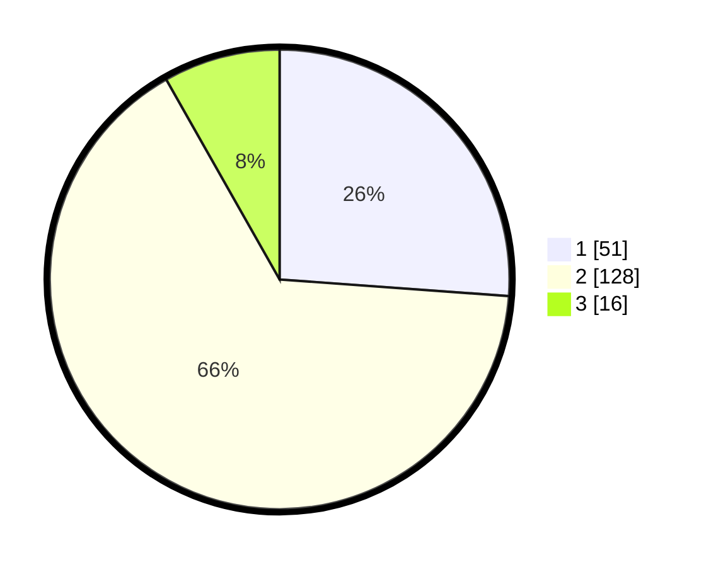

# Hasil

## Grafik

## Tabel

| No. | Nama Paslon    | Suara | Suara (raw) | Persentase |
|:--- |:-------------- | -----:| -----------:| ----------:|
| 1   | ANIES MUHAIMIN | 51    | [51][p-1]   | 26,15      |
| 2   | PRABOWO GIBRAN | 128   | [128][p-2]  | 65,64      |
| 3   | GANJAR MAHFUD  | 16    | [16][p-3]   | 8,21       |

[p-1]: https://github.com/gigit-pemilu/pemilu-2024/blob/main/pilpres/hitung-suara/sub/32-jawa-barat/sub/03-cianjur/sub/26-cikadu/sub/2001-kalapanunggal/sub/005-tps/sub/paslon-1.txt
[p-2]: https://github.com/gigit-pemilu/pemilu-2024/blob/main/pilpres/hitung-suara/sub/32-jawa-barat/sub/03-cianjur/sub/26-cikadu/sub/2001-kalapanunggal/sub/005-tps/sub/paslon-2.txt
[p-3]: https://github.com/gigit-pemilu/pemilu-2024/blob/main/pilpres/hitung-suara/sub/32-jawa-barat/sub/03-cianjur/sub/26-cikadu/sub/2001-kalapanunggal/sub/005-tps/sub/paslon-3.txt

## Foto C Plano

https://sirekap-obj-formc.kpu.go.id/a831/pemilu/ppwp/32/03/26/20/01/3203262001005-20240215-133227--26dc476d-31f0-4b59-a1eb-39647e194b9d.jpg

https://sirekap-obj-formc.kpu.go.id/a831/pemilu/ppwp/32/03/26/20/01/3203262001005-20240215-111612--1b9fe727-a747-4945-b9be-3f41651391d4.jpg

https://sirekap-obj-formc.kpu.go.id/a831/pemilu/ppwp/32/03/26/20/01/3203262001005-20240215-111745--ddf8c743-0634-4289-9277-310dc1933dc7.jpg

## Metadata

| Key        | Value               |
| ---------- | ------------------- |
| Time Stamp | 2024-02-19 13:00:00 |

