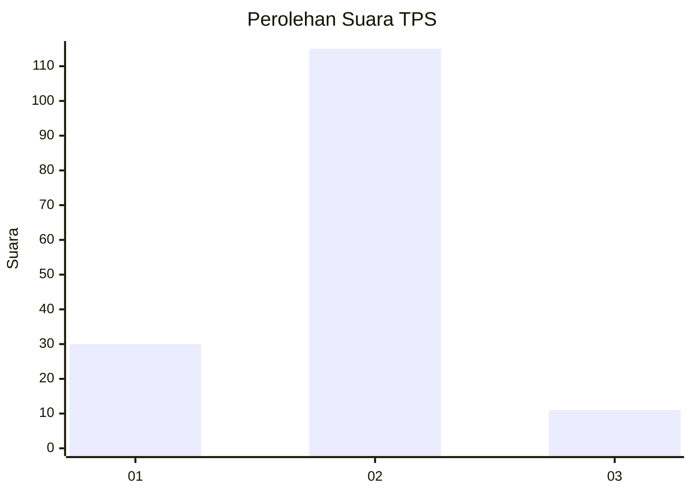
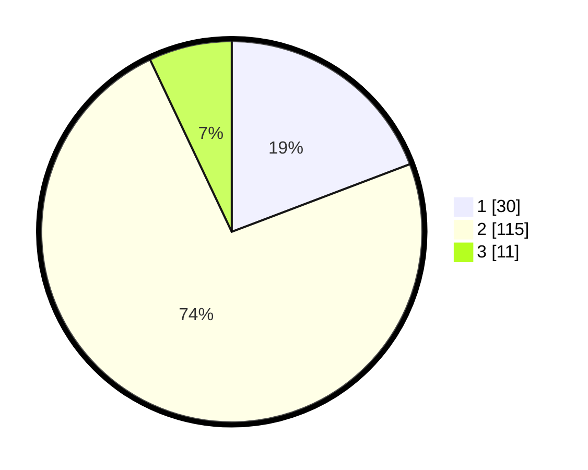

# Hasil

## Grafik

## Tabel

| No. | Nama Paslon    | Suara | Suara (raw) | Persentase |
|:--- |:-------------- | -----:| -----------:| ----------:|
| 1   | ANIES MUHAIMIN | 30    | [30][p-1]   | 19,23      |
| 2   | PRABOWO GIBRAN | 115   | [115][p-2]  | 73,72      |
| 3   | GANJAR MAHFUD  | 11    | [11][p-3]   | 7,05       |

[p-1]: https://github.com/gigit-pemilu/pemilu-2024-32-jawa-barat/blob/main/pilpres/hitung-suara/sub/32-jawa-barat/sub/03-cianjur/sub/27-gekbrong/sub/2001-bangbayang/sub/011-tps/sub/paslon-1.txt
[p-2]: https://github.com/gigit-pemilu/pemilu-2024-32-jawa-barat/blob/main/pilpres/hitung-suara/sub/32-jawa-barat/sub/03-cianjur/sub/27-gekbrong/sub/2001-bangbayang/sub/011-tps/sub/paslon-2.txt
[p-3]: https://github.com/gigit-pemilu/pemilu-2024-32-jawa-barat/blob/main/pilpres/hitung-suara/sub/32-jawa-barat/sub/03-cianjur/sub/27-gekbrong/sub/2001-bangbayang/sub/011-tps/sub/paslon-3.txt

## Foto C Plano

https://sirekap-obj-formc.kpu.go.id/2353/pemilu/ppwp/32/03/27/20/01/3203272001011-20240215-073821--2e577df8-3e49-4398-a9fb-2a78c9202fbc.jpg

https://sirekap-obj-formc.kpu.go.id/2353/pemilu/ppwp/32/03/27/20/01/3203272001011-20240215-074039--247f88df-5532-422b-849b-ed8306d70e23.jpg

https://sirekap-obj-formc.kpu.go.id/2353/pemilu/ppwp/32/03/27/20/01/3203272001011-20240215-074222--edaa2e92-ac7a-4c71-a046-da1cb505326b.jpg

## Metadata

| Key        | Value               |
| ---------- | ------------------- |
| Time Stamp | 2024-02-16 21:01:00 |

