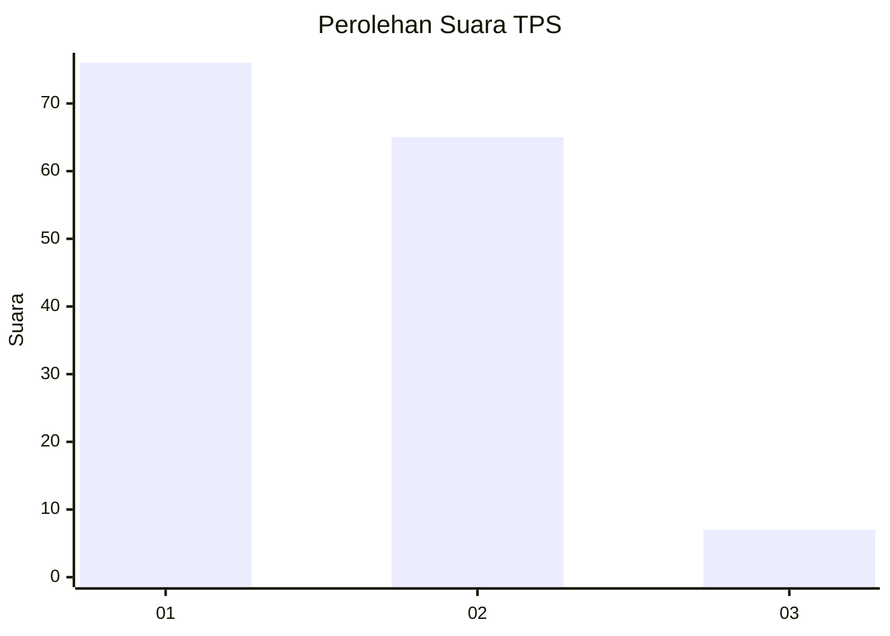
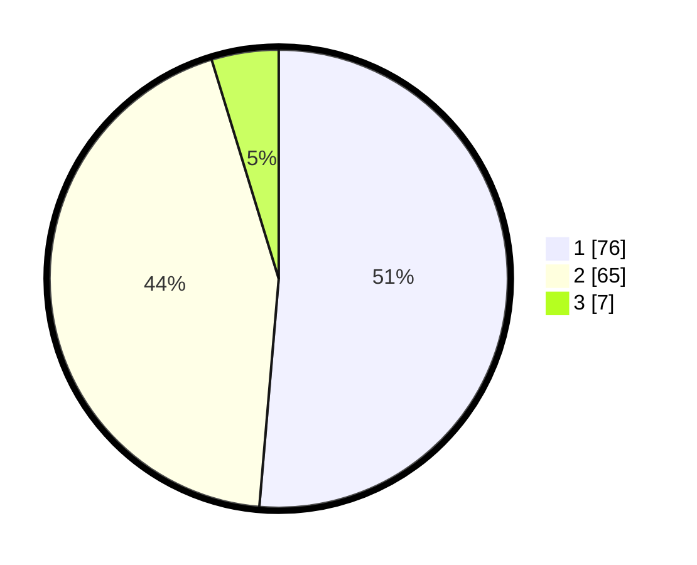

# Hasil

## Grafik

## Tabel

| No. | Nama Paslon    | Suara | Suara (raw) | Persentase |
|:--- |:-------------- | -----:| -----------:| ----------:|
| 1   | ANIES MUHAIMIN | 76    | [76][p-1]   | 51,35      |
| 2   | PRABOWO GIBRAN | 65    | [65][p-2]   | 43,92      |
| 3   | GANJAR MAHFUD  | 7     | [7][p-3]    | 4,73       |

[p-1]: https://github.com/gigit-pemilu/pemilu-2024-32-jawa-barat/blob/main/pilpres/hitung-suara/sub/32-jawa-barat/sub/03-cianjur/sub/27-gekbrong/sub/2001-bangbayang/sub/021-tps/sub/paslon-1.txt
[p-2]: https://github.com/gigit-pemilu/pemilu-2024-32-jawa-barat/blob/main/pilpres/hitung-suara/sub/32-jawa-barat/sub/03-cianjur/sub/27-gekbrong/sub/2001-bangbayang/sub/021-tps/sub/paslon-2.txt
[p-3]: https://github.com/gigit-pemilu/pemilu-2024-32-jawa-barat/blob/main/pilpres/hitung-suara/sub/32-jawa-barat/sub/03-cianjur/sub/27-gekbrong/sub/2001-bangbayang/sub/021-tps/sub/paslon-3.txt

## Foto C Plano

https://sirekap-obj-formc.kpu.go.id/58f4/pemilu/ppwp/32/03/27/20/01/3203272001021-20240215-084649--dbc088d1-0f05-45fc-9b9a-734b4ac703ed.jpg

https://sirekap-obj-formc.kpu.go.id/58f4/pemilu/ppwp/32/03/27/20/01/3203272001021-20240214-203507--25ee3963-b8cc-4b0c-9fd7-fc5665001c08.jpg

https://sirekap-obj-formc.kpu.go.id/58f4/pemilu/ppwp/32/03/27/20/01/3203272001021-20240214-203546--8aeadcec-e769-4c82-a985-6417cd7ed535.jpg

## Metadata

| Key        | Value               |
| ---------- | ------------------- |
| Time Stamp | 2024-02-16 21:01:00 |

