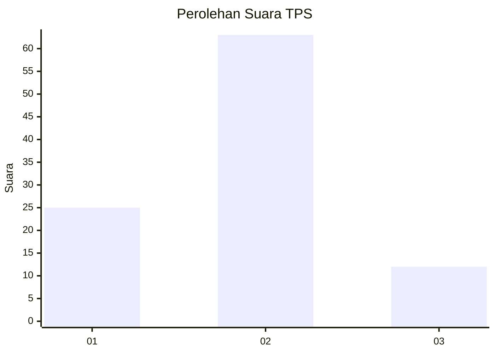
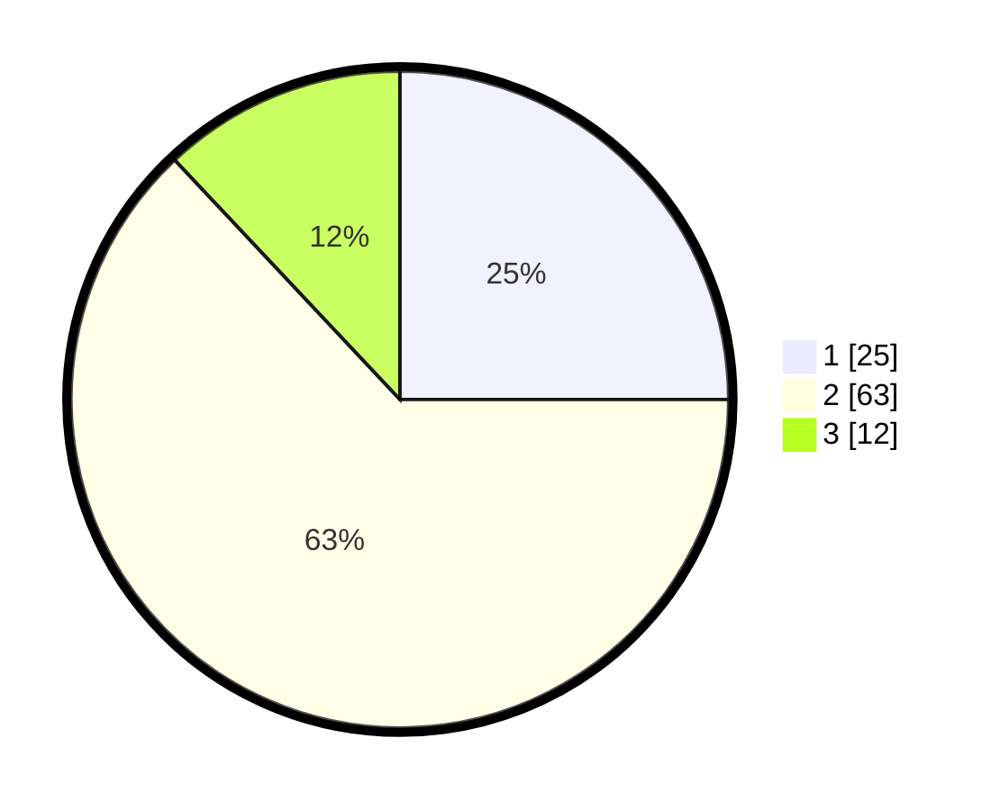

# Hasil

## Grafik

## Tabel

| No. | Nama Paslon    | Suara | Suara (raw) | Persentase |
|:--- |:-------------- | -----:| -----------:| ----------:|
| 1   | ANIES MUHAIMIN | 25    | [25][p-1]   | 25,00      |
| 2   | PRABOWO GIBRAN | 63    | [63][p-2]   | 63,00      |
| 3   | GANJAR MAHFUD  | 12    | [12][p-3]   | 12,00      |

[p-1]: https://github.com/gigit-pemilu/pemilu-2024-32-jawa-barat/blob/main/pilpres/hitung-suara/sub/32-jawa-barat/sub/03-cianjur/sub/27-gekbrong/sub/2003-sukaratu/sub/010-tps/sub/paslon-1.txt
[p-2]: https://github.com/gigit-pemilu/pemilu-2024-32-jawa-barat/blob/main/pilpres/hitung-suara/sub/32-jawa-barat/sub/03-cianjur/sub/27-gekbrong/sub/2003-sukaratu/sub/010-tps/sub/paslon-2.txt
[p-3]: https://github.com/gigit-pemilu/pemilu-2024-32-jawa-barat/blob/main/pilpres/hitung-suara/sub/32-jawa-barat/sub/03-cianjur/sub/27-gekbrong/sub/2003-sukaratu/sub/010-tps/sub/paslon-3.txt

## Foto C Plano

https://sirekap-obj-formc.kpu.go.id/c348/pemilu/ppwp/32/03/27/20/03/3203272003010-20240215-014544--6f8bd1f4-33b4-4b9c-9afc-fb09a772a882.jpg

https://sirekap-obj-formc.kpu.go.id/c348/pemilu/ppwp/32/03/27/20/03/3203272003010-20240215-014824--df0b4785-b646-4361-aa3a-58ab4b4bbb8c.jpg

https://sirekap-obj-formc.kpu.go.id/c348/pemilu/ppwp/32/03/27/20/03/3203272003010-20240215-015025--fadcf7db-47a9-4588-ac4c-a12339733bc5.jpg

## Metadata

| Key        | Value               |
| ---------- | ------------------- |
| Time Stamp | 2024-02-16 21:01:00 |

