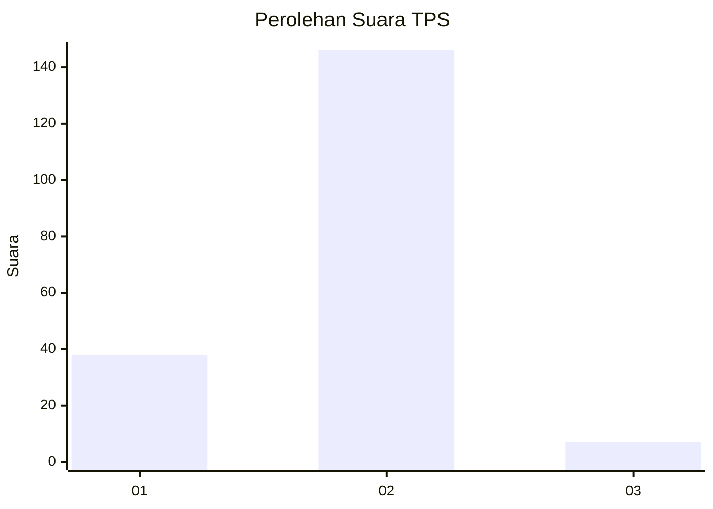
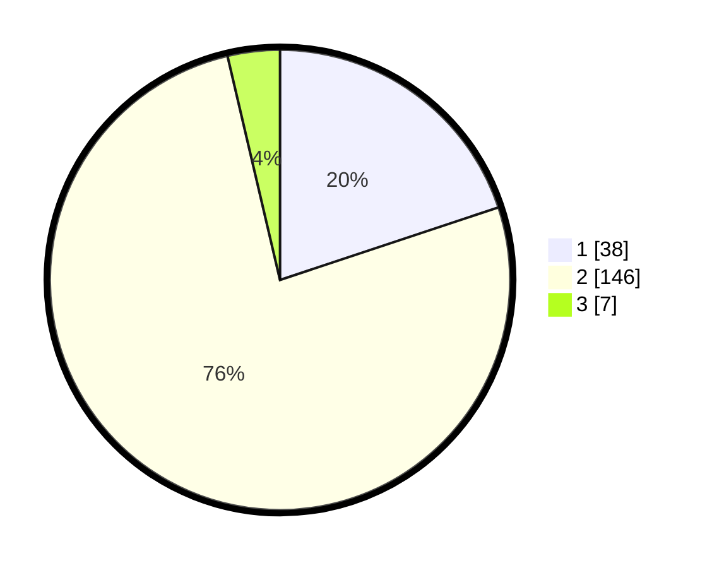

# Hasil

## Grafik

## Tabel

| No. | Nama Paslon    | Suara | Suara (raw) | Persentase |
|:--- |:-------------- | -----:| -----------:| ----------:|
| 1   | ANIES MUHAIMIN | 38    | [38][p-1]   | 19,90      |
| 2   | PRABOWO GIBRAN | 146   | [146][p-2]  | 76,44      |
| 3   | GANJAR MAHFUD  | 7     | [7][p-3]    | 3,66       |

[p-1]: https://github.com/gigit-pemilu/pemilu-2024-32-jawa-barat/blob/main/pilpres/hitung-suara/sub/32-jawa-barat/sub/03-cianjur/sub/27-gekbrong/sub/2005-kebonpeuteuy/sub/001-tps/sub/paslon-1.txt
[p-2]: https://github.com/gigit-pemilu/pemilu-2024-32-jawa-barat/blob/main/pilpres/hitung-suara/sub/32-jawa-barat/sub/03-cianjur/sub/27-gekbrong/sub/2005-kebonpeuteuy/sub/001-tps/sub/paslon-2.txt
[p-3]: https://github.com/gigit-pemilu/pemilu-2024-32-jawa-barat/blob/main/pilpres/hitung-suara/sub/32-jawa-barat/sub/03-cianjur/sub/27-gekbrong/sub/2005-kebonpeuteuy/sub/001-tps/sub/paslon-3.txt

## Foto C Plano

https://sirekap-obj-formc.kpu.go.id/59fc/pemilu/ppwp/32/03/27/20/05/3203272005001-20240214-234114--40b3e532-8d53-4a94-8919-cf72a0f64ac4.jpg

https://sirekap-obj-formc.kpu.go.id/59fc/pemilu/ppwp/32/03/27/20/05/3203272005001-20240214-234305--db4fbbd0-3e15-42da-bfac-5cc3b0dc0f7a.jpg

https://sirekap-obj-formc.kpu.go.id/59fc/pemilu/ppwp/32/03/27/20/05/3203272005001-20240214-234556--59ade9a9-7343-42d0-aaaf-a10e0b932f75.jpg

## Metadata

| Key        | Value               |
| ---------- | ------------------- |
| Time Stamp | 2024-02-16 21:01:00 |

