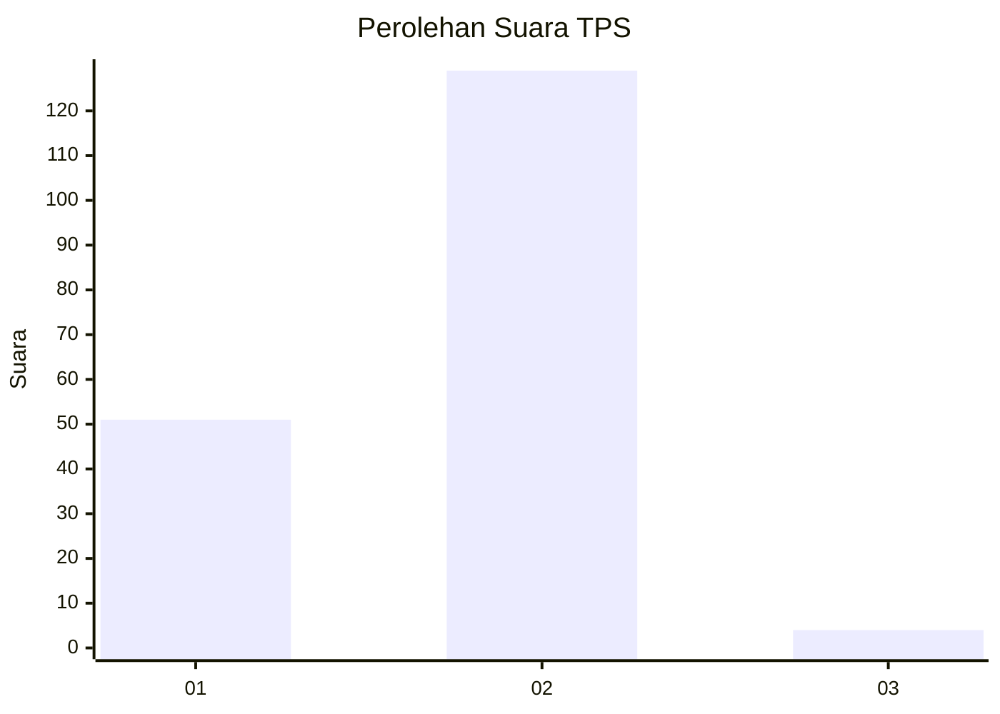
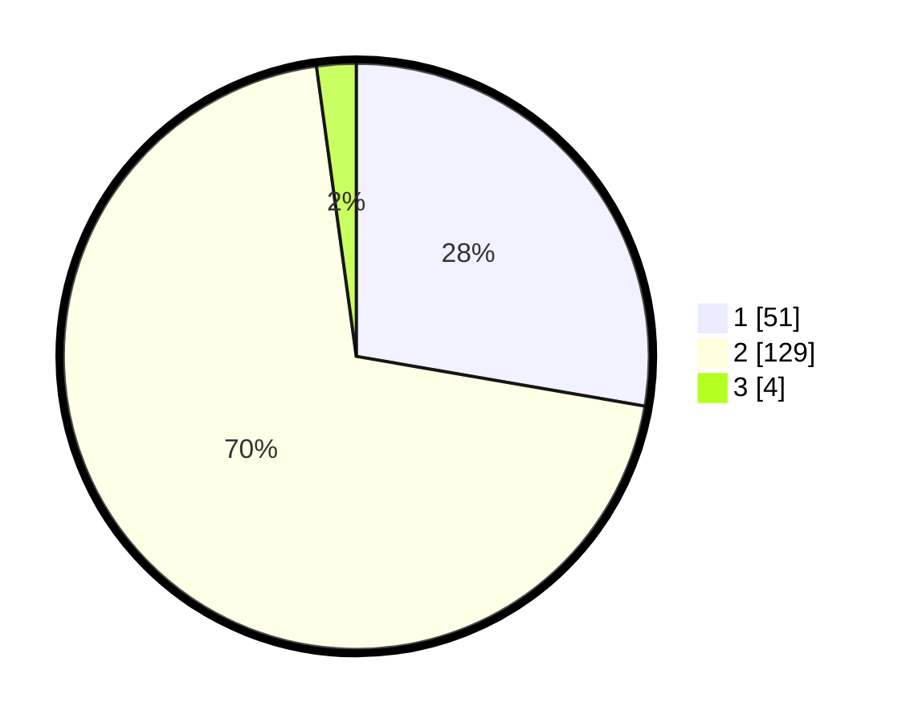

# Hasil

## Grafik

## Tabel

| No. | Nama Paslon    | Suara | Suara (raw) | Persentase |
|:--- |:-------------- | -----:| -----------:| ----------:|
| 1   | ANIES MUHAIMIN | 51    | [51][p-1]   | 27,72      |
| 2   | PRABOWO GIBRAN | 129   | [129][p-2]  | 70,11      |
| 3   | GANJAR MAHFUD  | 4     | [4][p-3]    | 2,17       |

[p-1]: https://github.com/gigit-pemilu/pemilu-2024-32-jawa-barat/blob/main/pilpres/hitung-suara/sub/32-jawa-barat/sub/03-cianjur/sub/27-gekbrong/sub/2005-kebonpeuteuy/sub/008-tps/sub/paslon-1.txt
[p-2]: https://github.com/gigit-pemilu/pemilu-2024-32-jawa-barat/blob/main/pilpres/hitung-suara/sub/32-jawa-barat/sub/03-cianjur/sub/27-gekbrong/sub/2005-kebonpeuteuy/sub/008-tps/sub/paslon-2.txt
[p-3]: https://github.com/gigit-pemilu/pemilu-2024-32-jawa-barat/blob/main/pilpres/hitung-suara/sub/32-jawa-barat/sub/03-cianjur/sub/27-gekbrong/sub/2005-kebonpeuteuy/sub/008-tps/sub/paslon-3.txt

## Foto C Plano

https://sirekap-obj-formc.kpu.go.id/a640/pemilu/ppwp/32/03/27/20/05/3203272005008-20240215-004024--f66807fe-1387-4e13-a6a9-aa48ebd2fc13.jpg

https://sirekap-obj-formc.kpu.go.id/a640/pemilu/ppwp/32/03/27/20/05/3203272005008-20240215-004030--9bd72764-8bd3-40ce-9068-cf5fd35dbb2f.jpg

https://sirekap-obj-formc.kpu.go.id/a640/pemilu/ppwp/32/03/27/20/05/3203272005008-20240215-004037--5701eb4b-1579-4c36-b419-ca77ae25ec93.jpg

## Metadata

| Key        | Value               |
| ---------- | ------------------- |
| Time Stamp | 2024-02-16 21:01:00 |

