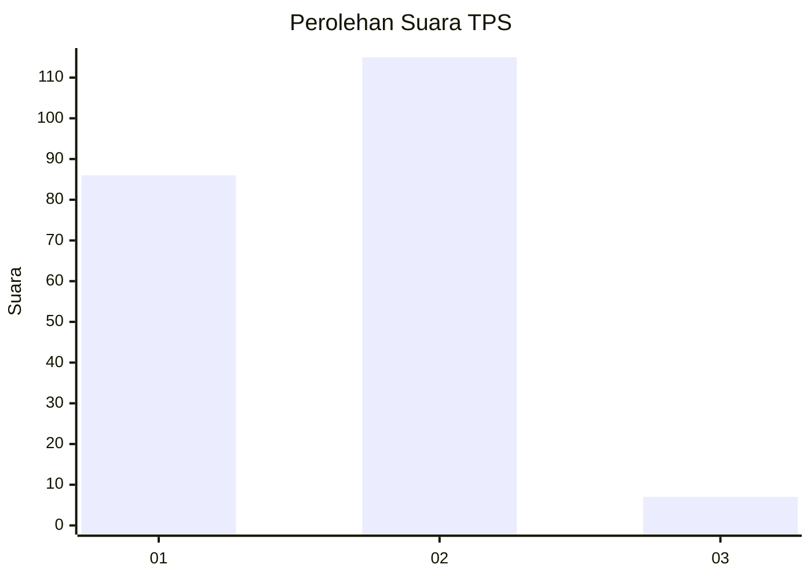
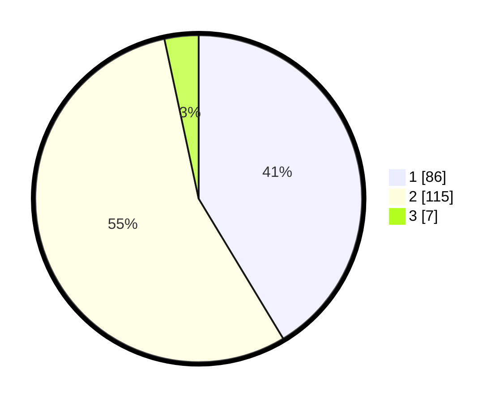

# Hasil

## Grafik

## Tabel

| No. | Nama Paslon    | Suara | Suara (raw) | Persentase |
|:--- |:-------------- | -----:| -----------:| ----------:|
| 1   | ANIES MUHAIMIN | 86    | [86][p-1]   | 41,35      |
| 2   | PRABOWO GIBRAN | 115   | [115][p-2]  | 55,29      |
| 3   | GANJAR MAHFUD  | 7     | [7][p-3]    | 3,37       |

[p-1]: https://github.com/gigit-pemilu/pemilu-2024/blob/main/pilpres/hitung-suara/sub/32-jawa-barat/sub/03-cianjur/sub/28-cipanas/sub/2001-cipanas/sub/002-tps/sub/paslon-1.txt
[p-2]: https://github.com/gigit-pemilu/pemilu-2024/blob/main/pilpres/hitung-suara/sub/32-jawa-barat/sub/03-cianjur/sub/28-cipanas/sub/2001-cipanas/sub/002-tps/sub/paslon-2.txt
[p-3]: https://github.com/gigit-pemilu/pemilu-2024/blob/main/pilpres/hitung-suara/sub/32-jawa-barat/sub/03-cianjur/sub/28-cipanas/sub/2001-cipanas/sub/002-tps/sub/paslon-3.txt

## Foto C Plano

https://sirekap-obj-formc.kpu.go.id/cede/pemilu/ppwp/32/03/28/20/01/3203282001002-20240214-185628--74e33066-9eee-47bc-b2fa-1bb61e372a1a.jpg

https://sirekap-obj-formc.kpu.go.id/cede/pemilu/ppwp/32/03/28/20/01/3203282001002-20240214-185953--a4052b6d-b8d9-47ca-a7ba-42d70b74fe53.jpg

https://sirekap-obj-formc.kpu.go.id/cede/pemilu/ppwp/32/03/28/20/01/3203282001002-20240216-095534--60d45303-5c89-44e7-9de6-232a1001e970.jpg

## Metadata

| Key        | Value               |
| ---------- | ------------------- |
| Time Stamp | 2024-02-16 21:01:00 |

