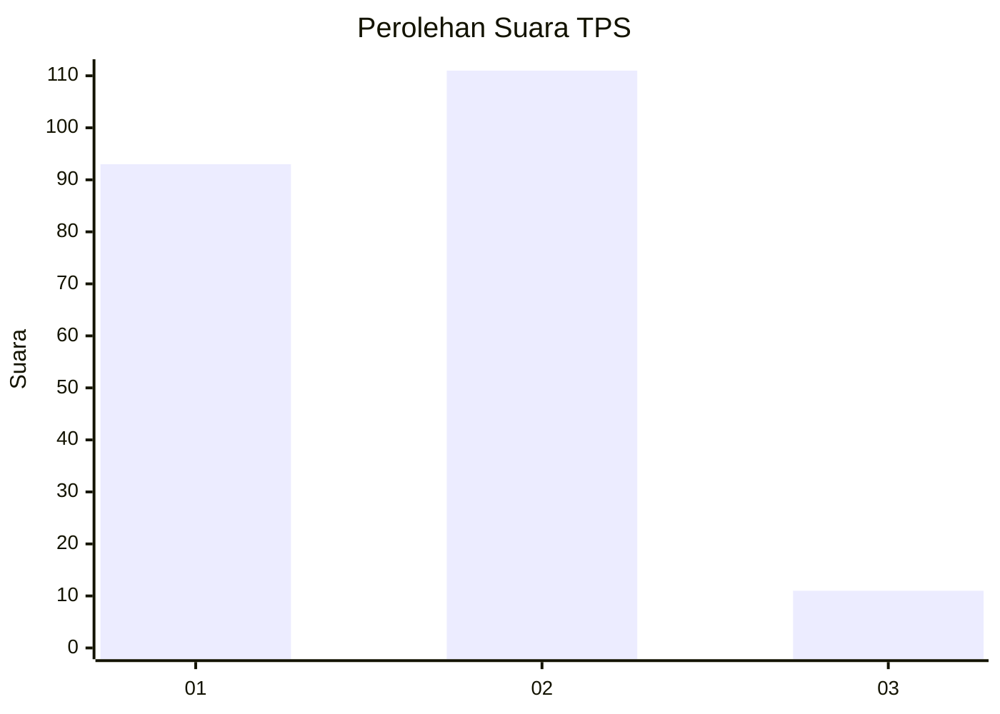
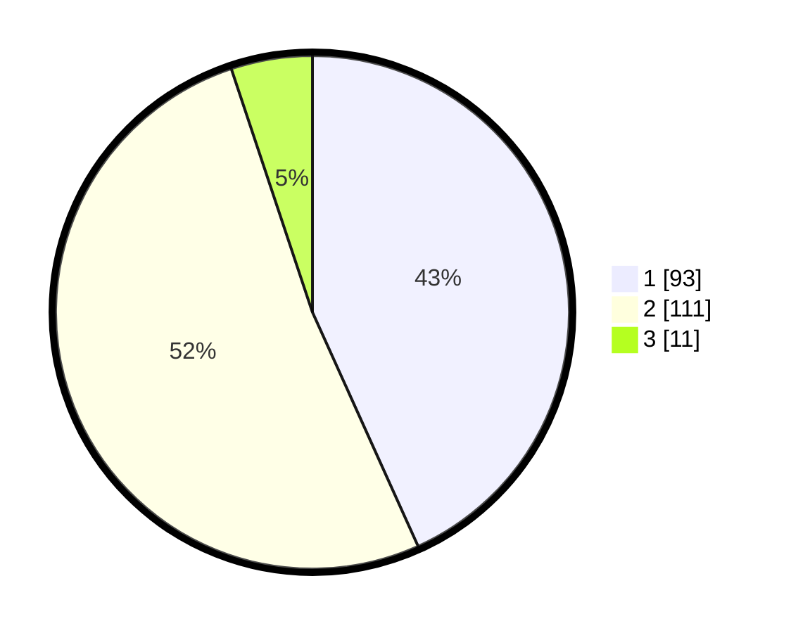

# Hasil

## Grafik

## Tabel

| No. | Nama Paslon    | Suara | Suara (raw) | Persentase |
|:--- |:-------------- | -----:| -----------:| ----------:|
| 1   | ANIES MUHAIMIN | 93    | [93][p-1]   | 43,26      |
| 2   | PRABOWO GIBRAN | 111   | [111][p-2]  | 51,63      |
| 3   | GANJAR MAHFUD  | 11    | [11][p-3]   | 5,12       |

[p-1]: https://github.com/gigit-pemilu/pemilu-2024/blob/main/pilpres/hitung-suara/sub/32-jawa-barat/sub/03-cianjur/sub/28-cipanas/sub/2001-cipanas/sub/003-tps/sub/paslon-1.txt
[p-2]: https://github.com/gigit-pemilu/pemilu-2024/blob/main/pilpres/hitung-suara/sub/32-jawa-barat/sub/03-cianjur/sub/28-cipanas/sub/2001-cipanas/sub/003-tps/sub/paslon-2.txt
[p-3]: https://github.com/gigit-pemilu/pemilu-2024/blob/main/pilpres/hitung-suara/sub/32-jawa-barat/sub/03-cianjur/sub/28-cipanas/sub/2001-cipanas/sub/003-tps/sub/paslon-3.txt

## Foto C Plano

https://sirekap-obj-formc.kpu.go.id/55eb/pemilu/ppwp/32/03/28/20/01/3203282001003-20240215-014838--3cc98aa8-e530-4d9c-a011-587b1e946df0.jpg

https://sirekap-obj-formc.kpu.go.id/55eb/pemilu/ppwp/32/03/28/20/01/3203282001003-20240215-015000--9c0f3c30-6f7b-469f-92c8-b1b4e3e5ffdb.jpg

https://sirekap-obj-formc.kpu.go.id/55eb/pemilu/ppwp/32/03/28/20/01/3203282001003-20240215-015058--9a987537-44ff-421f-ad9c-5d77ba6c7aa7.jpg

## Metadata

| Key        | Value               |
| ---------- | ------------------- |
| Time Stamp | 2024-02-25 13:00:00 |

