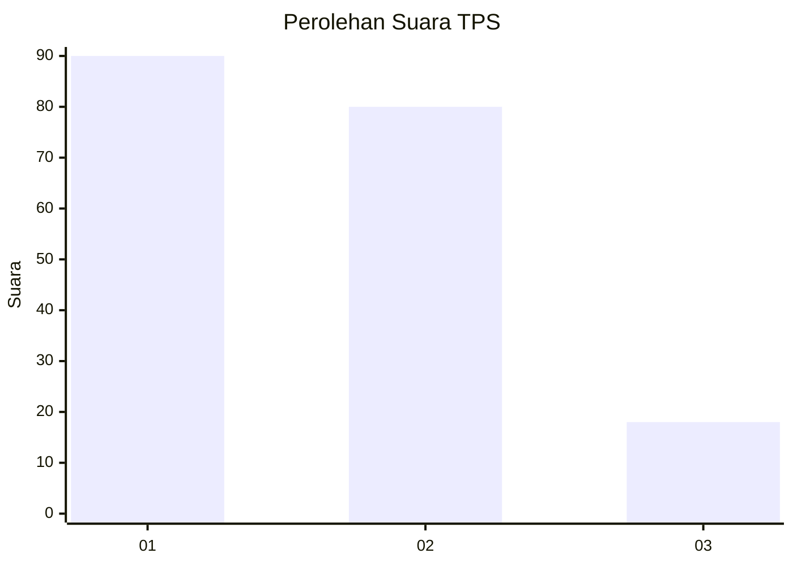
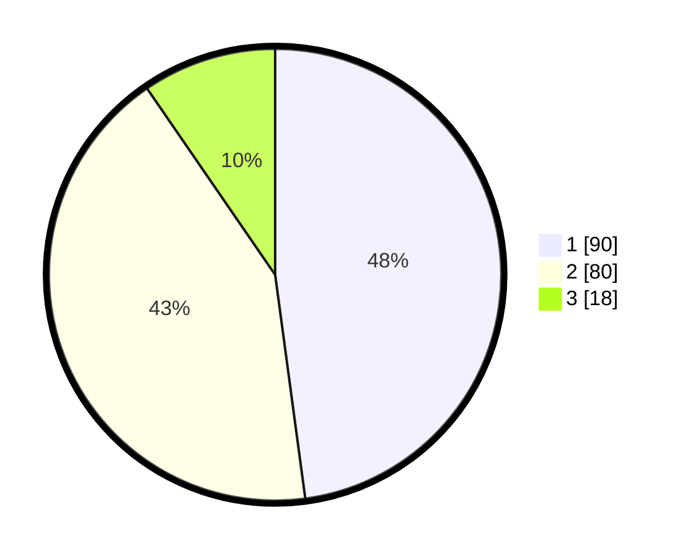

# Hasil

## Grafik

## Tabel

| No. | Nama Paslon    | Suara | Suara (raw) | Persentase |
|:--- |:-------------- | -----:| -----------:| ----------:|
| 1   | ANIES MUHAIMIN | 90    | [90][p-1]   | 47,87      |
| 2   | PRABOWO GIBRAN | 80    | [80][p-2]   | 42,55      |
| 3   | GANJAR MAHFUD  | 18    | [18][p-3]   | 9,57       |

[p-1]: https://github.com/gigit-pemilu/pemilu-2024-32-jawa-barat/blob/main/pilpres/hitung-suara/sub/32-jawa-barat/sub/03-cianjur/sub/28-cipanas/sub/2001-cipanas/sub/004-tps/sub/paslon-1.txt
[p-2]: https://github.com/gigit-pemilu/pemilu-2024-32-jawa-barat/blob/main/pilpres/hitung-suara/sub/32-jawa-barat/sub/03-cianjur/sub/28-cipanas/sub/2001-cipanas/sub/004-tps/sub/paslon-2.txt
[p-3]: https://github.com/gigit-pemilu/pemilu-2024-32-jawa-barat/blob/main/pilpres/hitung-suara/sub/32-jawa-barat/sub/03-cianjur/sub/28-cipanas/sub/2001-cipanas/sub/004-tps/sub/paslon-3.txt

## Foto C Plano

https://sirekap-obj-formc.kpu.go.id/fd51/pemilu/ppwp/32/03/28/20/01/3203282001004-20240215-055815--7073aa55-5e14-417d-abd2-8cdc1135c28d.jpg

https://sirekap-obj-formc.kpu.go.id/fd51/pemilu/ppwp/32/03/28/20/01/3203282001004-20240215-034458--5dbe800b-bfcf-4e64-a008-d3791bcd1a54.jpg

https://sirekap-obj-formc.kpu.go.id/fd51/pemilu/ppwp/32/03/28/20/01/3203282001004-20240215-045736--242ff3bc-3f57-496e-a6e3-260fa757bdf1.jpg

## Metadata

| Key        | Value               |
| ---------- | ------------------- |
| Time Stamp | 2024-02-16 21:01:00 |

