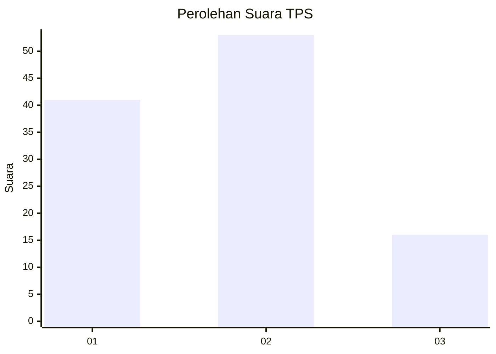
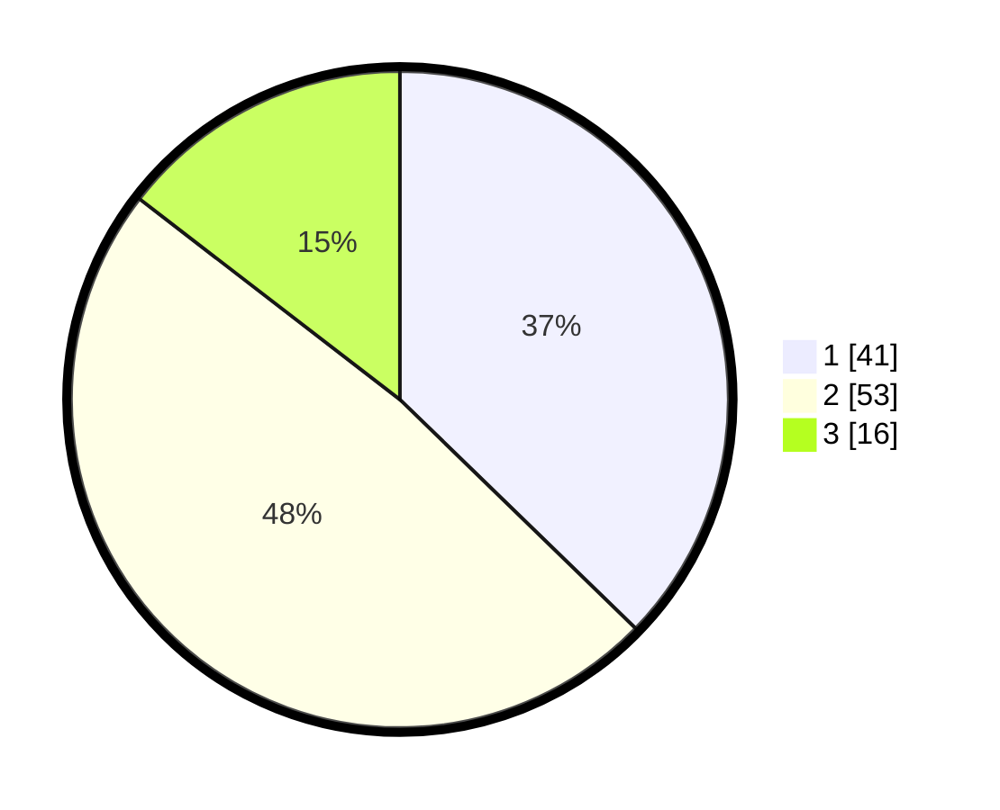

# Hasil

## Grafik

## Tabel

| No. | Nama Paslon    | Suara | Suara (raw) | Persentase |
|:--- |:-------------- | -----:| -----------:| ----------:|
| 1   | ANIES MUHAIMIN | 41    | [41][p-1]   | 37,27      |
| 2   | PRABOWO GIBRAN | 53    | [53][p-2]   | 48,18      |
| 3   | GANJAR MAHFUD  | 16    | [16][p-3]   | 14,55      |

[p-1]: https://github.com/gigit-pemilu/pemilu-2024/blob/main/pilpres/hitung-suara/sub/32-jawa-barat/sub/03-cianjur/sub/28-cipanas/sub/2002-cimacan/sub/038-tps/sub/paslon-1.txt
[p-2]: https://github.com/gigit-pemilu/pemilu-2024/blob/main/pilpres/hitung-suara/sub/32-jawa-barat/sub/03-cianjur/sub/28-cipanas/sub/2002-cimacan/sub/038-tps/sub/paslon-2.txt
[p-3]: https://github.com/gigit-pemilu/pemilu-2024/blob/main/pilpres/hitung-suara/sub/32-jawa-barat/sub/03-cianjur/sub/28-cipanas/sub/2002-cimacan/sub/038-tps/sub/paslon-3.txt

## Foto C Plano

https://sirekap-obj-formc.kpu.go.id/f914/pemilu/ppwp/32/03/28/20/02/3203282002038-20240214-155543--1793fd6e-0b81-4c17-a1d0-adcbd9ae28ad.jpg

https://sirekap-obj-formc.kpu.go.id/f914/pemilu/ppwp/32/03/28/20/02/3203282002038-20240214-141843--15e50cc6-d83e-4790-a877-f1e871f25560.jpg

https://sirekap-obj-formc.kpu.go.id/f914/pemilu/ppwp/32/03/28/20/02/3203282002038-20240214-141854--a5223098-011f-4417-80d2-449f0081d5b5.jpg

## Metadata

| Key        | Value               |
| ---------- | ------------------- |
| Time Stamp | 2024-02-17 12:00:00 |

