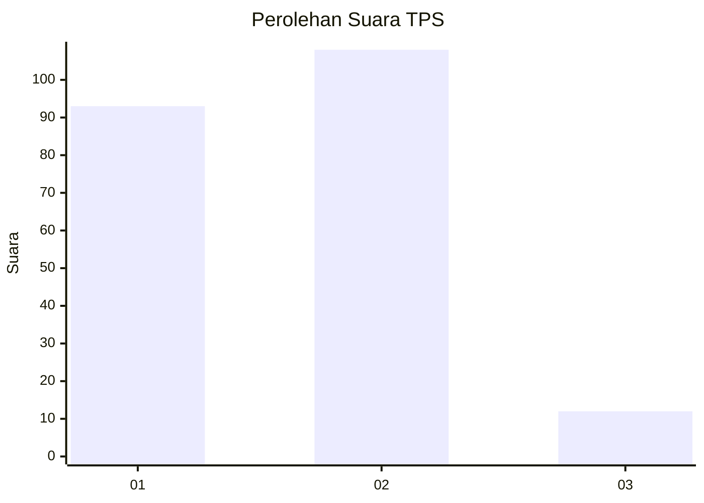
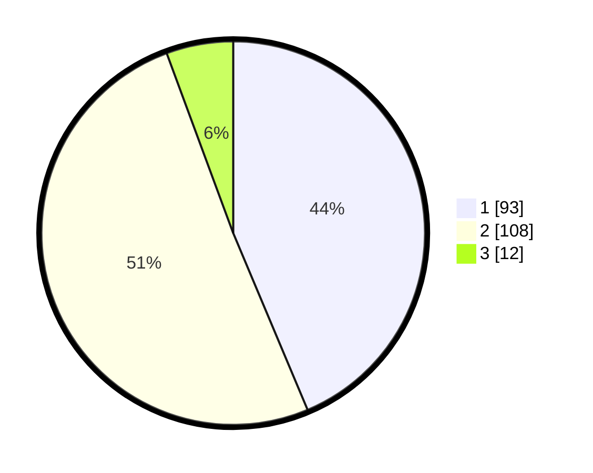

# Hasil

## Grafik

## Tabel

| No. | Nama Paslon    | Suara | Suara (raw) | Persentase |
|:--- |:-------------- | -----:| -----------:| ----------:|
| 1   | ANIES MUHAIMIN | 93    | [93][p-1]   | 43,66      |
| 2   | PRABOWO GIBRAN | 108   | [108][p-2]  | 50,70      |
| 3   | GANJAR MAHFUD  | 12    | [12][p-3]   | 5,63       |

[p-1]: https://github.com/gigit-pemilu/pemilu-2024-32-jawa-barat/blob/main/pilpres/hitung-suara/sub/32-jawa-barat/sub/03-cianjur/sub/29-cijati/sub/2001-parakantugu/sub/002-tps/sub/paslon-1.txt
[p-2]: https://github.com/gigit-pemilu/pemilu-2024-32-jawa-barat/blob/main/pilpres/hitung-suara/sub/32-jawa-barat/sub/03-cianjur/sub/29-cijati/sub/2001-parakantugu/sub/002-tps/sub/paslon-2.txt
[p-3]: https://github.com/gigit-pemilu/pemilu-2024-32-jawa-barat/blob/main/pilpres/hitung-suara/sub/32-jawa-barat/sub/03-cianjur/sub/29-cijati/sub/2001-parakantugu/sub/002-tps/sub/paslon-3.txt

## Foto C Plano

https://sirekap-obj-formc.kpu.go.id/f02e/pemilu/ppwp/32/03/29/20/01/3203292001002-20240214-231153--3f47c765-afd2-4713-819e-c43c8a26c516.jpg

https://sirekap-obj-formc.kpu.go.id/f02e/pemilu/ppwp/32/03/29/20/01/3203292001002-20240214-231249--bd3a8553-19b6-4e10-b33a-c3712646a515.jpg

https://sirekap-obj-formc.kpu.go.id/f02e/pemilu/ppwp/32/03/29/20/01/3203292001002-20240214-231325--210ce8a2-b0f0-417f-8781-12b34316232d.jpg

## Metadata

| Key        | Value               |
| ---------- | ------------------- |
| Time Stamp | 2024-02-16 22:01:00 |

