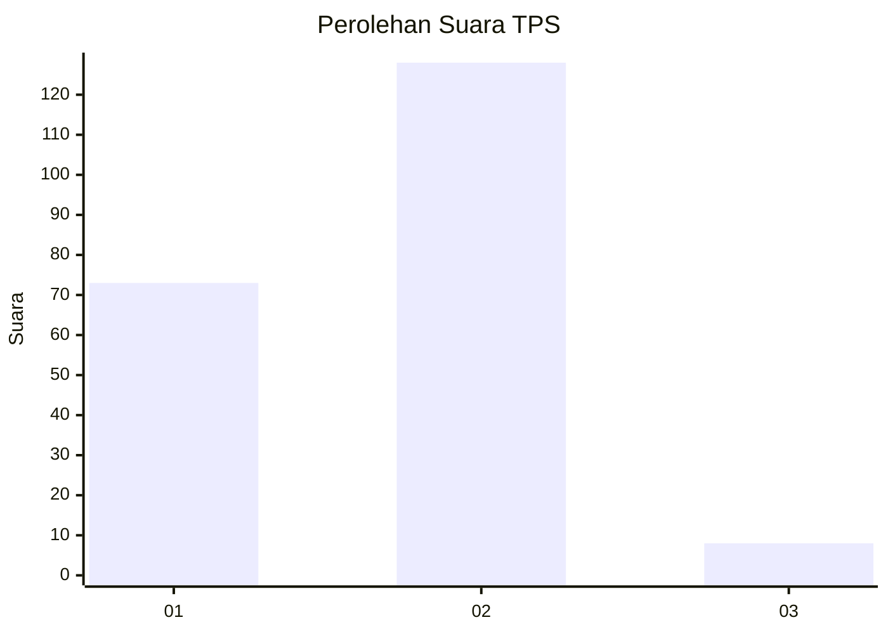
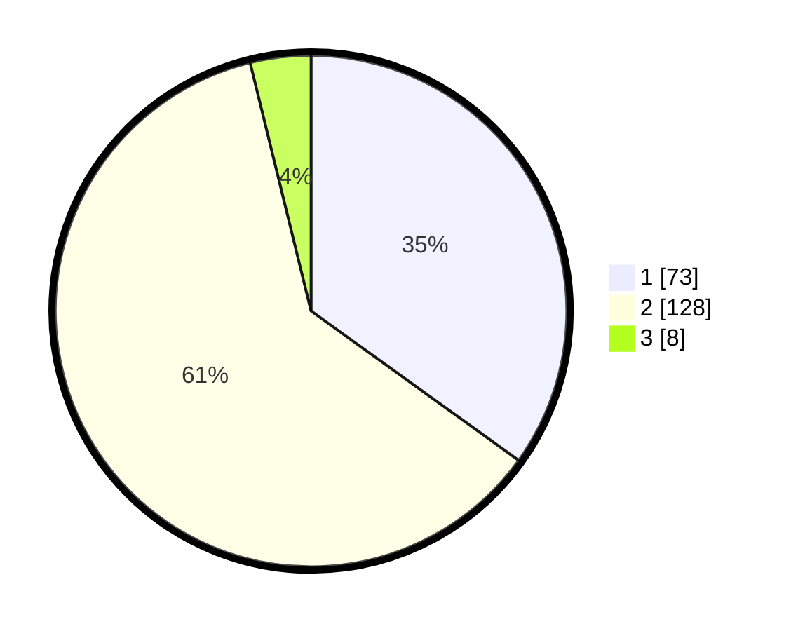

# Hasil

## Grafik

## Tabel

| No. | Nama Paslon    | Suara | Suara (raw) | Persentase |
|:--- |:-------------- | -----:| -----------:| ----------:|
| 1   | ANIES MUHAIMIN | 73    | [73][p-1]   | 34,93      |
| 2   | PRABOWO GIBRAN | 128   | [128][p-2]  | 61,24      |
| 3   | GANJAR MAHFUD  | 8     | [8][p-3]    | 3,83       |

[p-1]: https://github.com/gigit-pemilu/pemilu-2024/blob/main/pilpres/hitung-suara/sub/32-jawa-barat/sub/03-cianjur/sub/29-cijati/sub/2001-parakantugu/sub/004-tps/sub/paslon-1.txt
[p-2]: https://github.com/gigit-pemilu/pemilu-2024/blob/main/pilpres/hitung-suara/sub/32-jawa-barat/sub/03-cianjur/sub/29-cijati/sub/2001-parakantugu/sub/004-tps/sub/paslon-2.txt
[p-3]: https://github.com/gigit-pemilu/pemilu-2024/blob/main/pilpres/hitung-suara/sub/32-jawa-barat/sub/03-cianjur/sub/29-cijati/sub/2001-parakantugu/sub/004-tps/sub/paslon-3.txt

## Foto C Plano

https://sirekap-obj-formc.kpu.go.id/4bda/pemilu/ppwp/32/03/29/20/01/3203292001004-20240214-195119--63023e21-8b77-4441-9c17-a95c46c0ad2a.jpg

https://sirekap-obj-formc.kpu.go.id/4bda/pemilu/ppwp/32/03/29/20/01/3203292001004-20240214-194901--53e48bc3-f421-4ab4-8924-fd9ec1bbf9fd.jpg

https://sirekap-obj-formc.kpu.go.id/4bda/pemilu/ppwp/32/03/29/20/01/3203292001004-20240214-194705--ad118afa-0224-4d2e-8538-c5e0fa1425f4.jpg

## Metadata

| Key        | Value               |
| ---------- | ------------------- |
| Time Stamp | 2024-02-16 22:01:00 |

