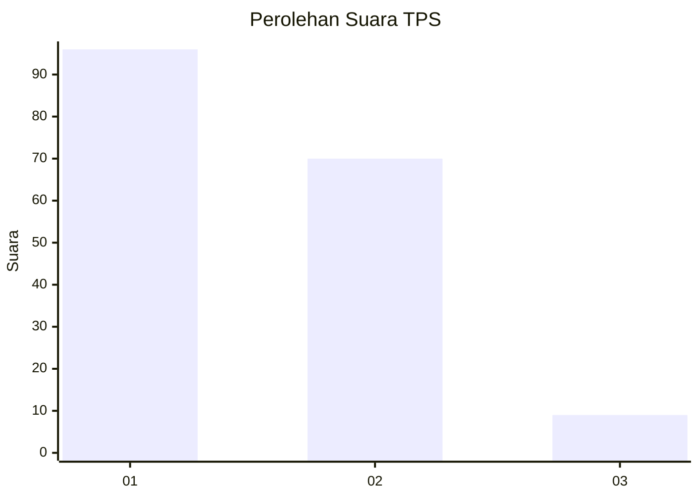
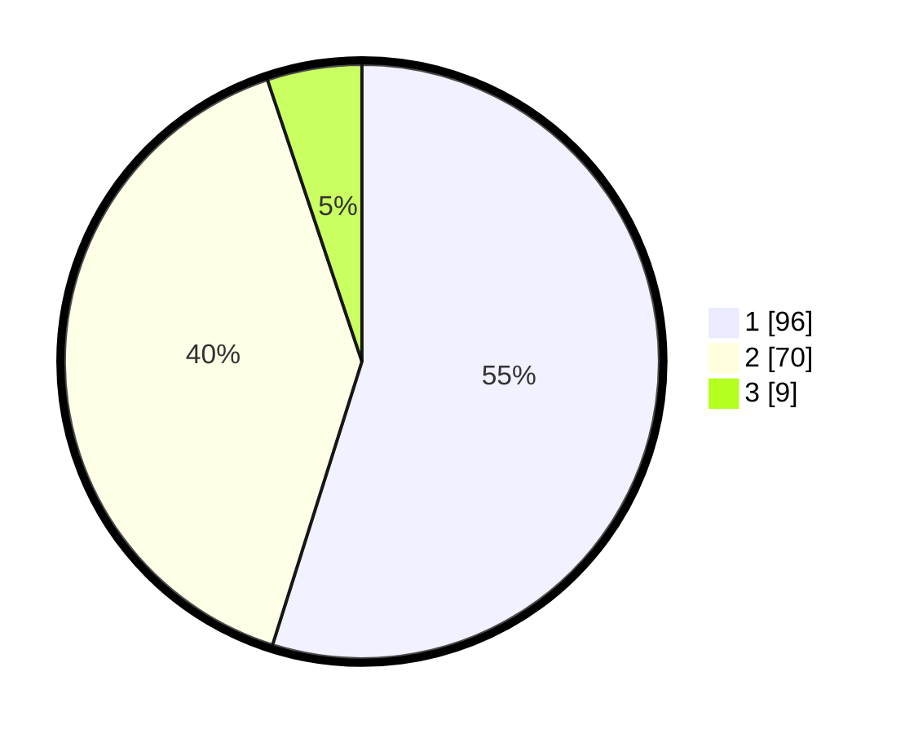

# Hasil

## Grafik

## Tabel

| No. | Nama Paslon    | Suara | Suara (raw) | Persentase |
|:--- |:-------------- | -----:| -----------:| ----------:|
| 1   | ANIES MUHAIMIN | 96    | [96][p-1]   | 54,86      |
| 2   | PRABOWO GIBRAN | 70    | [70][p-2]   | 40,00      |
| 3   | GANJAR MAHFUD  | 9     | [9][p-3]    | 5,14       |

[p-1]: https://github.com/gigit-pemilu/pemilu-2024-32-jawa-barat/blob/main/pilpres/hitung-suara/sub/32-jawa-barat/sub/03-cianjur/sub/29-cijati/sub/2001-parakantugu/sub/006-tps/sub/paslon-1.txt
[p-2]: https://github.com/gigit-pemilu/pemilu-2024-32-jawa-barat/blob/main/pilpres/hitung-suara/sub/32-jawa-barat/sub/03-cianjur/sub/29-cijati/sub/2001-parakantugu/sub/006-tps/sub/paslon-2.txt
[p-3]: https://github.com/gigit-pemilu/pemilu-2024-32-jawa-barat/blob/main/pilpres/hitung-suara/sub/32-jawa-barat/sub/03-cianjur/sub/29-cijati/sub/2001-parakantugu/sub/006-tps/sub/paslon-3.txt

## Foto C Plano

https://sirekap-obj-formc.kpu.go.id/46a8/pemilu/ppwp/32/03/29/20/01/3203292001006-20240215-075839--4afe4661-590b-4538-963c-75ad2f5e0200.jpg

https://sirekap-obj-formc.kpu.go.id/46a8/pemilu/ppwp/32/03/29/20/01/3203292001006-20240215-080127--37cc0e1a-49a6-4897-9e10-542e5c560b87.jpg

https://sirekap-obj-formc.kpu.go.id/46a8/pemilu/ppwp/32/03/29/20/01/3203292001006-20240215-080351--13475923-2ed6-4080-8cc3-25db2435cfea.jpg

## Metadata

| Key        | Value               |
| ---------- | ------------------- |
| Time Stamp | 2024-02-24 22:31:28 |

