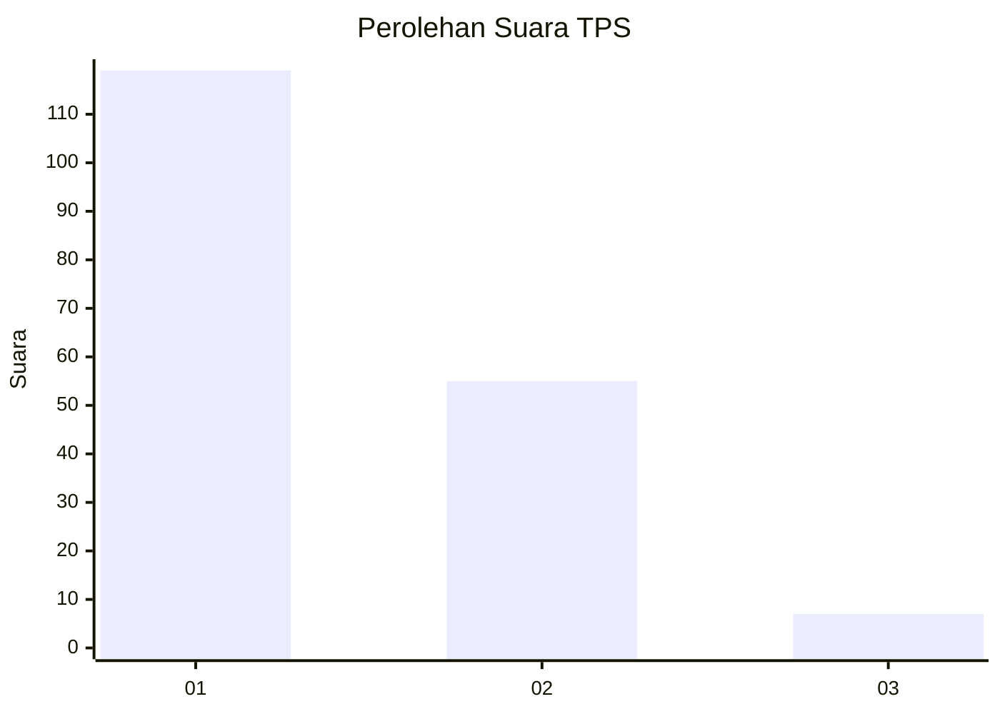
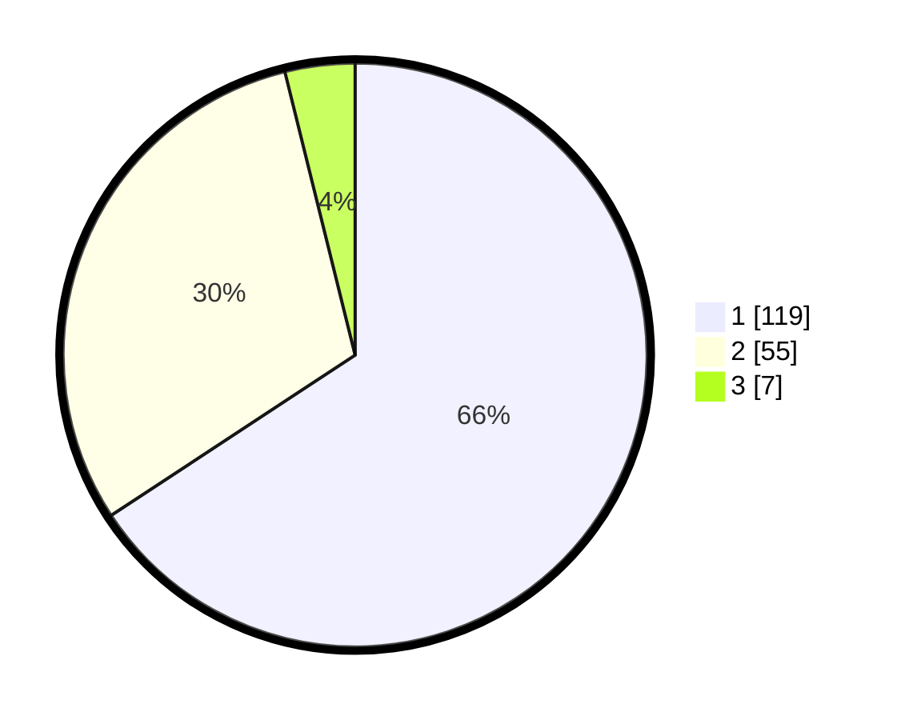

# Hasil

## Grafik

## Tabel

| No. | Nama Paslon    | Suara | Suara (raw) | Persentase |
|:--- |:-------------- | -----:| -----------:| ----------:|
| 1   | ANIES MUHAIMIN | 119   | [119][p-1]  | 65,75      |
| 2   | PRABOWO GIBRAN | 55    | [55][p-2]   | 30,39      |
| 3   | GANJAR MAHFUD  | 7     | [7][p-3]    | 3,87       |

[p-1]: https://github.com/gigit-pemilu/pemilu-2024/blob/main/pilpres/hitung-suara/sub/32-jawa-barat/sub/03-cianjur/sub/29-cijati/sub/2004-padaasih/sub/007-tps/sub/paslon-1.txt
[p-2]: https://github.com/gigit-pemilu/pemilu-2024/blob/main/pilpres/hitung-suara/sub/32-jawa-barat/sub/03-cianjur/sub/29-cijati/sub/2004-padaasih/sub/007-tps/sub/paslon-2.txt
[p-3]: https://github.com/gigit-pemilu/pemilu-2024/blob/main/pilpres/hitung-suara/sub/32-jawa-barat/sub/03-cianjur/sub/29-cijati/sub/2004-padaasih/sub/007-tps/sub/paslon-3.txt

## Foto C Plano

https://sirekap-obj-formc.kpu.go.id/70b4/pemilu/ppwp/32/03/29/20/04/3203292004007-20240215-151125--e82b17f9-5326-4c67-a2fd-ba610336c1af.jpg

https://sirekap-obj-formc.kpu.go.id/70b4/pemilu/ppwp/32/03/29/20/04/3203292004007-20240215-151542--9dfd04b3-84bd-48b8-88db-c4dd2142bef3.jpg

https://sirekap-obj-formc.kpu.go.id/70b4/pemilu/ppwp/32/03/29/20/04/3203292004007-20240215-151856--0201f9cb-742c-46bd-a444-2512dfcb81ed.jpg

## Metadata

| Key        | Value               |
| ---------- | ------------------- |
| Time Stamp | 2024-02-24 22:31:28 |

