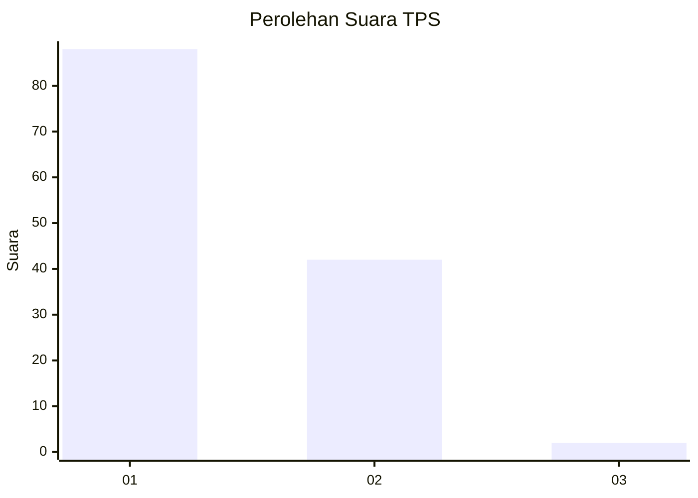
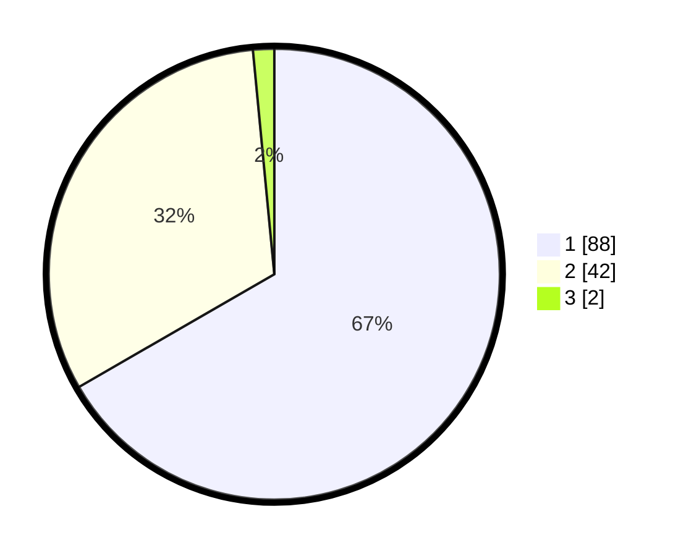

# Hasil

## Grafik

## Tabel

| No. | Nama Paslon    | Suara | Suara (raw) | Persentase |
|:--- |:-------------- | -----:| -----------:| ----------:|
| 1   | ANIES MUHAIMIN | 88    | [88][p-1]   | 66,67      |
| 2   | PRABOWO GIBRAN | 42    | [42][p-2]   | 31,82      |
| 3   | GANJAR MAHFUD  | 2     | [2][p-3]    | 1,52       |

[p-1]: https://github.com/gigit-pemilu/pemilu-2024-32-jawa-barat/blob/main/pilpres/hitung-suara/sub/32-jawa-barat/sub/03-cianjur/sub/29-cijati/sub/2007-sukaluyu/sub/004-tps/sub/paslon-1.txt
[p-2]: https://github.com/gigit-pemilu/pemilu-2024-32-jawa-barat/blob/main/pilpres/hitung-suara/sub/32-jawa-barat/sub/03-cianjur/sub/29-cijati/sub/2007-sukaluyu/sub/004-tps/sub/paslon-2.txt
[p-3]: https://github.com/gigit-pemilu/pemilu-2024-32-jawa-barat/blob/main/pilpres/hitung-suara/sub/32-jawa-barat/sub/03-cianjur/sub/29-cijati/sub/2007-sukaluyu/sub/004-tps/sub/paslon-3.txt

## Foto C Plano

https://sirekap-obj-formc.kpu.go.id/fe33/pemilu/ppwp/32/03/29/20/07/3203292007004-20240215-113656--4fc485ea-b5b2-4663-a774-73b0ca38efb8.jpg

https://sirekap-obj-formc.kpu.go.id/fe33/pemilu/ppwp/32/03/29/20/07/3203292007004-20240215-113522--d5eb10aa-0899-4876-8571-86a4f50f367b.jpg

https://sirekap-obj-formc.kpu.go.id/fe33/pemilu/ppwp/32/03/29/20/07/3203292007004-20240215-013345--6a662c63-33db-4f40-b526-7096c71d6c7d.jpg

## Metadata

| Key        | Value               |
| ---------- | ------------------- |
| Time Stamp | 2024-02-25 15:00:00 |

