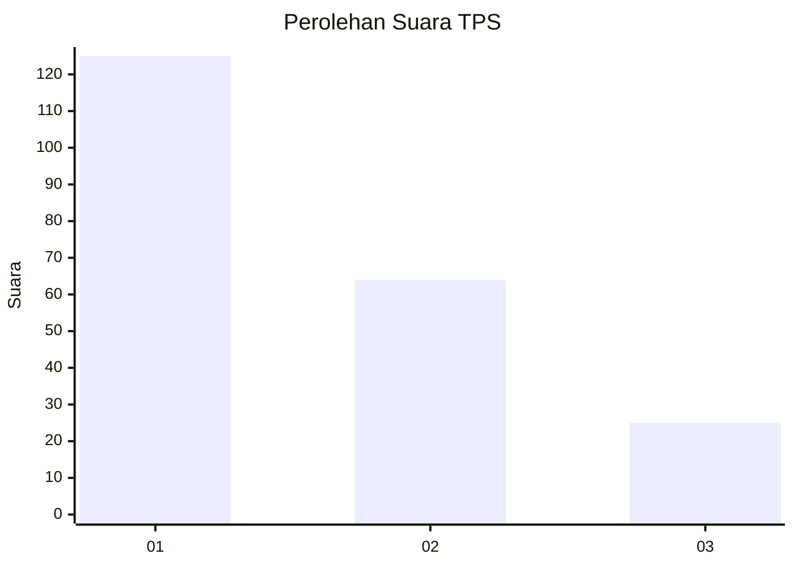
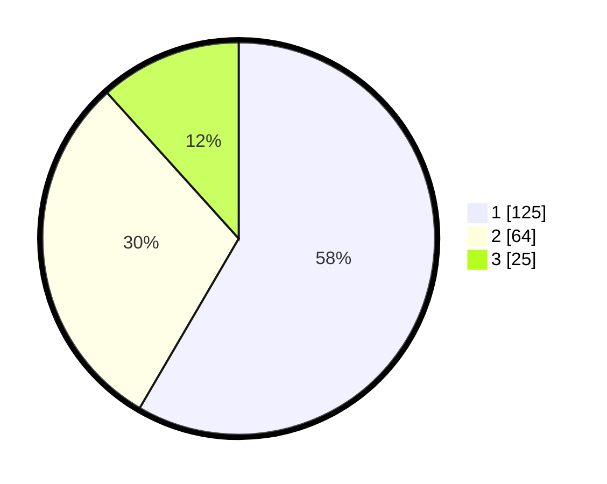

# Hasil

## Grafik

## Tabel

| No. | Nama Paslon    | Suara | Suara (raw) | Persentase |
|:--- |:-------------- | -----:| -----------:| ----------:|
| 1   | ANIES MUHAIMIN | 125   | [125][p-1]  | 58,41      |
| 2   | PRABOWO GIBRAN | 64    | [64][p-2]   | 29,91      |
| 3   | GANJAR MAHFUD  | 25    | [25][p-3]   | 11,68      |

[p-1]: https://github.com/gigit-pemilu/pemilu-2024/blob/main/pilpres/hitung-suara/sub/32-jawa-barat/sub/03-cianjur/sub/29-cijati/sub/2007-sukaluyu/sub/007-tps/sub/paslon-1.txt
[p-2]: https://github.com/gigit-pemilu/pemilu-2024/blob/main/pilpres/hitung-suara/sub/32-jawa-barat/sub/03-cianjur/sub/29-cijati/sub/2007-sukaluyu/sub/007-tps/sub/paslon-2.txt
[p-3]: https://github.com/gigit-pemilu/pemilu-2024/blob/main/pilpres/hitung-suara/sub/32-jawa-barat/sub/03-cianjur/sub/29-cijati/sub/2007-sukaluyu/sub/007-tps/sub/paslon-3.txt

## Foto C Plano

https://sirekap-obj-formc.kpu.go.id/0c2b/pemilu/ppwp/32/03/29/20/07/3203292007007-20240215-162509--a0894113-0abe-42bc-a16a-8d9a3e93b0c3.jpg

https://sirekap-obj-formc.kpu.go.id/0c2b/pemilu/ppwp/32/03/29/20/07/3203292007007-20240215-013453--7c5fa176-777a-4d98-a3da-be30c4baddd3.jpg

https://sirekap-obj-formc.kpu.go.id/0c2b/pemilu/ppwp/32/03/29/20/07/3203292007007-20240215-013603--826f4d74-df0b-4d34-bf26-3ae6919d9336.jpg

## Metadata

| Key        | Value               |
| ---------- | ------------------- |
| Time Stamp | 2024-02-15 20:30:46 |

